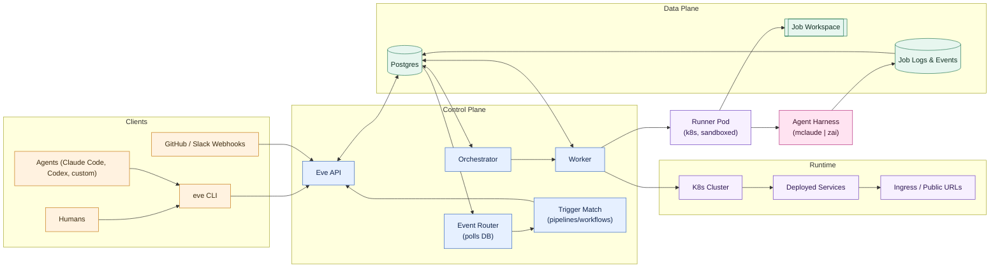
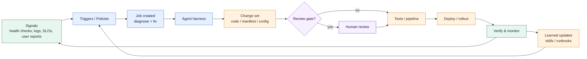
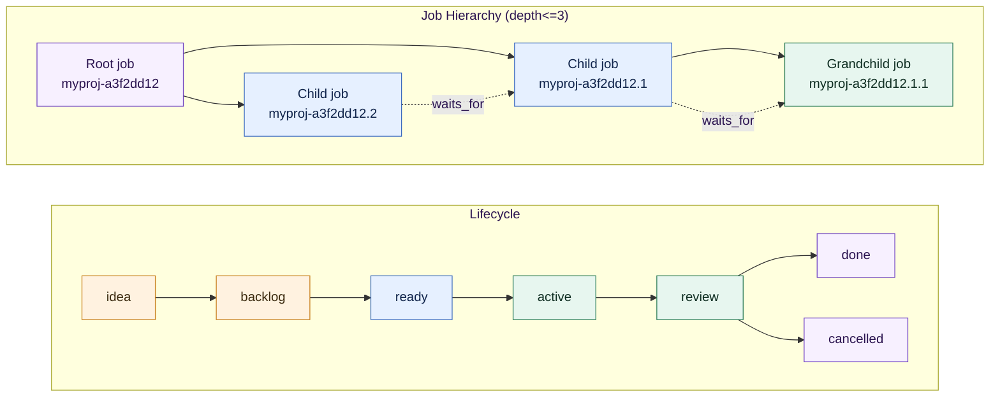
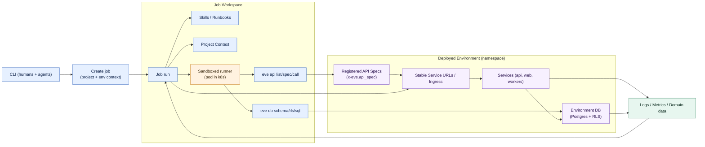

# Eve Horizon

**Agentic-Native PaaS** — A platform for building and deploying self-healing, self-improving applications and native agentic apps.

Eve Horizon treats AI agents as first-class citizens. Every workflow is observable, debuggable, and API-driven. Build apps that don't just run—they evolve.

## Why Eve Horizon?

- **Self-healing applications** — AI agents monitor, diagnose, and fix issues automatically
- **Self-improving systems** — Continuous optimization through agent-driven feedback loops
- **Native agentic apps** — First-class support for AI agents as both builders and runtime components
- **Embedded agent conversations** — Eve-hosted apps can mount thread-backed agent panes through the conversations API and chat SDKs
- **Agent-first API** — Claude Code, Codex, and custom agents operate through the same API as humans
- **Observable everything** — Jobs, workflows, and deployments are fully traceable and debuggable
- **Postgres-first** — No hidden queues or side stores; your data is always queryable

## How Eve Works (Diagrams)

Below are six at-a-glance diagrams showing the platform, deployment flow for Eve-compatible apps, the self-heal/improve loop, the job lifecycle, how jobs operate within deployed environments, and PR preview environments.

### 1) System Overview



### 2) Deploying an Eve-Compatible App

```mermaid
flowchart LR
  Operator["Operator / CI"] --> DeployCmd["eve env deploy"]
  Operator --> Diagnose["eve env diagnose"]
  DeployCmd --> API["Eve API"]
  Diagnose --> API

  API --> Decision{"Pipeline in manifest?"}
  Decision -- "yes" --> Pipeline["Pipeline run<br/>build -> test -> deploy"]
  Decision -- "no" --> Direct["Direct deploy (worker)"]

  Pipeline --> Orchestrator --> Worker --> Runner["Runner pods<br/>(agent/script steps)"]
  Direct --> Worker
  Worker --> K8S["K8s deploy<br/>namespace per env"]
  K8S --> Ingress["Ingress"] --> URL["{service}.{org}-{project}-{env}.{domain}"]

  classDef actor fill:#fff2e0,stroke:#c77d1a,color:#3b2a0f;
  classDef control fill:#e6f0ff,stroke:#3b6bbf,color:#0f234a;
  classDef runtime fill:#f7f0ff,stroke:#6f42c1,color:#2b1450;
  classDef pipeline fill:#e7f6ef,stroke:#2a7b57,color:#0f2e22;
  classDef endpoint fill:#ffe3f1,stroke:#b83280,color:#3b1028;

  class Operator,DeployCmd,Diagnose actor;
  class API,Decision,Orchestrator,Worker control;
  class Pipeline,Direct,Runner pipeline;
  class K8S,Ingress runtime;
  class URL endpoint;
```



### 3) Self-Heal & Improve Loop



### 4) Job Lifecycle + Hierarchy + Dependencies



### 5) Jobs Inside Deployed Environments (API Specs + CLI Integration)



### 6) GitHub PR Preview Environments

```mermaid
flowchart LR
  Dev["Developer"] --> PR["GitHub PR"]
  PR --> Webhook["GitHub webhook<br/>pull_request"]
  Webhook --> API["Eve API"]
  API --> DB[(Postgres)]
  DB --> Events["Event Router<br/>(orchestrator)"]
  Events --> Trigger["Trigger match<br/>PR preview workflow"]
  Trigger --> Pipeline["Pipeline run<br/>build -> test -> deploy"]
  Pipeline --> Env["PR Environment<br/>(preview)"]
  Env --> URL["https://web.{org}-{project}-pr-{num}.eve.example.com"]
  URL --> QA["QA / Review"]
  QA --> Close["PR closed/merged"]
  Close --> Cleanup["Auto cleanup PR env"]

  classDef actor fill:#fff2e0,stroke:#c77d1a,color:#3b2a0f;
  classDef control fill:#e6f0ff,stroke:#3b6bbf,color:#0f234a;
  classDef pipeline fill:#e7f6ef,stroke:#2a7b57,color:#0f2e22;
  classDef env fill:#f7f0ff,stroke:#6f42c1,color:#2b1450;
  classDef endpoint fill:#ffe3f1,stroke:#b83280,color:#3b1028;
  classDef data fill:#e7f6ef,stroke:#2a7b57,color:#0f2e22;

  class Dev,QA,Close actor;
  class Webhook,API,Events,Trigger control;
  class Pipeline pipeline;
  class Env,Cleanup env;
  class URL endpoint;
  class DB data;
```



## Example URLs (hosted instance)

These are illustrative — substitute your own instance's domain (configured when
you deploy from `eve-horizon-infra`). `eve.example.com` is a placeholder.

- **API:** `https://api.eve.example.com`
- **Health:** `https://api.eve.example.com/health`
- **App URLs:** `https://{service}.{org}-{project}-{env}.eve.example.com`
  - Example: `https://web.myorg-myapp-staging.eve.example.com`
- **CLI profile:** `eve profile create staging --api-url https://api.eve.example.com`

## Sister Repos (Supporting This Platform)

> **This repository — [`eve-horizon/eve-horizon`](https://github.com/eve-horizon/eve-horizon) — is the canonical source.**
> All development and all releases happen here. The private `Incept5/eve-horizon`
> repo is the retired pre-open-source ancestor, kept read-only for its history.
> If a clone's `origin` points there, re-point it at this repo.

- [**eve-horizon-infra**](https://github.com/eve-horizon/eve-horizon-infra) — Public infrastructure template (Kubernetes manifests, Terraform, deploy workflows). Create your own deployment instance from it.
- [**eve-horizon-starter**](https://github.com/eve-horizon/eve-horizon-starter) — Starter template for new Eve projects. Clone this to get started quickly.
- [**eve-skillpacks**](https://github.com/eve-horizon/eve-skillpacks) — Public skillpacks distributed via `skills.txt` for users and internal teams.
- [**eve-horizon-fullstack-example**](https://github.com/eve-horizon/eve-horizon-fullstack-example) — Showcase app for new users and fixture data for E2E tests (tests clone `main`).
- [**eve-horizon-docs**](https://github.com/eve-horizon/eve-horizon-docs) — Human-facing documentation site.

## Run It Locally (from source)

The fastest way to try Eve Horizon on your own machine — no cloud account or
Kubernetes required. You only need Docker, Node.js >= 22, and pnpm >= 9.

```bash
git clone https://github.com/eve-horizon/eve-horizon
cd eve-horizon
pnpm install
pnpm build
./bin/eh start docker        # brings up Postgres + all services in containers
```

The API comes up at **http://localhost:4801**. Check it:

```bash
export EVE_API_URL=http://localhost:4801
eve system health --json     # -> {"status":"ok"}
```

When you're done: `./bin/eh stop`. For a production-like Kubernetes runtime
(via k3d), see [Quick Start (Local K8s)](#quick-start-local-k8s) below.

## Deploying to Your Own Cloud

Eve Horizon uses a **three-repo deploy model**: this source repo builds container
images, a public **infrastructure template** provides the cloud scaffold, and you
create a private **deployment instance** from that template for your environment.

```bash
gh repo create <your-org>/<name>-eve-infra \
  --template eve-horizon/eve-horizon-infra --private
```

Then fill in your domain, registry, and cloud settings and run the deploy. See
[eve-horizon-infra](https://github.com/eve-horizon/eve-horizon-infra) for the full
walkthrough (AWS k3s / EKS and GCP overlays, Terraform, and the deploy workflow).

## Quick Start (Local K8s)

### Prerequisites

- Docker Desktop with 8GB+ memory, 4+ CPUs
  `eve local up` installs/manages `k3d` and `kubectl` automatically.

### 1. Start the Platform

```bash
eve local up

export EVE_API_URL=http://api.eve.lvh.me
```

For platform contributors working in this monorepo, the lower-level helper remains available:

```bash
./bin/eh k8s start
./bin/eh k8s deploy
```

### 2. Create Your Project

```bash
eve org ensure "My Company"
eve profile set --org org_MyCompany

eve project ensure \
  --name "My App" \
  --slug myapp \
  --repo-url https://github.com/myorg/myapp \
  --branch main

eve profile set --project proj_xxx
```

### 3. Deploy Your Application

Add a manifest to your repo (`.eve/manifest.yaml`):

```yaml
project: myapp

environments:
  staging:
    type: persistent

services:
  api:
    image: ghcr.io/myorg/myapp-api
    ports: [3000]
    x-eve:
      ingress:
        public: true
        port: 3000
  web:
    image: ghcr.io/myorg/myapp-web
    ports: [80]
    x-eve:
      ingress:
        public: true
        port: 80
```

Deploy and access via Ingress:

```bash
eve env create staging --project proj_xxx --type persistent
eve manifest validate --project proj_xxx
eve env deploy staging --ref main --repo-dir .
eve env diagnose proj_xxx staging

open http://web.myorg-myapp-staging.lvh.me
```

**URL Pattern:** `{service}.{org}-{project}-{env}.{domain}` (e.g., `web.myorg-myapp-staging.lvh.me`)

**Note:** `eve env deploy` requires an explicit `--ref` (40-character git SHA or a ref resolved against `--repo-dir`/cwd). When the environment has a `pipeline` configured in the manifest, this command triggers a pipeline run. Use `--direct` to bypass the pipeline. Use `eve env diagnose` to surface deployment health, pods, and recent events without kubectl.

### 4. Run AI Jobs

```bash
eve job create --description "Review the auth flow and suggest improvements"
eve job follow myapp-a3f2dd12
eve job result myapp-a3f2dd12
```

## Skills and Skillpacks

Skills are OpenSkills-compatible `SKILL.md` files installed into `.agents/skills/`.
Use skills.txt to pull from public skillpacks:

```txt
https://github.com/eve-horizon/eve-skillpacks
```

Then install:

```bash
./bin/eh skills install
```

See [skillpacks.md](./docs/system/skillpacks.md) for details.

## Agent-Native Design Guide

We keep a non-Eve, generic guide for agent-native architecture here:
[agent-native-design.md](./docs/ideas/agent-native-design.md)

## Documentation

- **System docs:** [README.md](./docs/system/README.md)
- **Job CLI reference:** [job-cli.md](./docs/system/job-cli.md)
- **Deployment:** [deployment.md](./docs/system/deployment.md)
- **Manifest:** [manifest.md](./docs/system/manifest.md)
- **Secrets:** [secrets.md](./docs/system/secrets.md)
- **Developer guide:** [AGENTS.md](./AGENTS.md)

## Development

For contributor workflows, test commands, and debugging guidance, see [AGENTS.md](./AGENTS.md).

## Releasing the CLI

The Eve CLI is published to npm as `@eve-horizon/cli`.

**Current version**: `0.1.0`

To release a new version, push a git tag:

```bash
git tag cli-v0.2.0   # Replace with your version number
git push origin cli-v0.2.0
```

The `publish-cli.yml` GitHub Actions workflow automatically:
1. Builds the project
2. Updates the package version from the tag
3. Publishes to npm

**Install the CLI:**
```bash
npm install -g @eve-horizon/cli
```

## License

Licensed under the [MIT License](LICENSE). Copyright (c) 2026 Adam Chesney and Incept5.

The client SDK/CLI packages (`@eve-horizon/auth`, `auth-react`, `chat`, `chat-react`,
`cli`) are also MIT-licensed and carry their own `LICENSE` file. Third-party
components bundled into container images are documented in [THIRD_PARTY.md](THIRD_PARTY.md).

## Security

See [SECURITY.md](SECURITY.md) for how to report vulnerabilities.
