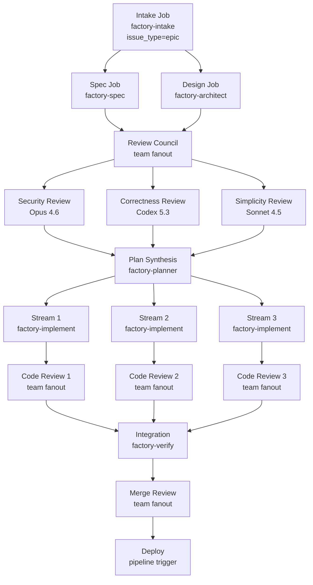

# Automated Software Factory v2

> Status: Idea (supersedes v1)
> Last Updated: 2026-02-08
>
> Inputs:
> - docs/system/agents.md (agents, teams, repo-first sync)
> - docs/system/job-api.md (job lifecycle, hierarchy, deps, review)
> - docs/system/manifest.md (manifest shape, pipelines, workflows, x-eve)
> - docs/system/skills.md (OpenSkills, skills.txt, skillpacks)
> - docs/system/pipelines.md (pipeline steps, job graph expansion, triggers)
> - docs/system/workflows.md (workflow invocation, hints)
> - docs/system/events.md (event spine, system events, triggers)
> - docs/system/harness-policy.md (harness profiles, reasoning controls)
> - docs/system/harness-execution.md (harness invocation, auth, workspace)
> - docs/system/orchestration-skill.md (waits_for, eve.status=waiting)
> - docs/system/job-git-controls.md (ref resolution, branch creation, commit/push)
> - docs/system/job-control-signals.md (json-result, eve.status)
> - docs/system/chat-routing.md (chat.yaml, slug dispatch, listeners)
> - docs/system/threads.md (chat continuity, subscriptions)
> - docs/system/agent-runtime.md (warm pods, org scope)
> - docs/system/skillpacks.md (skill distribution, skills.txt)
> - docs/ideas/prd-to-epic-workflow.md (PRD workflow, review matrix, repo artifacts)
> - docs/ideas/workflows-as-skills.md (workflow skills, deterministic mode)
> - docs/ideas/automated-software-factory.md (v1 — vision, gaps, OpenSpec)
>
> Key difference from v1: Every section below is grounded in primitives that
> exist today. Where v1 invented new concepts (agent packs, documents API,
> model_matrix dispatch, confidence scoring), v2 assembles the factory from
> what Eve already ships. Gaps are smaller and more focused.

## North Star (Unchanged)

**An Eve app with no services — only agents — that turns ideas into production
software with zero humans in the loop by default.**

```
Idea → Spec → Design → Plan → Implement → Review → Test → Deploy → Monitor → Heal
  ^                                                                              |
  └──────────────────────────────────────────────────────────────────────────────-─┘
```

## v1 Retrospective: What We Got Wrong

v1 was vision-first. It invented primitives that didn't exist and treated them
as prerequisites. Looking at the actual system docs, most of what the factory
needs is already there. Here's what changed:

| v1 Assumption | Reality | v2 Approach |
|---------------|---------|-------------|
| Agent Packs are a new primitive | Skills are distributable via skillpacks. Agent YAML is just config files. | Ship a skillpack + template YAML. Add a thin CLI convenience. |
| Documents API needed for specs | Agents read/write repo files. Git is the database. | Use repo-local markdown files (same as prd-to-epic-workflow). |
| OpenSpec is required | OpenSpec adds structure but couples to an external tool. | Optional. Use plain markdown specs. OpenSpec as an enhancement later. |
| model_matrix dispatch needed | Team fanout already creates child jobs per agent. Each agent has its own harness_profile. | Use existing fanout dispatch. Multi-model = multiple review agents. |
| Confidence scoring needed | Binary pass/fail with review gates works fine. | Skip. Use blocking/advisory review categorization instead. |
| Factory config is a new file | Manifest `x-eve` already supports defaults, agents, profiles. | Use `x-eve.agents.profiles` + a factory skill config file. |
| Notification primitives needed | Event spine + Slack gateway already handles notifications. | Use existing Slack integration + system events. |

## What Already Exists (No Work Required)

Every item below is implemented and tested:

| Capability | How the Factory Uses It |
|-----------|------------------------|
| Job lifecycle (idea → done) | Factory phases map to job phases |
| Job hierarchy (epic → story → task, max depth 3) | PRD epic → implementation streams → atomic tasks |
| Job dependencies (blocks, waits_for) | Review gates, stream ordering, integration gating |
| Orchestration skill (waits_for + eve.status=waiting) | Parent jobs wait on child jobs, resume automatically |
| Team fanout dispatch | Parallel multi-agent review councils |
| Harness profiles (x-eve.agents.profiles) | Different models for different roles (review vs code) |
| 5 harnesses (mclaude, zai, gemini, code, codex) | Multi-model review across vendors |
| Skills + skillpacks via skills.txt | Factory skills installed into any project |
| Pipelines with job graph expansion | Build → test → deploy flows |
| Pipeline triggers (github.push, pull_request) | Auto-trigger on PR, push to main |
| Workflow invocation (manifest → job) | Named factory entry points |
| Event spine (system.job.failed, system.pipeline.failed) | Self-healing triggers |
| Slack gateway + chat routing | HITL notifications, @eve commands |
| Agent slugs (org-unique) | Cross-project agent addressing |
| Git controls (ref, branch, commit, push) | Feature branches, per-job branches, auto-push |
| create-pr pipeline action | Automated PR creation with review gating |
| Review workflow (submit/approve/reject) | Human and agent review gates |
| Agent runtime (warm pods) | Fast chat-driven interactions |

## The Factory Is a Skillpack + Agent Config Template

No new primitives. The factory is:

1. A **git repo** containing skills and agent config templates.
2. Projects install it by adding it to `skills.txt` and adapting agent YAML.
3. Jobs created by factory agents appear on the **target project's board**.

```
Factory Repo (source)                   Target Project (consumer)
├── skills/                             ├── .eve/manifest.yaml
│   ├── factory-intake/SKILL.md         │   └── x-eve.agents → profiles
│   ├── factory-spec/SKILL.md           ├── agents/
│   ├── factory-architect/SKILL.md      │   ├── agents.yaml  ← adapted from factory template
│   ├── factory-planner/SKILL.md        │   ├── teams.yaml   ← adapted from factory template
│   ├── factory-implement/SKILL.md      │   └── chat.yaml    ← adapted from factory template
│   ├── factory-review-*/SKILL.md       ├── skills.txt       ← references factory repo
│   ├── factory-verify/SKILL.md         │   # https://github.com/yourorg/eve-software-factory
│   ├── factory-ops/SKILL.md            └── factory.yaml     ← local overrides
│   └── factory-improve/SKILL.md
├── templates/
│   ├── agents.yaml                     # Copy + adapt into target project
│   ├── teams.yaml
│   └── chat.yaml
├── config/
│   └── factory.yaml                    # Default factory config
├── skills.txt                          # Factory's own skill dependencies
└── README.md
```

### Installation Flow (Today's Primitives)

```bash
# 1. Add factory skills to target project
echo "https://github.com/yourorg/eve-software-factory" >> skills.txt
skills add https://github.com/yourorg/eve-software-factory -a claude-code -y --all

# 2. Copy + adapt agent config templates
cp factory-repo/templates/agents.yaml agents/agents.yaml
cp factory-repo/templates/teams.yaml agents/teams.yaml
# Edit to customize harness profiles, review matrix, etc.

# 3. Configure harness profiles in manifest
# (edit .eve/manifest.yaml x-eve.agents.profiles)

# 4. Sync agents to Eve
eve agents sync --project proj_myapp --ref main --repo-dir .
```

### Future: Convenience CLI (Small Gap)

A thin CLI wrapper could automate steps 2-4:

```bash
eve factory install https://github.com/yourorg/eve-software-factory --ref v1.0.0
# → Adds to skills.txt
# → Copies template YAML to agents/
# → Prompts for harness profile customization
# → Runs eve agents sync
```

This is a CLI convenience, not a platform primitive. The API doesn't change.
Agent config composition stays client-side.

---

## Factory Pipeline: Grounded in Reality

Each phase below uses only existing Eve primitives. References to system docs
are included so you can verify each claim.

### Phase 1: Intake

**Trigger**: Workflow invocation, GitHub issue with `factory` label, or Slack `@eve intake "..."`.

**Agent**: `factory-intake` (harness_profile: `fast-triage`)

**How it works**:
1. Workflow invocation creates a root job (issue_type=epic). *(workflow-invocation.md)*
2. Agent reads the input (PRD text, file path, or issue URL).
3. Normalises into `docs/prd/<slug>.md` in the repo. *(prd-to-epic-workflow.md pattern)*
4. If vague: creates clarifying questions and submits for review. *(job-api.md: review workflow)*
5. If clear: creates child spec + design jobs and returns `eve.status=waiting`. *(orchestration-skill.md)*

**Git controls**: *(job-git-controls.md)*
```json
{
  "git": {
    "ref": "main",
    "branch": "feat/${slug}",
    "create_branch": "if_missing",
    "commit": "auto",
    "push": "on_success"
  }
}
```

### Phase 2: Specification

**Agent**: `factory-spec` (harness_profile: `deep-reasoning`)

**How it works**:
1. Child job created by intake with `waits_for` relation. *(job-api.md: dependencies)*
2. Reads the normalised PRD from `docs/prd/<slug>.md`.
3. Explores the codebase to understand current behaviour.
4. Writes `docs/specs/<slug>-spec-v1.md` with Given/When/Then scenarios.
5. Commits to `feat/<slug>` branch and pushes. *(job-git-controls.md: auto commit + push)*

### Phase 3: Design

**Agent**: `factory-architect` (harness_profile: `deep-reasoning`)

**How it works**:
1. Runs in parallel with spec (both created by intake). *(orchestration-skill.md: parallel children)*
2. Reads PRD, explores codebase, reads AGENTS.md and existing docs.
3. Writes `docs/design/<slug>-design-v1.md` with goals, non-goals, technical decisions, risks.
4. Commits and pushes to `feat/<slug>`.

### Phase 4: Multi-Model Review (Parallel)

**Team**: `review_council` (dispatch: fanout) *(agents.md: teams.yaml, fanout dispatch)*

**How it works**:
1. Intake job resumes when spec + design jobs complete. *(orchestration-skill.md: automatic resume)*
2. Creates a review team job. Team fanout creates one child job per reviewer agent.
3. Each reviewer reads specs + design, writes review to `docs/reviews/<slug>-<type>-v1.md`.
4. Different reviewers use different harness profiles. *(harness-policy.md: per-agent profiles)*

**Review agents and profiles**:

```yaml
# agents/agents.yaml (in target project, adapted from factory template)
agents:
  reviewer_security:
    skill: factory-review-security
    harness_profile: primary-reviewer     # Opus high
  reviewer_correctness:
    skill: factory-review-correctness
    harness_profile: deep-reasoning       # Codex x-high
  reviewer_simplicity:
    skill: factory-review-simplicity
    harness_profile: fast-triage          # Sonnet medium
```

```yaml
# .eve/manifest.yaml
x-eve:
  agents:
    profiles:
      primary-reviewer:
        - harness: mclaude
          model: opus-4.6
          reasoning_effort: high
      deep-reasoning:
        - harness: codex
          model: codex-5.3
          reasoning_effort: x-high
      fast-triage:
        - harness: mclaude
          model: sonnet-4.5
          reasoning_effort: medium
```

**Blocking vs advisory**: Controlled by the intake orchestrator skill. Blocking
reviews (security, correctness) use `waits_for`. Advisory reviews (simplicity,
performance) use `conditional_blocks` — the parent can proceed if they're not done.

### Phase 5: Plan Synthesis

**Agent**: `factory-planner` (harness_profile: `deep-reasoning`)

**How it works**:
1. Created by intake after review council completes.
2. Reads reviewed specs + design + review feedback from repo files.
3. Decomposes into `docs/plans/<slug>-plan-v1.md` with task groups.
4. Maps task groups to implementation streams.
5. Writes `docs/plans/<slug>-streams.md` with dependency graph.
6. Creates child jobs per stream with `waits_for` relations. *(job-api.md: hierarchy + deps)*
7. Returns `eve.status=waiting`.

### Phase 6: Implementation (Parallel Streams)

**Agent**: `factory-implement` (harness_profile: `primary-coder`)

**How it works per stream**:
1. Stream job works on a per-job branch off `feat/<slug>`. *(job-git-controls.md)*
   ```json
   {
     "git": {
       "ref": "feat/${slug}",
       "branch": "job/${job_id}",
       "create_branch": "if_missing",
       "commit": "auto",
       "push": "on_success"
     }
   }
   ```
2. Reads relevant task group from `docs/plans/<slug>-plan-v1.md`.
3. Implements code + tests (TDD when possible).
4. Commits, pushes, and uses `create-pr` to open PR into `feat/<slug>`. *(pipelines.md: create-pr action)*
5. Submits job for review. *(job-api.md: review workflow)*

### Phase 7: Code Review (Per-PR)

**Team**: `code_review_council` (dispatch: fanout)

**How it works**:
1. Each stream job's PR triggers a code review team job.
2. Reviewers read the diff against specs and design.
3. Blocking reviews (security, tests, correctness) must pass.
4. On approval: PR is merged into feature branch.
5. On rejection: implementation job gets another attempt. *(job-api.md: reject → new attempt)*

### Phase 8: Integration + Verification

**Agent**: `factory-verify` (harness_profile: `deep-reasoning`)

**How it works**:
1. Created by planner with `waits_for` on all stream jobs.
2. Runs on `feat/<slug>` after all streams merge.
3. Runs the project's test suite.
4. Cross-checks specs: verifies each Given/When/Then scenario has a passing test.
5. Opens the final PR from `feat/<slug>` → `main` via `create-pr`. *(pipelines.md)*

### Phase 9: Final PR Review

**Team**: `merge_review_council` (dispatch: fanout, all blocking)

Uses the same team fanout pattern. All reviewers must approve before merge.

### Phase 10: Deploy

**How it works**:
1. After PR is merged, a pipeline trigger fires. *(pipelines.md: github.push trigger)*
   ```yaml
   pipelines:
     deploy-production:
       trigger:
         github:
           event: push
           branch: main
       steps:
         - name: build
           action: { type: build }
         - name: test
           script: { run: "pnpm test" }
         - name: release
           depends_on: [build, test]
           action: { type: release }
         - name: deploy
           depends_on: [release]
           action: { type: deploy }
   ```
2. Standard pipeline execution — no factory agent needed.

### Phase 11: Monitor + Self-Heal

**Agent**: `factory-ops` (harness_profile: `fast-triage`)

**How it works**:
1. System events fire on failures. *(events.md: system.job.failed, system.pipeline.failed)*
2. Workflow trigger matches system events:
   ```yaml
   workflows:
     remediation:
       trigger:
         system:
           event: system.pipeline.failed
       hints:
         gates: ["remediate:${project_id}:production"]
       steps:
         - agent:
             prompt: "Diagnose and fix the pipeline failure"
             skill: factory-ops
   ```
3. Ops agent diagnoses, creates a targeted fix job (constrained factory run).
4. Max 3 auto-remediation attempts before escalating. *(counted via job attempt_number)*
5. Rollback available via `eve env deploy <env> --direct --inputs '{"release_id":"<previous>"}'`.

### Phase 12: Self-Improvement (Background)

**Agent**: `factory-improve` (harness_profile: `deep-reasoning`)

**How it works**:
1. Scheduled via cron trigger. *(events.md: cron.tick planned)*
2. Analyses completed factory runs (job trees, review findings, failure patterns).
3. Updates factory skill files in the factory repo.
4. Opens PRs against the factory repo itself.
5. Those PRs go through the factory's own review pipeline.

---

## Agent Roster (agents.yaml Template)

```yaml
# templates/agents.yaml — shipped with factory, adapted per project
version: 1
agents:
  factory_intake:
    slug: factory-intake
    skill: factory-intake
    harness_profile: fast-triage
    description: "Normalises ideas into structured briefs"
    policies:
      permission_policy: auto_edit
      git: { commit: auto, push: on_success }

  factory_spec:
    slug: factory-spec
    skill: factory-spec
    harness_profile: deep-reasoning
    description: "Writes specifications with Given/When/Then scenarios"
    policies:
      permission_policy: auto_edit
      git: { commit: auto, push: on_success }

  factory_architect:
    slug: factory-architect
    skill: factory-architect
    harness_profile: deep-reasoning
    description: "Designs technical architecture and trade-offs"
    policies:
      permission_policy: auto_edit
      git: { commit: auto, push: on_success }

  factory_planner:
    slug: factory-planner
    skill: factory-planner
    harness_profile: deep-reasoning
    description: "Decomposes work into parallel implementation streams"
    policies:
      permission_policy: auto_edit
      git: { commit: auto, push: on_success }

  factory_implement:
    slug: factory-implement
    skill: factory-implement
    harness_profile: primary-coder
    description: "Writes code with tests, TDD when possible"
    policies:
      permission_policy: auto_edit
      git: { commit: auto, push: on_success }

  reviewer_security:
    slug: factory-review-security
    skill: factory-review-security
    harness_profile: primary-reviewer
    description: "Security audit: OWASP, injection, auth, secrets"
    policies:
      permission_policy: auto_edit

  reviewer_correctness:
    slug: factory-review-correctness
    skill: factory-review-correctness
    harness_profile: deep-reasoning
    description: "Correctness: spec conformance, edge cases, logic"
    policies:
      permission_policy: auto_edit

  reviewer_simplicity:
    slug: factory-review-simplicity
    skill: factory-review-simplicity
    harness_profile: fast-triage
    description: "Simplicity: over-engineering, unnecessary abstractions"
    policies:
      permission_policy: auto_edit

  reviewer_tests:
    slug: factory-review-tests
    skill: factory-review-tests
    harness_profile: primary-reviewer
    description: "Test coverage: missing tests, weak assertions"
    policies:
      permission_policy: auto_edit

  factory_verify:
    slug: factory-verify
    skill: factory-verify
    harness_profile: deep-reasoning
    description: "Cross-checks implementation against specs"
    policies:
      permission_policy: auto_edit
      git: { commit: auto, push: on_success }

  factory_ops:
    slug: factory-ops
    skill: factory-ops
    harness_profile: fast-triage
    description: "Monitors and triggers remediation"
    policies:
      permission_policy: auto_edit
      git: { commit: auto, push: on_success }

  factory_improve:
    slug: factory-improve
    skill: factory-improve
    harness_profile: deep-reasoning
    description: "Analyses performance and proposes improvements"
    policies:
      permission_policy: auto_edit
      git: { commit: auto, push: on_success }
```

## Team Config (teams.yaml Template)

```yaml
# templates/teams.yaml
version: 1
teams:
  review_council:
    lead: factory_intake
    members: [reviewer_security, reviewer_correctness, reviewer_simplicity]
    dispatch:
      mode: fanout
      max_parallel: 4

  code_review_council:
    lead: factory_verify
    members: [reviewer_security, reviewer_correctness, reviewer_tests]
    dispatch:
      mode: fanout
      max_parallel: 4

  merge_review_council:
    lead: factory_verify
    members: [reviewer_security, reviewer_correctness, reviewer_tests, reviewer_simplicity]
    dispatch:
      mode: fanout
      max_parallel: 5
```

## Manifest Shape (Target Project)

```yaml
# .eve/manifest.yaml
schema: eve/compose/v1
project: my-app

x-eve:
  agents:
    config_path: agents/agents.yaml
    teams_path: agents/teams.yaml
    version: 1
    profiles:
      fast-triage:
        - harness: mclaude
          model: sonnet-4.5
          reasoning_effort: medium
      deep-reasoning:
        - harness: codex
          model: codex-5.3
          reasoning_effort: x-high
      primary-coder:
        - harness: mclaude
          model: opus-4.6
          reasoning_effort: high
      primary-reviewer:
        - harness: mclaude
          model: opus-4.6
          reasoning_effort: high

  defaults:
    harness: mclaude
    harness_profile: primary-coder
    git:
      commit: auto
      push: on_success

workflows:
  factory-run:
    trigger:
      github:
        event: issues
        action: opened
        label: factory
    steps:
      - agent:
          prompt: "Run the factory intake workflow"
          skill: factory-intake

  remediation:
    trigger:
      system:
        event: system.pipeline.failed
    hints:
      gates: ["remediate:${project_id}:production"]
    steps:
      - agent:
          prompt: "Diagnose and fix the failure"
          skill: factory-ops

pipelines:
  deploy-production:
    trigger:
      github:
        event: push
        branch: main
    steps:
      - name: build
        action: { type: build }
      - name: test
        script: { run: "pnpm test", timeout: 1800 }
      - name: release
        depends_on: [build, test]
        action: { type: release }
      - name: deploy
        depends_on: [release]
        action: { type: deploy }
```

```
# skills.txt
https://github.com/yourorg/eve-software-factory
```

---

## Job Graph: Full Factory Run



---

## Correctness Verification (Zero Humans)

Uses existing Eve primitives — no new verification system.

### Layer 1: Spec-Driven Tests
The spec agent writes Given/When/Then scenarios. The implementer writes matching
tests. The verifier cross-checks scenario coverage. All via repo file reads.

### Layer 2: Multi-Model Review
Team fanout with different harness profiles gives independent perspectives.
Different models catch different problems. A finding from any blocking reviewer
stops the pipeline via job review rejection. *(job-api.md: reject)*

### Layer 3: Existing Test Suite
Pipeline steps run `pnpm test` (or equivalent). Factory doesn't skip existing
quality gates. *(pipelines.md: script steps)*

### Layer 4: Deploy Verification
Post-deploy health checks via pipeline steps. If the project registers API specs
in the manifest, conformance tests can run against them. *(manifest.md: api_spec)*

### Escape Hatch: Review Rejection
If any reviewer is unsure, they reject the job with a reason. The parent
orchestrator handles the rejection and can escalate (retry with a different
model, or pause and notify humans).

---

## HITL Mode (Optional Humans)

No new primitives. Uses existing review workflow + Slack.

### How It Works

1. Factory agents submit jobs for review (`review_required: human`).
2. Eve sends a Slack notification via the gateway. *(chat-gateway.md)*
3. Human reviews the PR (linked from job description).
4. Human approves or rejects via `eve job approve` / `eve job reject`.
5. Factory resumes or iterates.

### Gate Configuration

Controlled by the factory skill config (not a platform primitive):

```yaml
# factory.yaml (factory config, per-project override)
version: 1
hitl:
  enabled: false
  gates:
    spec_approval: false        # Human reviews specs
    design_approval: false      # Human reviews design
    plan_approval: false        # Human reviews plan
    merge_approval: false       # Human reviews final PR
    deploy_approval: false      # Human approves deploy
```

When a gate is enabled, the corresponding factory skill creates the job with
`review_required: human` instead of `review_required: agent`. The platform
handles the rest.

### Notifications

Use the existing Slack integration:
- Agent posts to a configured Slack channel via chat routing.
- Include PR links and summaries in the message.
- Human responds via Slack or GitHub PR review.

---

## Gap Analysis (v2)

### Zero Gaps for MVP

The factory MVP requires **no platform changes**:

| Need | Existing Capability |
|------|---------------------|
| Install skills from external repo | `skills.txt` + `skills add` |
| Agent config templates | Copy YAML files + `eve agents sync` |
| Job orchestration | Orchestration skill + waits_for + eve.status=waiting |
| Multi-model review | Team fanout + per-agent harness_profile |
| Git branching | Job git controls (ref, branch, commit, push) |
| PR creation | create-pr pipeline action |
| Event-driven triggers | Pipeline/workflow triggers (github, system events) |
| Slack notifications | Chat gateway + agent Slack routing |
| Review gates | Job review workflow (submit/approve/reject) |

### Nice-to-Have Gaps (Post-MVP)

#### Gap 1: Factory Install CLI Command

**Problem**: Installing the factory requires multiple manual steps (edit skills.txt,
copy YAML, edit manifest, sync agents).

**Solution**: A convenience CLI command:

```bash
eve factory install <repo-url> [--ref <tag>]
```

**Scope**: CLI-only. Automates the copy + merge + sync workflow. No API changes.

**Priority**: Medium. The manual flow works. Automation is a developer experience
improvement.

#### Gap 2: Cron-Based Event Triggers

**Problem**: Self-improvement and scheduled monitoring need cron triggers.
The event spine supports `cron.tick` but emission is not implemented.

**Solution**: Implement cron-based event emission in the orchestrator.
Already planned in events.md.

**Priority**: Medium. Self-improvement is Phase 5, not MVP.

#### Gap 3: System Event Trigger Matching for Workflows

**Problem**: Remediation workflows need to trigger on `system.pipeline.failed`.
The event router currently matches GitHub and cron triggers. System event
matching may need extension.

**Solution**: Add `system` as a trigger source in the event router alongside
`github` and `cron`.

**Priority**: High for self-healing (Phase 4), not needed for MVP.

#### Gap 4: Agent Pack Merge Semantics (Optional Enhancement)

**Problem**: When teams want to override specific factory agents without copying
the entire YAML, they need a merge model.

**Solution**: A convention-based merge:
- Local agents.yaml can override agents by matching agent key.
- Local `_remove: [agent_key]` strips agents.
- Deep merge on agent properties when keys match.

**Implementation**: In the factory install script or a future `eve agents sync`
enhancement. CLI-side only.

**Priority**: Low. Copy-and-edit works for early adopters.

#### Gap 5: Per-Project Job Concurrency Limits

**Problem**: A factory run with 6 parallel streams could saturate the worker
pool, starving other projects.

**Solution**: Per-project concurrency caps in the orchestrator.
Already proposed in prd-to-epic-workflow.md.

**Priority**: Medium. Important for multi-project orgs but not a blocker.

---

## Fork + Customise

The factory repo is forked per organisation:

**Organisation-level** (fork the factory repo):
- Edit skill SKILL.md files (review criteria, coding standards, personas).
- Adjust `config/factory.yaml` (models, review matrix, HITL gates).
- Add or remove review agents.

**Project-level** (in target project):
- Override specific agents in local `agents/agents.yaml`.
- Add project-specific harness profiles in manifest.
- Override factory config via local `factory.yaml`.

---

## Priority Roadmap

### Phase 1: Minimum Viable Factory (No Platform Changes)

**Goal**: End-to-end factory run with existing primitives.

1. Create the factory repo with skill SKILL.md files.
2. Create agent/team YAML templates.
3. Create factory.yaml config schema.
4. Install factory into a test project (skills.txt + agent YAML).
5. Run: intake → spec → design → review → plan → implement → PR → merge.
6. Use single harness (mclaude/Opus) for all agents initially.

**Requires from Eve**: Nothing new.

### Phase 2: Multi-Model Reviews

**Goal**: Diverse review perspectives.

1. Configure distinct harness profiles per reviewer agent.
2. Add all 5 harnesses to credential setup.
3. Tune review skills with model-specific prompts.

**Requires from Eve**: Nothing new. Credentials per harness already supported.

### Phase 3: Background Reviews + CI/CD Integration

**Goal**: Continuous quality monitoring.

1. Add pipeline triggers for push/PR events.
2. Wire background review workflows.
3. Integrate with project's existing CI/CD pipelines.

**Requires from Eve**: Nothing new (triggers already implemented).

### Phase 4: Self-Healing

**Goal**: Autonomous monitoring and remediation.

1. Implement ops agent with system event triggers.
2. Remediation follows constrained factory pipeline.
3. Rollback as fallback.

**Requires from Eve**: System event trigger matching in event router (Gap 3).

### Phase 5: Self-Improvement

**Goal**: The factory improves itself.

1. Scheduled analysis of factory performance.
2. Self-improvement PRs to factory repo.
3. Recursive quality gates.

**Requires from Eve**: Cron event emission (Gap 2).

### Phase 6: Developer Experience

**Goal**: Smooth onboarding.

1. `eve factory install` CLI command (Gap 1).
2. Onboarding skill that analyses codebase and suggests config.
3. Factory dashboard (job tree visualization).

**Requires from Eve**: CLI convenience command (Gap 1).

---

## Getting Started (User Journey)

### 1. Fork the Factory

```bash
gh repo fork eve-horizon/eve-software-factory --clone
cd eve-software-factory
```

### 2. Customise (Optional)

```bash
$EDITOR config/factory.yaml          # Models, reviews, HITL gates
$EDITOR skills/factory-review-security/SKILL.md  # Team standards
```

### 3. Install into Target Project

```bash
cd /path/to/my-app

# Add factory skills
echo "https://github.com/yourorg/eve-software-factory" >> skills.txt
skills add https://github.com/yourorg/eve-software-factory -a claude-code -y --all

# Copy + adapt agent config
cp /path/to/factory/templates/agents.yaml agents/agents.yaml
cp /path/to/factory/templates/teams.yaml agents/teams.yaml
# Edit agents/agents.yaml to customize profiles

# Configure harness profiles in manifest
# (edit .eve/manifest.yaml → x-eve.agents.profiles)

# Sync
eve agents sync --project proj_myapp --ref main --repo-dir .
```

### 4. Run the Factory

```bash
# Via CLI
eve workflow run factory-run --input '{"description":"Add OAuth2 authentication"}'

# Via GitHub issue (if trigger configured)
# Create issue with "factory" label

# Via Slack
# @eve factory-intake Add OAuth2 authentication
```

### 5. Watch

```bash
eve job tree <epic-job-id>
eve job follow <epic-job-id>
```

---

## Why v2 Is Better Than v1

1. **Zero new primitives for MVP.** v1 required agent packs, documents API,
   model_matrix dispatch, and confidence scoring. v2 requires nothing new.

2. **Honest about what exists.** Every claim references a system doc. Every
   primitive is implemented and tested.

3. **Smaller gaps.** v1 had 9 gaps (4 high priority). v2 has 5 gaps (1 high
   priority), and the high one (system event triggers) is partially implemented.

4. **Same vision, less risk.** The north star hasn't changed. The delivery
   path has fewer unknowns.

5. **Factory is just a skillpack.** No special runtime, no platform coupling.
   If someone forks the factory and changes everything, it still works. The
   platform doesn't know or care that a "factory" is running — it just sees
   jobs, teams, and agents.

---

## Open Questions

1. **Skill granularity**: Should review skills be one generic skill with
   config-driven persona, or separate SKILL.md files per review type?
   Separate files are simpler to write and customize.

2. **Factory config location**: `factory.yaml` at repo root vs `.eve/factory.yaml`
   vs inside the skill directory? Repo root is most visible.

3. **Stream concurrency**: How many parallel implementation streams should the
   default be? The planner decides, but should there be a hard cap per project?
   Propose: configurable, default 4.

4. **Review iteration depth**: How many rounds of review-fix-review before
   escalating? Propose: 2 rounds per reviewer, then escalate to human.

5. **Cost governance**: Multi-model reviews are expensive. Should the factory
   config support a cost budget or a "downgrade to cheaper model after N
   reviews" rule?

6. **OpenSpec integration**: Worth adding as an optional layer? The spec agent
   could use OpenSpec's schema if the repo has it initialised, or fall back to
   plain markdown. Keep it optional, not required.

7. **Concurrent factory runs**: Can two factory epics run in the same project?
   Yes — they use different feature branches. Branch conflicts are handled by
   git (merge or rebase). The planner should check for branch conflicts before
   creating streams.

8. **Factory-of-factories**: Should the factory be able to build itself? Yes —
   install the factory into the factory repo. This is just another project with
   factory agents.
