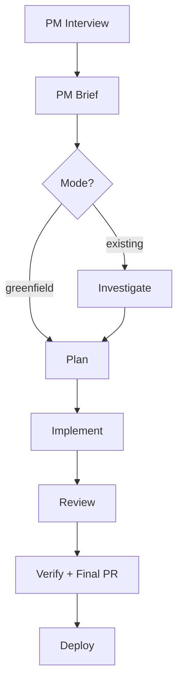

# Automated Software Factory v3

> Status: Idea (supersedes v2)
> Last Updated: 2026-02-08
>
> Inputs (new since v2):
> - docs/ideas/skills-sh-migration.md (skills.sh + Eve AgentPacks)
>
> Inputs (carried from v2):
> - docs/system/agents.md, job-api.md, manifest.md, skills.md, pipelines.md
> - docs/system/workflows.md, events.md, harness-policy.md, harness-execution.md
> - docs/system/orchestration-skill.md, job-git-controls.md, job-control-signals.md
> - docs/system/chat-routing.md, threads.md, agent-runtime.md, skillpacks.md
> - docs/ideas/prd-to-epic-workflow.md, workflows-as-skills.md
>
> Key difference from v2: AgentPacks are being built. The factory is the
> flagship AgentPack. Installation is a single manifest entry. Customization
> is overlay-based. Upgrades are a ref bump. Two of v2's five gaps are closed.

## North Star (Unchanged)

**An Eve app with no services — only agents — that turns ideas into production
software with zero humans in the loop by default.**

```
Idea → Spec → Design → Plan → Implement → Review → Test → Deploy → Monitor → Heal
  ^                                                                              |
  └──────────────────────────────────────────────────────────────────────────────-─┘
```

---

## MVP Re-jig (2026-02-08)

Re-scoped for an MVP with these constraints:

- **Models**: Opus 4.6 and Codex 5.3 only.
- **Harnesses**: `mclaude` and `codex` only.
- **PM roles first**: add product-manager agents up front that interview the human when requirements are not concrete.
- **Fewer agents**: remove councils/fanout and specialized reviewers by default.
- **Two modes**: works for both greenfield (blank slate) and existing mature codebases (feature work).

Non-goals for MVP:

- Self-healing/self-improvement loops, cron triggers, and multi-council review topologies (kept as later phases / optional add-ons).

## Evolution: v1 → v2 → v3

| | v1 | v2 | v3 |
|---|---|---|---|
| **Factory is...** | New platform primitive (agent packs + docs API) | Skillpack + template YAML (no new primitives) | An **Eve AgentPack** (skills + metadata, single manifest entry) |
| **Install** | `manifest.pack` + new CLI | Copy templates, edit skills.txt, sync | Add `x-eve.packs` entry, sync |
| **Upgrade** | Bump `pack_ref`, re-sync | Re-copy templates, diff manually | Bump `ref`, re-sync |
| **Customize** | Deep merge proposed but unspecified | Copy and edit YAML files | Kustomize-style overlays with `_remove` |
| **Slug conflicts** | "Open question" | Manual deconfliction | `namespace.slug_prefix` |
| **Platform changes for MVP** | 9 gaps (4 high) | 0 gaps | 0 gaps (AgentPacks built independently) |
| **Harness profiles** | New `model_matrix` dispatch | Existing team fanout + per-agent profiles | Same, but defaults ship *with* the pack |
| **Specs** | OpenSpec required | Plain markdown | Plain markdown (OpenSpec optional) |
| **Determinism** | Not addressed | Not addressed | Lockfile (`.eve/packs.lock.json`) |

### What Changed from v2

v2 proved the factory needs zero new platform primitives. But it had a UX
problem: installation required 4 manual steps (edit skills.txt, copy YAML,
edit manifest, sync). Upgrading was worse (re-copy or manual diff).

The skills.sh migration introduces **Eve AgentPacks** — a repo containing
skills *plus* Eve metadata (agents, teams, chat, harness profiles). This
is being built as a general-purpose composition primitive, not factory-specific.
The factory is its flagship consumer.

AgentPacks close two of v2's five gaps:
- **Gap 1** (factory install CLI) → eliminated; manifest entry IS the install
- **Gap 4** (merge semantics) → solved by the overlay model

---

## The Factory Is an Eve AgentPack

An AgentPack is a git repo containing:
- **Skills** (`skills/` directory with SKILL.md files)
- **Eve metadata** (`eve/` directory with agents/teams/chat/harness config)

The pack ships a complete multi-agent system. Projects consume it via a
single `x-eve.packs` entry in their manifest and optionally overlay
project-specific customizations.

### Factory Repo Layout

```
eve-software-factory/
├── skills/
│   ├── factory-pm-interview/SKILL.md
│   ├── factory-pm-brief/SKILL.md
│   ├── factory-investigate/SKILL.md        # existing-codebase only
│   ├── factory-planner/SKILL.md            # spec + design + plan (MVP)
│   ├── factory-implement/SKILL.md
│   ├── factory-review/SKILL.md             # single reviewer (MVP)
│   └── factory-verify/SKILL.md
│
│   # Optional (post-MVP) specialisation
│   # ├── factory-intake/SKILL.md
│   # ├── factory-spec/SKILL.md
│   # ├── factory-architect/SKILL.md
│   # ├── factory-review-security/SKILL.md
│   # ├── factory-review-correctness/SKILL.md
│   # ├── factory-review-simplicity/SKILL.md
│   # ├── factory-review-tests/SKILL.md
│   # ├── factory-ops/SKILL.md
│   # └── factory-improve/SKILL.md
├── eve/
│   ├── pack.yaml              # Pack descriptor
│   ├── agents.yaml            # Base agent roster
│   ├── teams.yaml             # Base team topology
│   ├── chat.yaml              # Base chat routes
│   └── x-eve.yaml             # Default harness profiles + defaults
├── config/
│   └── factory.yaml           # Factory-specific config (HITL gates, etc.)
└── README.md
```

### `eve/pack.yaml`

```yaml
version: 1
kind: agentpack
id: software-factory

imports:
  agents: eve/agents.yaml
  teams: eve/teams.yaml
  chat: eve/chat.yaml
  x_eve: eve/x-eve.yaml
```

### `eve/x-eve.yaml` (Shipped with Pack)

The pack ships sensible default harness profiles. Projects can override any
profile in their own manifest — project-level `x-eve` wins via deep-merge.

```yaml
# Default harness profiles shipped with the factory pack (MVP: only Opus 4.6 + Codex 5.3)
agents:
  profiles:
    fast-triage:
      - harness: mclaude
        model: opus-4.6
        reasoning_effort: low
    deep-reasoning:
      - harness: codex
        model: codex-5.3
        reasoning_effort: x-high
      - harness: mclaude
        model: opus-4.6
        reasoning_effort: high
    primary-coder:
      - harness: mclaude
        model: opus-4.6
        reasoning_effort: high
    primary-reviewer:
      - harness: codex
        model: codex-5.3
        reasoning_effort: high
      - harness: mclaude
        model: opus-4.6
        reasoning_effort: high

  defaults:
    harness: mclaude
    harness_profile: primary-coder
    git:
      commit: auto
      push: on_success
```

---

## Installation: One Manifest Entry

### Minimal Install (Zero Customization)

```yaml
# .eve/manifest.yaml
x-eve:
  packs:
    - id: software-factory
      kind: agentpack
      source: https://github.com/yourorg/eve-software-factory
      ref: v1.0.0
      namespace:
        slug_prefix: "${project_slug}-"
```

```bash
eve agents sync --project proj_myapp --ref main --repo-dir .
```

That's it. Skills are installed at job execution time. Agent/team/chat config
is resolved and merged at sync time. Harness profiles come from the pack.

### With Project Overlays

Projects keep their normal `agents/agents.yaml`, `agents/teams.yaml`, and
`agents/chat.yaml`. When packs are present, these become **overlays** —
deep-merged on top of the pack base.

```yaml
# agents/agents.yaml (project overlay)
version: 1
_remove: [factory_investigate]          # Greenfield project: never run investigate step
agents:
  factory_implement:
    harness_profile: python-coder       # This project uses Python-specific model
  custom_compliance_reviewer:           # Add a project-specific reviewer
    skill: custom-compliance-review
    harness_profile: deep-reasoning
    description: "Domain-specific compliance review"
```

```yaml
# .eve/manifest.yaml (project-level harness override)
x-eve:
  packs:
    - id: software-factory
      source: https://github.com/yourorg/eve-software-factory
      ref: v1.0.0
      namespace:
        slug_prefix: "${project_slug}-"

  agents:
    config_path: agents/agents.yaml     # overlay file
    teams_path: agents/teams.yaml       # overlay file
    profiles:
      python-coder:                     # project-specific profile
        - harness: mclaude
          model: opus-4.6
          reasoning_effort: high
```

### Upgrade Flow

```bash
# In manifest: bump ref from v1.0.0 → v1.1.0
# Then:
eve agents sync --project proj_myapp --ref main --repo-dir .
```

Overlays stay unchanged. New agents/skills from the pack appear automatically.
Removed pack agents disappear. The lockfile (`.eve/packs.lock.json`) records
the resolved SHA for reproducibility.

### Resolution Order (From skills-sh-migration.md)

At **sync time** (`eve agents sync`):
1. Fetch pack at `source@ref`
2. Read `eve/pack.yaml` for import paths
3. Load base: agents.yaml, teams.yaml, chat.yaml, x-eve.yaml from pack
4. Apply slug namespacing (`slug_prefix`)
5. Deep-merge project overlays on top (project wins)
6. Sync effective config to API (API shape unchanged)

At **job execution time** (worker):
1. Worker reads `x-eve.packs` from manifest
2. Installs skills via `skills add <source> --skill '*'`
3. Skills available in `.claude/skills/` and `.agents/skills/`

---

## Agent Roster (`eve/agents.yaml`)

```yaml
# eve/agents.yaml — shipped with factory AgentPack (MVP roster)
version: 1
agents:
  factory_pm_interview:
    slug: factory-pm-interview
    skill: factory-pm-interview
    harness_profile: fast-triage
    description: "Interviews the human when requirements are underspecified; otherwise skips"
    policies:
      permission_policy: auto_edit
      git: { commit: auto, push: on_success }

  factory_pm_brief:
    slug: factory-pm-brief
    skill: factory-pm-brief
    harness_profile: fast-triage
    description: "Produces a concrete brief + acceptance criteria; selects greenfield vs existing"
    policies:
      permission_policy: auto_edit
      git: { commit: auto, push: on_success }

  factory_investigate:
    slug: factory-investigate
    skill: factory-investigate
    harness_profile: deep-reasoning
    description: "Existing-codebase only: maps architecture, constraints, and the safest change plan"
    policies:
      permission_policy: auto_edit
      git: { commit: auto, push: on_success }

  factory_planner:
    slug: factory-planner
    skill: factory-planner
    harness_profile: deep-reasoning
    description: "Writes spec + design + plan (MVP: single stream by default)"
    policies:
      permission_policy: auto_edit
      git: { commit: auto, push: on_success }

  factory_implement:
    slug: factory-implement
    skill: factory-implement
    harness_profile: primary-coder
    description: "Implements the plan with tests"
    policies:
      permission_policy: auto_edit
      git: { commit: auto, push: on_success }

  factory_review:
    slug: factory-review
    skill: factory-review
    harness_profile: primary-reviewer
    description: "Single reviewer pass: correctness, security, simplicity, test gaps"
    policies:
      permission_policy: auto_edit

  factory_verify:
    slug: factory-verify
    skill: factory-verify
    harness_profile: deep-reasoning
    description: "Runs test suite + checks acceptance criteria against the brief/spec"
    policies:
      permission_policy: auto_edit
      git: { commit: auto, push: on_success }
```

## Team Topology (`eve/teams.yaml`) (MVP)

```yaml
# eve/teams.yaml — shipped with factory AgentPack
version: 1
teams:
  # MVP ships no councils/fanout by default. A single `factory_review` agent is used.
  # Projects can add review councils later via overlays.
```

---

## Factory Pipeline (MVP Re-jig)

Each phase uses existing Eve primitives. What changed from v2/v3-original is
the **default agent roster and topology**: MVP adds PM interview roles up front
and removes councils/specialised reviewers by default.

### Phase 1: PM Interview (Conditional)
- **Agent**: `factory_pm_interview` (fast-triage)
- If the input is underspecified, asks targeted questions to make requirements concrete.
- If already concrete, emits "no questions" and continues.
- Slack/chat invocation is the ideal UX (interactive). Non-chat triggers can fail fast with a questions list.

### Phase 2: PM Brief
- **Agent**: `factory_pm_brief` (fast-triage)
- Writes a brief with: goals, non-goals, acceptance criteria, edge cases, constraints, rollout.
- Selects `factory_mode: greenfield | existing` and writes it into the brief metadata.
- Creates feature branch `feat/<slug>` and commits the brief.

### Phase 3: Investigation (Existing Only)
- **Agent**: `factory_investigate` (deep-reasoning)
- Runs only when `factory_mode=existing`.
- Produces a repo map: architecture, critical paths, test strategy, risk areas, and suggested change approach.

### Phase 4: Plan (Spec + Design + Task Breakdown)
- **Agent**: `factory_planner` (deep-reasoning)
- Outputs:
  - `docs/specs/<slug>-spec-v1.md` (Given/When/Then scenarios)
  - `docs/plans/<slug>-plan-v1.md` (design decisions + steps)
- MVP default: **single stream** (no parallel fanout). Optional later: multiple streams.

### Phase 5: Implement
- **Agent**: `factory_implement` (primary-coder)
- Implements the plan, adds tests, keeps changes scoped.
- Opens a PR into `feat/<slug>`.

### Phase 6: Review
- **Agent**: `factory_review` (primary-reviewer)
- Single reviewer pass (no council): correctness, security, and test gaps.
- Approve → proceed. Reject → new attempt.

### Phase 7: Verify + Final PR
- **Agent**: `factory_verify` (deep-reasoning)
- Runs test suite on `feat/<slug>` and cross-checks acceptance criteria/spec coverage.
- Opens final PR from `feat/<slug>` → `main`.

### Phase 8: Deploy (Normal Project Pipeline)
- Pipeline trigger on push to `main`. Standard build → test → release → deploy.

### Job Graph



---

## Target Project Manifest (Complete Example)

```yaml
# .eve/manifest.yaml
schema: eve/compose/v1
project: my-app

# --- AgentPack reference (this is the entire factory install) ---
x-eve:
  packs:
    - id: software-factory
      kind: agentpack
      source: https://github.com/yourorg/eve-software-factory
      ref: v1.0.0
      namespace:
        slug_prefix: "${project_slug}-"

  # Optional: override harness profiles from the pack
  agents:
    config_path: agents/agents.yaml     # overlay (optional)
    teams_path: agents/teams.yaml       # overlay (optional; only if you add councils/teams)

  # Optional: project-level defaults that override pack defaults
  defaults:
    harness: mclaude
    harness_profile: primary-coder

# --- Workflows (can reference pack skills) ---
workflows:
  factory-run:
    trigger:
      github:
        event: issues
        action: opened
        label: factory
    steps:
      - agent:
          prompt: "Start a factory run (PM interview -> brief -> plan -> implement -> review -> verify)"
          skill: factory-pm-interview

# --- Normal project pipelines ---
pipelines:
  deploy-production:
    trigger:
      github:
        event: push
        branch: main
    steps:
      - name: build
        action: { type: build }
      - name: test
        script: { run: "pnpm test", timeout: 1800 }
      - name: release
        depends_on: [build, test]
        action: { type: release }
      - name: deploy
        depends_on: [release]
        action: { type: deploy }
```

---

## Correctness Verification (MVP)

Uses existing Eve primitives — no new verification system.

1. **Spec-driven tests**: Planner writes Given/When/Then; implementer writes
   matching tests; verifier cross-checks coverage.
2. **Review pass**: Single reviewer agent blocks on critical findings.
   Optional later: add a second reviewer pass (still only Opus + Codex).
3. **Existing test suite**: Pipeline steps run `pnpm test`. Factory doesn't
   skip quality gates.
4. **Deploy verification**: Post-deploy health checks via pipeline steps.
5. **Escape hatch**: Review rejection → retry with different model or escalate
   to human.

---

## HITL Mode (Unchanged from v2)

Controlled by factory skill config, not a platform primitive.

```yaml
# config/factory.yaml
version: 1
hitl:
  enabled: false
  gates:
    brief_approval: false
    plan_approval: false
    merge_approval: false
    deploy_approval: false
```

When a gate is enabled, the corresponding skill creates jobs with
`review_required: human`. Notifications via existing Slack integration.

---

## Gap Analysis (v3)

### Gaps Closed by AgentPacks

| v2 Gap | How AgentPacks Close It |
|--------|------------------------|
| Gap 1: Factory install CLI | Eliminated. `x-eve.packs` entry IS the install. |
| Gap 4: Agent pack merge semantics | Solved. Overlay model with deep-merge + `_remove`. |

### Remaining Gaps (3 of 5 from v2)

#### Gap 1 (was v2 Gap 2): Cron-Based Event Triggers

**Problem**: Self-improvement and scheduled monitoring need cron triggers.

**Solution**: Implement cron-based event emission in the orchestrator.

**Priority**: Medium. Self-improvement is Phase 5, not MVP.

#### Gap 2 (was v2 Gap 3): System Event Trigger Matching for Workflows

**Problem**: Remediation workflows need `system.pipeline.failed` triggers.

**Solution**: Add `system` as a trigger source in the event router.

**Priority**: High for self-healing (Phase 4), not needed for factory MVP.

#### Gap 3 (was v2 Gap 5): Per-Project Job Concurrency Limits

**Problem**: A factory run with 6 parallel streams could saturate workers.

**Solution**: Per-project concurrency caps in the orchestrator.

**Priority**: Medium. Important for multi-project orgs.

### Dependency: AgentPacks Themselves

The factory v3 depends on AgentPacks being implemented (skills-sh-migration.md
Phase 2). This is not a factory-specific gap — AgentPacks are being built as
a general-purpose composition primitive. The factory is the driving use case.

Until AgentPacks ship, the factory can launch using the v2 approach (copy
templates + skills.txt). Migration from v2 → v3 is straightforward:
remove copied templates, add `x-eve.packs` entry, create overlays from diffs.

---

## Fork + Customise (Enhanced by Overlays)

### Organisation Level (Fork the Pack)

Fork the factory repo. Customise broadly:
- Edit skill SKILL.md files (review criteria, coding standards, personas).
- Adjust `eve/x-eve.yaml` (default models, reasoning effort).
- Adjust `config/factory.yaml` (HITL gates, stream concurrency).
- Add or remove agents in `eve/agents.yaml`.

### Project Level (Overlay the Pack)

No fork needed. Add lightweight overlays:

```yaml
# agents/agents.yaml (overlay)
version: 1
_remove: [factory_investigate]       # Greenfield project: never run investigate step
agents:
  factory_implement:
    harness_profile: python-coder     # Override for Python project
  my_compliance_reviewer:             # Add a project-specific agent
    skill: compliance-review
    harness_profile: deep-reasoning
```

### Slug Namespacing

Agent slugs must be org-unique. The pack defines base slugs (e.g., `factory-pm-interview`).
The manifest `namespace.slug_prefix: "${project_slug}-"` yields:
- `myapp-factory-pm-interview`
- `myapp-factory-review`

Multiple projects in the same org can install the same factory pack with
different prefixes — no slug collisions.

---

## Priority Roadmap (Updated)

### Phase 1: Minimum Viable Factory (Before AgentPacks)

**Goal**: End-to-end factory run using v2 approach (copy templates).

1. Create the factory repo with skill SKILL.md files.
2. Create `eve/agents.yaml`, `eve/teams.yaml`, `eve/x-eve.yaml`.
3. Create `config/factory.yaml` schema.
4. Install into test project via v2 flow (skills.txt + copy YAML).
5. Run: PM interview (conditional) → PM brief → investigate (existing only) → plan → implement → review → verify → PR → merge.
6. Use only two models across all agents: Opus 4.6 (`mclaude`) + Codex 5.3 (`codex`).

**Requires from Eve**: Nothing new.

### Phase 2: AgentPack Migration

**Goal**: Switch from copy-template to manifest-driven install.

1. AgentPacks ship (skills-sh-migration.md Phase 2).
2. Add `eve/pack.yaml` to factory repo.
3. Target projects switch from copied YAML to `x-eve.packs` entry.
4. Existing overlays (if any) keep working via merge semantics.

**Requires from Eve**: AgentPacks (being built independently).

### Phase 3: Optional Two-Model Reviews (Opus + Codex)

**Goal**: Better coverage without adding new models/harnesses.

1. Add a second reviewer pass (e.g., Codex correctness + Opus security/UX) via overlays.
2. Keep credential setup limited to `mclaude` and `codex`.
3. Tune review prompts for the two models.

**Requires from Eve**: Nothing new.

### Phase 4: Background Reviews + CI/CD

**Goal**: Continuous quality monitoring.

1. Pipeline triggers for push/PR events.
2. Background review workflows.
3. Integrate with project's existing CI/CD.

**Requires from Eve**: Nothing new.

### Phase 5: Self-Healing

**Goal**: Autonomous monitoring and remediation.

1. Ops agent with system event triggers.
2. Constrained remediation pipeline.
3. Rollback as fallback.

**Requires from Eve**: System event trigger matching (Gap 2).

### Phase 6: Self-Improvement

**Goal**: The factory improves itself.

1. Cron-triggered performance analysis.
2. Self-improvement PRs to factory repo.
3. Recursive quality gates.

**Requires from Eve**: Cron event emission (Gap 1).

---

## Getting Started (User Journey)

### 1. Fork the Factory

```bash
gh repo fork eve-horizon/eve-software-factory --clone
cd eve-software-factory
# Optional: customise skills, harness profiles, factory config
```

### 2. Install into Target Project

**With AgentPacks (Phase 2+):**

Add to `.eve/manifest.yaml`:

```yaml
x-eve:
  packs:
    - id: software-factory
      kind: agentpack
      source: https://github.com/yourorg/eve-software-factory
      ref: v1.0.0
      namespace:
        slug_prefix: "${project_slug}-"
```

```bash
eve agents sync --project proj_myapp --ref main --repo-dir .
```

**Before AgentPacks (Phase 1):**

```bash
# v2 approach (copy templates)
echo "https://github.com/yourorg/eve-software-factory" >> skills.txt
cp factory-repo/eve/agents.yaml agents/agents.yaml
cp factory-repo/eve/teams.yaml agents/teams.yaml
eve agents sync --project proj_myapp --ref main --repo-dir .
```

### 3. Customise (Optional)

```yaml
# agents/agents.yaml (overlay — only what you want to change)
version: 1
_remove: [factory_investigate]
agents:
  factory_implement:
    harness_profile: python-coder
```

### 4. Run the Factory

```bash
# Via CLI
eve workflow run factory-run --input '{"description":"Add OAuth2 authentication"}'

# Via GitHub issue with "factory" label
# Via Slack: @eve myapp-factory-pm-interview Add OAuth2 authentication
```

### 5. Watch

```bash
eve job tree <epic-job-id>
eve job follow <epic-job-id>
```

### 6. Upgrade the Factory

```bash
# In manifest: bump ref v1.0.0 → v1.1.0
eve agents sync --project proj_myapp --ref main --repo-dir .
# Overlays preserved. New skills/agents appear. Lockfile updated.
```

---

## Why v3 Is Better Than v2

1. **One-entry install.** v2 required editing skills.txt, copying 3 YAML files,
   editing the manifest, and syncing. v3 adds one `x-eve.packs` entry and syncs.

2. **Clean upgrades.** v2 upgrades meant re-copying templates and manually
   diffing changes. v3 bumps a ref.

3. **Proper customization.** v2 copied and edited templates — a recipe for
   drift. v3 overlays are minimal diffs that survive upgrades.

4. **Slug namespacing.** v2 had manual slug deconfliction. v3 uses
   `slug_prefix` — multiple projects install the same pack safely.

5. **Supply chain hygiene.** v3 gets a lockfile for deterministic resolution
   and provenance tracking. v2 had none.

6. **Same primitives, better packaging.** Every phase still uses existing Eve
   primitives. What improved is the developer experience of adopting, upgrading,
   and customising the factory via AgentPacks + overlays.

7. **Graceful migration.** Phase 1 uses v2's copy approach. Phase 2 migrates
   to AgentPacks. Projects aren't blocked on AgentPacks shipping.

---

## Symbiosis: Factory Drives AgentPacks

The skills-sh-migration doc explicitly identifies the factory as the driving
use case: *"Automated Software Factory v2 highlights the UX gap: installing
it requires editing skills.txt, copying YAML templates, editing the manifest,
and syncing."*

This is healthy. The factory is the most complex AgentPack we'll build — if
the composition model works for it, it works for everything simpler. The
factory validates:

- Multi-agent roster composition
- Team topology shipping
- Harness profile defaults
- Overlay-based customization
- Slug namespacing across orgs
- Lockfile determinism

Every simpler pack (ops monitoring, security auditing, code review) benefits
from patterns proven by the factory.

---

## Open Questions

1. **PM interview UX**: For non-chat triggers (GitHub issues/workflows), how
   should the PM interview step "wait" for answers?
   Proposal: fail fast with a structured questions list (rerun when answered),
   or create a HITL gate job that requires a human-provided `docs/briefs/...` update.

2. **Workflow definitions in packs**: Should the factory pack ship workflow
   definitions (factory-run) or should projects define these?
   Proposal: pack ships example/default workflows in a `eve/workflows.yaml`
   fragment, imported into the manifest via a similar merge strategy. TBD
   whether `x-eve.packs.import.workflows` is needed.

3. **Factory config**: `config/factory.yaml` controls HITL gates and stream
   concurrency. Should this be importable via the pack, or always project-local?
   Proposal: ship defaults in the pack, override per-project. The pack's
   `config/factory.yaml` is read by skills at runtime (not by Eve tooling).

4. **Pack composition**: Can a project install multiple AgentPacks (factory +
   ops monitoring + code review)? How are agent ID conflicts handled?
   Proposal: `slug_prefix` per pack avoids slug conflicts. Agent key conflicts
   across packs fail at sync time with a clear error.

5. **Pack-shipped pipelines/workflows**: The factory needs workflows (factory-run,
   remediation) and pipelines (deploy-production) in the target project. Should
   the pack be able to contribute these to the manifest? Or should projects
   always define pipelines/workflows locally? This is the deepest open question
   and may warrant its own design doc.

6. **v2 open questions** (unchanged): Skill granularity, stream concurrency
   defaults, review iteration depth, cost governance, OpenSpec integration,
   concurrent factory runs, factory-of-factories. See v2 doc for details.
