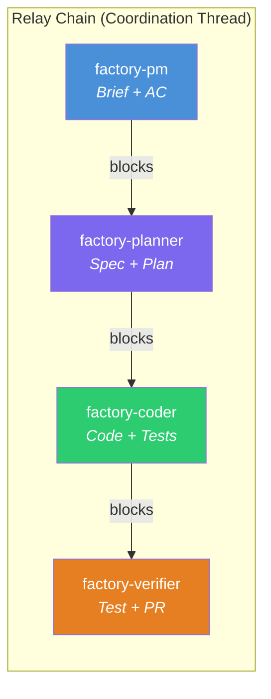
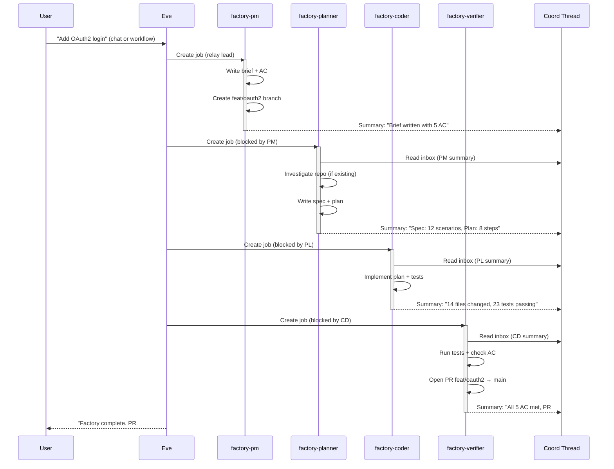
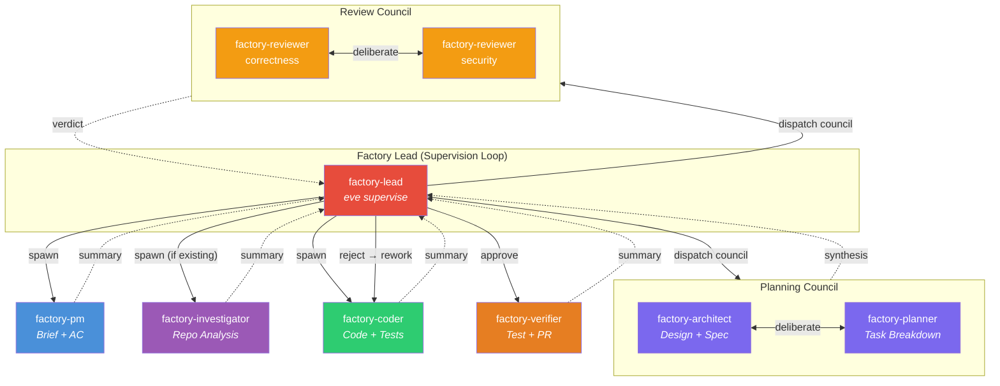
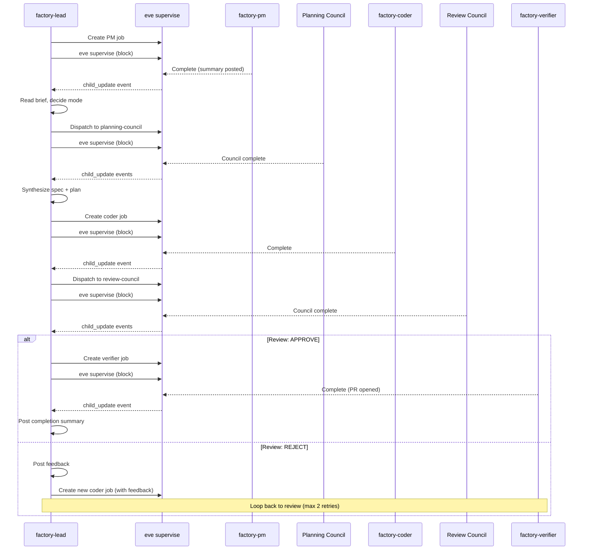
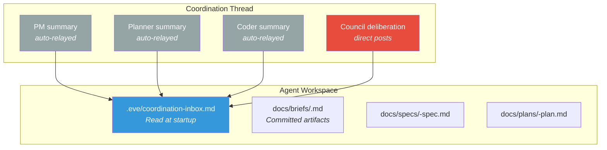

# Automated Software Factory v4

> Status: Idea (supersedes v3)
> Last Updated: 2026-02-09
>
> Inputs (new since v3):
> - Agent team coordination: threads, supervision, council/relay dispatch
> - Unified permissions: per-job credentials, membership API
> - AgentPacks: resolution pipeline, overlay merge, lockfile
>
> Inputs (carried from v3):
> - docs/system/agents.md, job-api.md, manifest.md, skills.md, pipelines.md
> - docs/system/workflows.md, events.md, harness-policy.md, harness-execution.md
> - docs/system/orchestration-skill.md, job-control-signals.md, threads.md
> - docs/system/chat-routing.md, agent-runtime.md, skillpacks.md
>
> Key difference from v3: Team coordination is built. The factory finally has
> the primitives it was always waiting for — supervision, councils, relay
> chains, and coordination threads. This changes everything.

## North Star

**An Eve AgentPack that turns ideas into production software.**

```
Idea  ──▶  Brief  ──▶  Plan  ──▶  Code  ──▶  Verify  ──▶  Ship
```

Two editions. Same pack. Relay mode gets you started in minutes.
Council mode gives you multi-agent deliberation when you're ready.

---

## What Changed Since v3

v3 was written before team coordination existed. It described agents that
worked in isolation, handing off via git commits and job dependencies. The
coordination tax was brutal — each agent cold-started, re-read the repo,
and inferred context from file diffs.

Three things shipped since then:

**1. Coordination Threads** — Agents share a persistent thread keyed by
`coord:job:{parent_job_id}`. End-of-attempt summaries post automatically.
Agents read `.eve/coordination-inbox.md` at startup for instant context.
The handoff problem is solved.

**2. Supervision** — `eve supervise` lets a lead agent long-poll for child
events with sub-second wake latency, preserving full conversation context.
No more 1.5–6 minute cold-start penalties between phases. The lead stays
alive and makes intelligent decisions at each gate.

**3. Dispatch Topologies** — Teams now support three modes:
- **Fanout**: Parallel child jobs (existing)
- **Council**: Same prompt to N specialists who deliberate, lead synthesizes
- **Relay**: Sequential chain where each agent builds on the previous output

These three primitives collapse the factory from a complex orchestration
problem into a natural team pattern.

---

## Evolution: v1 → v2 → v3 → v4

| | v1 | v2 | v3 | **v4** |
|---|---|---|---|---|
| **Factory is...** | New platform primitive | Skillpack + template YAML | AgentPack (before coordination) | **AgentPack + team coordination** |
| **Agent communication** | None | None | None (git-mediated) | **Coordination threads + inbox** |
| **Orchestration** | Unspecified | Job dependencies | Job dependencies | **Relay chain (MVP) / Supervision loop (Advanced)** |
| **Review** | Unspecified | Single reviewer | Single reviewer | **Single pass (MVP) / Review council (Advanced)** |
| **Planning** | Unspecified | Single planner | Single planner | **Single planner (MVP) / Planning council (Advanced)** |
| **Cold starts** | Every phase | Every phase | Every phase | **Every phase (MVP) / Lead stays alive (Advanced)** |
| **Platform changes** | 9 gaps | 0 gaps | 0 gaps | **0 gaps** |

---

## Architecture

### Design Philosophy

1. **Fewer agents, better prompts.** The MVP uses 4 agents. Each one has a
   clear, atomic responsibility. Complexity comes from composition, not count.

2. **Relay before council.** Start with a simple sequential chain. Graduate
   to multi-agent deliberation when the relay chain proves the flow works.

3. **The thread is the memory.** Coordination threads replace file-based
   handoff. Every agent reads the inbox, does its work, and posts a summary.
   The next agent picks up seamlessly.

4. **One pack, two modes.** The AgentPack ships both the relay team and the
   council teams. Projects choose their mode via team config. Upgrade is an
   overlay change, not a migration.

5. **Existing primitives only.** No new platform features required. Everything
   uses jobs, teams, threads, skills, and the control envelope.

### Two Editions, One Pack

```
┌─────────────────────────────────────────────────────────────┐
│                    eve-software-factory                      │
│                                                             │
│  ┌───────────────────────┐  ┌────────────────────────────┐  │
│  │   Factory Relay (MVP) │  │   Factory Council (Adv.)   │  │
│  │                       │  │                            │  │
│  │  4 agents             │  │  8 agents                  │  │
│  │  1 relay team         │  │  1 lead + 2 council teams  │  │
│  │  No supervision       │  │  Stay-alive supervision    │  │
│  │  Sequential chain     │  │  Deliberation + iteration  │  │
│  └───────────────────────┘  └────────────────────────────┘  │
│                                                             │
│  Same skills. Same pack. Different team topology.           │
└─────────────────────────────────────────────────────────────┘
```

---

## Phase 1: Factory Relay (MVP)

The MVP is a relay chain — four specialists executing in sequence, each
building on the previous agent's work. No supervision loop, no councils,
no lead agent. Just a clean pipeline of experts.

### Agent Roster

| Agent | Skill | Profile | Role |
|-------|-------|---------|------|
| `factory-pm` | `factory-pm` | `fast-triage` | Intake, interview, write brief + acceptance criteria |
| `factory-planner` | `factory-planner` | `deep-reasoning` | Spec (Given/When/Then), design, task breakdown |
| `factory-coder` | `factory-coder` | `primary-coder` | Implement plan, write tests, commit |
| `factory-verifier` | `factory-verifier` | `deep-reasoning` | Run tests, check acceptance criteria, open PR |

### Team Topology

```yaml
# eve/teams.yaml (shipped with pack)
version: 1
teams:
  factory:
    lead: factory-pm
    members: [factory-planner, factory-coder, factory-verifier]
    dispatch:
      mode: relay
```

Relay mode creates the chain automatically:
1. `factory-pm` executes (writes brief, creates feature branch)
2. `factory-planner` executes (blocked until PM completes; reads PM's brief via coordination inbox)
3. `factory-coder` executes (blocked until planner completes; reads spec + plan)
4. `factory-verifier` executes (blocked until coder completes; runs tests, opens PR)

Each agent posts an `eve.summary` on completion. The orchestrator relays it
to the coordination thread. The next agent reads it from
`.eve/coordination-inbox.md` at startup.

### The Flow



### What Each Agent Does

**factory-pm** (fast-triage)
```
1. Read the incoming request
2. If underspecified → fail with structured questions (non-chat)
   or ask interactively (chat-triggered)
3. Determine factory_mode: greenfield | existing
4. Write brief to docs/briefs/<slug>.md
   - Goals, non-goals, acceptance criteria, constraints
5. Create feature branch: feat/<slug>
6. Commit + push
```

**factory-planner** (deep-reasoning)
```
1. Read coordination inbox (PM's brief summary)
2. Read docs/briefs/<slug>.md from repo
3. If factory_mode=existing → investigate repo structure
   (architecture, test strategy, risk areas)
4. Write spec: docs/specs/<slug>-spec.md
   - Given/When/Then scenarios for each acceptance criterion
5. Write plan: docs/plans/<slug>-plan.md
   - Design decisions, implementation steps, test strategy
6. Commit + push
```

**factory-coder** (primary-coder)
```
1. Read coordination inbox (planner's summary)
2. Read spec + plan from repo
3. Implement each step from the plan
4. Write tests matching spec scenarios
5. Run tests locally (fix if failing)
6. Commit + push
```

**factory-verifier** (deep-reasoning)
```
1. Read coordination inbox (coder's summary)
2. Run full test suite
3. Cross-check each acceptance criterion against:
   - Spec scenarios (are they covered?)
   - Test results (do they pass?)
   - Code changes (do they match the plan?)
4. If tests fail or criteria unmet → report failures
5. If all pass → open PR from feat/<slug> to main
6. Post final summary with PR link
```

### Sequence Diagram



### Git Workflow

All agents in the relay share a feature branch. Each agent commits and pushes;
the next agent clones the latest state.

```yaml
# Factory jobs inherit these git defaults
x-eve:
  defaults:
    git:
      commit: auto
      push: on_success
```

The PM agent creates the feature branch. Subsequent agents auto-detect
the branch from the parent job's git metadata.

---

## Phase 2: Factory Council (Advanced)

The advanced edition replaces the relay chain with a supervision-based
architecture. A lead agent orchestrates the full pipeline, dispatching to
specialist agents and council teams. It stays alive via `eve supervise`,
making intelligent decisions at each gate.

### Extended Agent Roster

| Agent | Skill | Profile | Role |
|-------|-------|---------|------|
| `factory-lead` | `factory-lead` | `fast-triage` | Supervising orchestrator — manages the full pipeline |
| `factory-pm` | `factory-pm` | `fast-triage` | Intake, interview, write brief + acceptance criteria |
| `factory-investigator` | `factory-investigator` | `deep-reasoning` | Deep codebase analysis (existing repos only) |
| `factory-architect` | `factory-architect` | `deep-reasoning` | Design + spec (planning council member) |
| `factory-planner` | `factory-planner` | `deep-reasoning` | Task breakdown + plan (planning council member) |
| `factory-coder` | `factory-coder` | `primary-coder` | Implement plan, write tests |
| `factory-reviewer-correctness` | `factory-reviewer-correctness` | `primary-reviewer` | Code correctness + test coverage (review council) |
| `factory-reviewer-security` | `factory-reviewer-security` | `primary-reviewer` | Security audit + vulnerability check (review council) |
| `factory-verifier` | `factory-verifier` | `deep-reasoning` | Run tests, verify acceptance criteria, open final PR |

### Team Topology

```yaml
# eve/teams.yaml (advanced overlay)
version: 1
teams:
  planning-council:
    lead: factory-lead
    members: [factory-architect, factory-planner]
    dispatch:
      mode: council
      merge_strategy: lead_summarize

  review-council:
    lead: factory-lead
    members: [factory-reviewer-correctness, factory-reviewer-security]
    dispatch:
      mode: council
      merge_strategy: lead_summarize
```

### The Flow



### The Lead Agent

The `factory-lead` is the brain of the advanced factory. It stays alive
throughout the entire run via `eve supervise`, preserving full conversation
context across all phases.

```
1. Receive factory request
2. Spawn factory-pm → supervise → read brief from coordination thread
3. Decide: greenfield or existing?
4. If existing: spawn factory-investigator → supervise → read analysis
5. Dispatch to planning-council → supervise
   - Architect + Planner deliberate via coordination thread
   - Lead reads council findings, synthesizes final spec + plan
6. Spawn factory-coder → supervise → read implementation summary
7. Dispatch to review-council → supervise
   - Correctness + Security reviewers deliberate
   - Lead reads verdict
8. If REJECT: post feedback to coordination thread, re-spawn coder
   Go to step 6 (max 2 retries)
9. If APPROVE: spawn factory-verifier → supervise → read final PR
10. Post completion summary
```

The lead's orchestration skill encodes this flow. Each `eve supervise`
call blocks until a child event arrives — sub-second latency, zero
cold-start cost, full context preserved.

### Supervision Sequence



### How Councils Work

In council mode, all members receive the same prompt — the factory request
augmented with the current phase's context. Each member interprets it through
their specialist skill/persona.

**Planning Council** example:
- `factory-architect` focuses on design decisions, API contracts, data models
- `factory-planner` focuses on implementation steps, ordering, risk mitigation
- Both post their analyses to the coordination thread
- The lead reads both, synthesizes a unified spec + plan

**Review Council** example:
- `factory-reviewer-correctness` checks logic, test coverage, edge cases
- `factory-reviewer-security` checks auth, injection, secrets, OWASP top 10
- Both post their findings to the coordination thread
- The lead synthesizes a verdict: APPROVE or REJECT with specific feedback

Council deliberation happens naturally through the coordination thread.
Members can read each other's posts and respond — the thread is shared.

---

## AgentPack Structure

### Pack Layout

```
eve-software-factory/
├── skills/
│   ├── factory-pm/
│   │   ├── SKILL.md
│   │   └── references/
│   │       └── brief-template.md
│   ├── factory-planner/
│   │   ├── SKILL.md
│   │   └── references/
│   │       ├── spec-template.md
│   │       └── plan-template.md
│   ├── factory-coder/
│   │   └── SKILL.md
│   ├── factory-verifier/
│   │   └── SKILL.md
│   │
│   │   # Advanced skills (council edition)
│   ├── factory-lead/
│   │   ├── SKILL.md
│   │   └── references/
│   │       └── orchestration-flow.md
│   ├── factory-investigator/
│   │   └── SKILL.md
│   ├── factory-architect/
│   │   └── SKILL.md
│   ├── factory-reviewer-correctness/
│   │   └── SKILL.md
│   └── factory-reviewer-security/
│       └── SKILL.md
│
├── eve/
│   ├── pack.yaml              # Pack descriptor
│   ├── agents.yaml            # Full agent roster (MVP + advanced)
│   ├── teams-relay.yaml       # Relay team (default)
│   ├── teams-council.yaml     # Council teams (advanced)
│   ├── chat.yaml              # Chat routes
│   └── x-eve.yaml             # Harness profiles
│
├── config/
│   └── factory.yaml           # HITL gates + factory config
│
└── README.md
```

### `eve/pack.yaml`

```yaml
version: 1
kind: agentpack
id: software-factory

imports:
  agents: eve/agents.yaml
  teams: eve/teams-relay.yaml    # Default: relay mode
  chat: eve/chat.yaml
  x_eve: eve/x-eve.yaml
```

### `eve/agents.yaml`

```yaml
version: 1
agents:
  # ── MVP (Relay) Agents ───────────────────────────────────

  factory_pm:
    slug: factory-pm
    skill: factory-pm
    harness_profile: fast-triage
    description: "Intake and brief — interviews when underspecified, writes brief with acceptance criteria"
    policies:
      permission_policy: auto_edit
      git: { commit: auto, push: on_success }

  factory_planner:
    slug: factory-planner
    skill: factory-planner
    harness_profile: deep-reasoning
    description: "Spec + plan — investigates repo (if existing), writes Given/When/Then spec and implementation plan"
    policies:
      permission_policy: auto_edit
      git: { commit: auto, push: on_success }

  factory_coder:
    slug: factory-coder
    skill: factory-coder
    harness_profile: primary-coder
    description: "Implementation — builds the plan with tests, keeps changes scoped"
    policies:
      permission_policy: auto_edit
      git: { commit: auto, push: on_success }

  factory_verifier:
    slug: factory-verifier
    skill: factory-verifier
    harness_profile: deep-reasoning
    description: "Verification — runs tests, checks acceptance criteria, opens final PR"
    policies:
      permission_policy: auto_edit
      git: { commit: auto, push: on_success }

  # ── Advanced (Council) Agents ────────────────────────────

  factory_lead:
    slug: factory-lead
    skill: factory-lead
    harness_profile: fast-triage
    description: "Supervising orchestrator — manages the full factory pipeline via eve supervise"
    policies:
      permission_policy: auto_edit
      git: { commit: auto, push: on_success }

  factory_investigator:
    slug: factory-investigator
    skill: factory-investigator
    harness_profile: deep-reasoning
    description: "Deep codebase analysis — architecture, constraints, safest change approach"
    policies:
      permission_policy: auto_edit
      git: { commit: auto, push: on_success }

  factory_architect:
    slug: factory-architect
    skill: factory-architect
    harness_profile: deep-reasoning
    description: "Design specialist — API contracts, data models, architecture decisions (planning council)"
    policies:
      permission_policy: auto_edit
      git: { commit: auto, push: on_success }

  factory_reviewer_correctness:
    slug: factory-reviewer-correctness
    skill: factory-reviewer-correctness
    harness_profile: primary-reviewer
    description: "Correctness reviewer — logic, test coverage, edge cases (review council)"
    policies:
      permission_policy: auto_edit

  factory_reviewer_security:
    slug: factory-reviewer-security
    skill: factory-reviewer-security
    harness_profile: primary-reviewer
    description: "Security reviewer — auth, injection, secrets, OWASP top 10 (review council)"
    policies:
      permission_policy: auto_edit
```

### `eve/teams-relay.yaml` (Default)

```yaml
version: 1
teams:
  factory:
    lead: factory_pm
    members: [factory_planner, factory_coder, factory_verifier]
    dispatch:
      mode: relay
```

### `eve/teams-council.yaml` (Advanced)

```yaml
version: 1
teams:
  planning-council:
    lead: factory_lead
    members: [factory_architect, factory_planner]
    dispatch:
      mode: council
      merge_strategy: lead_summarize

  review-council:
    lead: factory_lead
    members: [factory_reviewer_correctness, factory_reviewer_security]
    dispatch:
      mode: council
      merge_strategy: lead_summarize
```

### `eve/chat.yaml`

```yaml
version: 1
routes:
  - pattern: "^factory\\b"
    target: team:factory
    description: "Route 'factory ...' messages to the factory team"
```

### `eve/x-eve.yaml`

```yaml
# Harness profiles shipped with the factory pack
# Uses two harnesses: claude (Opus 4.6) and codex (Codex 5.3)
agents:
  profiles:
    fast-triage:
      - harness: claude
        model: opus-4.6
        reasoning_effort: low

    deep-reasoning:
      - harness: codex
        model: codex-5.3
        reasoning_effort: x-high
      - harness: claude
        model: opus-4.6
        reasoning_effort: high

    primary-coder:
      - harness: codex
        model: codex-5.3
        reasoning_effort: high
      - harness: claude
        model: opus-4.6
        reasoning_effort: high

    primary-reviewer:
      - harness: codex
        model: codex-5.3
        reasoning_effort: high
      - harness: claude
        model: opus-4.6
        reasoning_effort: high

  defaults:
    harness: codex
    harness_profile: primary-coder
    git:
      commit: auto
      push: on_success
```

---

## Installation

### MVP (Relay Mode)

Two lines in the manifest. That's it.

```yaml
# .eve/manifest.yaml
x-eve:
  packs:
    - source: https://github.com/yourorg/eve-software-factory
      ref: <sha>
      namespace:
        slug_prefix: "${project_slug}-"
```

```bash
eve agents sync --project proj_myapp --ref main --repo-dir .
```

### Upgrade to Council Mode

Add a project overlay that swaps the team topology:

```yaml
# agents/teams.yaml (project overlay)
version: 1
teams:
  factory:
    _remove: true    # Remove the relay team

  # Use council teams instead
  planning-council:
    lead: factory_lead
    members: [factory_architect, factory_planner]
    dispatch:
      mode: council
      merge_strategy: lead_summarize

  review-council:
    lead: factory_lead
    members: [factory_reviewer_correctness, factory_reviewer_security]
    dispatch:
      mode: council
      merge_strategy: lead_summarize
```

```yaml
# agents/chat.yaml (project overlay)
version: 1
routes:
  - pattern: "^factory\\b"
    target: agent:factory-lead    # Route to lead instead of relay team
```

```bash
eve agents sync --project proj_myapp --ref main --repo-dir .
```

### Customization via Overlays

Remove agents you don't need:

```yaml
# agents/agents.yaml (project overlay)
version: 1
_remove: [factory_investigator]    # Greenfield project, never investigate
agents:
  factory_coder:
    harness_profile: python-coder  # Override for Python project
```

Add project-specific profiles:

```yaml
# .eve/manifest.yaml
x-eve:
  agents:
    profiles:
      python-coder:
        - harness: codex
          model: codex-5.3
          reasoning_effort: high
        - harness: claude
          model: opus-4.6
          reasoning_effort: high
```

### Upgrade the Pack

```bash
# Bump ref in manifest, then:
eve agents sync --project proj_myapp --ref main --repo-dir .
# Overlays preserved. New agents/skills appear. Lockfile updated.
```

---

## Running the Factory

### Via Chat (Recommended)

```
@eve factory Add OAuth2 login with Google and GitHub providers
```

The chat route matches `^factory\b` and dispatches to the factory team.
In relay mode, the PM agent starts the chain. In council mode, the lead
agent begins its supervision loop.

### Via Workflow

```yaml
# .eve/manifest.yaml
workflows:
  factory-run:
    hints:
      git:
        branch: "factory/${slug}"
        create_branch: if_missing
    steps:
      - agent:
          prompt: "Run the software factory"
          skill: factory-pm
```

```bash
eve workflow run factory-run --input '{"description":"Add OAuth2 login"}'
```

### Via GitHub Issue

```yaml
# .eve/manifest.yaml
workflows:
  factory-on-issue:
    trigger:
      github:
        event: issues
        action: opened
        label: factory
    steps:
      - agent:
          prompt: "Run the software factory for this issue"
```

Label a GitHub issue with `factory` and the workflow fires automatically.

### Watch Progress

```bash
eve job tree <job-id>              # See the full job hierarchy
eve job follow <job-id>            # Stream live output
eve thread follow <thread-key>     # Follow coordination thread
```

---

## HITL Gates

Controlled by factory config, not a platform primitive. Gates are read by
skills at runtime — enabling a gate makes the corresponding skill create
a job with `review_required: human`.

```yaml
# config/factory.yaml
version: 1
hitl:
  enabled: false
  gates:
    brief_approval: false     # Pause after PM writes brief
    plan_approval: false      # Pause after planning completes
    code_approval: false      # Pause after implementation
    merge_approval: false     # Pause before final PR merge
```

When a gate is enabled:
1. The skill posts a message to the coordination thread requesting approval
2. The job enters a `review_required: human` state
3. Notification sent via Slack integration
4. Human approves → factory continues
5. Human rejects with feedback → factory retries the phase

---

## The Communication Model

### How Context Flows Between Agents



**Three context channels (all built):**

| Channel | Mechanism | When |
|---------|-----------|------|
| **Coordination inbox** | `.eve/coordination-inbox.md` written by worker | Job start |
| **End-of-attempt relay** | Orchestrator auto-posts `eve.summary` to thread | Job completion |
| **Git artifacts** | Committed docs (briefs, specs, plans) in the repo | Between phases |

Council members also post directly to the coordination thread via
`eve thread post` for real-time deliberation.

---

## Gap Analysis (v4)

### Gaps Closed Since v3

| v3 Gap | How It's Closed |
|--------|-----------------|
| No agent-to-agent communication | Coordination threads + inbox file |
| Fire-and-forget orchestration | `eve supervise` stay-alive loop |
| No multi-perspective review | Council dispatch mode |
| No sequential handoff primitive | Relay dispatch mode |
| Cold-start tax at every phase | Lead stays alive (advanced mode) |

### Remaining Gaps (From v3, Unchanged)

| Gap | Priority | Notes |
|-----|----------|-------|
| Cron-based event triggers | Medium | Needed for self-improvement (Phase 5+), not MVP |
| System event trigger matching | Medium | Needed for self-healing (Phase 4+), not MVP |
| Per-project job concurrency limits | Medium | Important for multi-project orgs at scale |

### New Consideration: Factory-Run Branch Strategy

When multiple factory runs execute concurrently on the same project,
feature branches may conflict. The branch pattern `factory/<slug>` uses
a unique slug per run, avoiding collisions. Projects should ensure slugs
are unique (derived from issue ID, timestamp, or request hash).

---

## Priority Roadmap

### Phase 1: Relay MVP

**Goal**: End-to-end factory run with 4 agents in a relay chain.

1. Create the `eve-software-factory` repo
2. Write SKILL.md for: `factory-pm`, `factory-planner`, `factory-coder`, `factory-verifier`
3. Write pack metadata: `pack.yaml`, `agents.yaml`, `teams-relay.yaml`, `chat.yaml`, `x-eve.yaml`
4. Install into test project via `x-eve.packs`
5. Run: PM → Planner → Coder → Verifier → PR
6. Validate: coordination thread captures handoffs, each agent reads inbox

**Requires from Eve**: Nothing new. All primitives exist.

### Phase 2: Council Upgrade

**Goal**: Multi-agent deliberation for planning and review.

1. Write SKILL.md for: `factory-lead`, `factory-investigator`, `factory-architect`, `factory-reviewer-correctness`, `factory-reviewer-security`
2. Write `teams-council.yaml`
3. Write `factory-lead` orchestration skill (supervision loop + council dispatch)
4. Test: lead supervision loop, planning council deliberation, review council with approve/reject

**Requires from Eve**: Nothing new.

### Phase 3: Iteration and Refinement

**Goal**: Review-reject-rework loops and HITL gates.

1. Implement reject → rework flow in the lead's supervision loop
2. Add HITL gate support (`config/factory.yaml`)
3. Add human-in-the-loop Slack notifications
4. Tune prompts based on real factory runs

**Requires from Eve**: Nothing new.

### Phase 4: CI/CD Integration

**Goal**: Factory triggered by pipeline events.

1. GitHub issue/PR triggers for factory runs
2. Post-merge deploy pipelines
3. Background quality monitoring

**Requires from Eve**: Nothing new.

### Phase 5+: Self-Healing and Self-Improvement

Deferred. Requires cron triggers and system event matching (v3 gaps).

---

## Getting Started

### 1. Fork the Factory

```bash
gh repo fork eve-horizon/eve-software-factory --clone
cd eve-software-factory
# Optional: customise skills, harness profiles
```

### 2. Install

```yaml
# .eve/manifest.yaml
x-eve:
  packs:
    - source: https://github.com/yourorg/eve-software-factory
      ref: <sha>
      namespace:
        slug_prefix: "${project_slug}-"
```

```bash
eve agents sync --project proj_myapp --ref main --repo-dir .
```

### 3. Run

```bash
# Chat
@eve factory Add a user profile page with avatar upload

# CLI
eve workflow run factory-run --input '{"description":"Add user profile page"}'
```

### 4. Watch

```bash
eve job tree <job-id>
```

### 5. Upgrade to Councils (When Ready)

Add the team overlay. Re-sync. Done.

---

## Why v4 Is Better Than v3

1. **Agents talk to each other.** v3 agents were isolated — context passed
   through git commits and file diffs. v4 agents share a coordination thread
   with automatic summaries and a startup inbox.

2. **The relay chain is trivially simple.** v3's MVP still required manual
   orchestration between phases. v4's relay mode auto-chains agents with
   blocking dependencies — zero orchestration code.

3. **Councils replace single reviewers.** v3 had one reviewer doing
   everything. v4's council mode enables multiple specialists to deliberate
   on planning and review — each through their own lens.

4. **The lead stays alive.** v3 paid a cold-start penalty at every phase
   transition. v4's lead agent uses `eve supervise` to long-poll with
   sub-second wake latency and full context preservation.

5. **One pack, smooth upgrade path.** v3 had separate editions as a concept.
   v4 ships one AgentPack — start with relay, upgrade to councils via a
   team overlay. No migration, no reinstall.

6. **Every primitive already exists.** v3 depended on AgentPacks shipping
   (they were in progress). v4 depends on nothing new — relay, council,
   supervision, threads, and AgentPacks are all built and tested.
