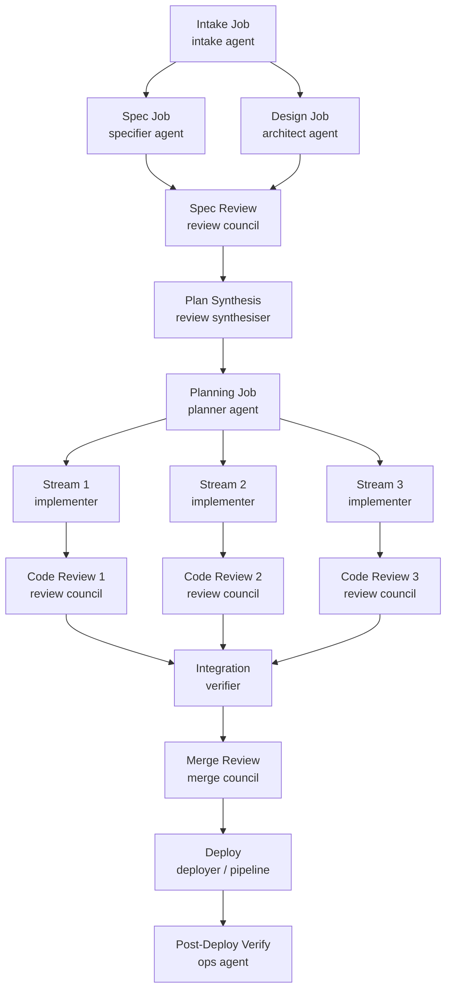

# Automated Software Factory

> Status: Idea
> Last Updated: 2026-02-08
>
> Inputs:
> - AGENTS.md (project architecture + primitives)
> - docs/ideas/prd-to-epic-workflow.md
> - docs/ideas/starter-cicd-self-healing.md
> - docs/ideas/agent-native-design.md
> - docs/ideas/persistent-runner-pools.md
> - docs/ideas/channel-integrations-unified-plan-v3.md
> - docs/ideas/chat-client-integrations.md
> - docs/ideas/workflows-as-skills.md
> - OpenSpec (https://github.com/Fission-AI/OpenSpec)

## North Star

**An Eve app with no services — only agents — that turns ideas into production
software with zero humans in the loop by default.**

Anyone forks the repo, installs it as an Eve app in their org, and every member
of that org can point it at any of their own Eve-compatible repos and say "build
this." The factory designs, plans, implements, reviews, tests, deploys, monitors,
and self-heals — autonomously.

Humans are optional. When they opt in, they get Slack notifications and approval
gates at the moments that matter. When they don't, the factory runs end to end.

```
Idea → Spec → Design → Plan → Implement → Review → Test → Deploy → Monitor → Heal
  ↑                                                                              |
  └──────────────────────────────────────────────────────────────────────────────-─┘
```

The default mode is a closed loop. The factory improves itself.

---

## Design Philosophy

### The Factory is an Agent Pack, Not a Separate Project

The factory is **not** a standalone Eve project that creates cross-project jobs.
It is an **agent pack** — a repo of agent definitions and skills that gets
**installed into** each target project. Jobs created by factory agents appear
on the target project's own job board, not on some central factory board.

This is critical. Imagine an org running the factory across 20 projects. A
single factory project with cross-project jobs would create a chaotic,
unmanageable job board mixing everything together. Instead, each project has
its own factory agents installed, its own jobs, its own board. The factory
repo is just the *source* of those agent definitions.

```
Factory Repo (source of agents)            Target Project (has factory installed)
├── agents/                                ├── .eve/manifest.yaml
│   ├── agents.yaml                        ├── src/
│   ├── teams.yaml                         ├── tests/
│   ├── chat.yaml                          ├── agents/
│   └── factory.yaml (config)              │   ├── agents.yaml  ← installed from factory
│                                          │   ├── teams.yaml   ← installed from factory
├── skills/                                │   └── chat.yaml    ← installed from factory
│   ├── intake/SKILL.md                    ├── skills.txt       ← references factory repo
│   ├── architect/SKILL.md                 │   # https://github.com/yourorg/eve-software-factory
│   ├── implementer/SKILL.md               └── factory.yaml     ← local config overrides
│   ├── reviewer_security/SKILL.md
│   └── ...
├── skills.txt
└── README.md
```

### Fork + Customise

The factory repo is forked per organisation. Customisation happens at two levels:

**1. Fork the factory repo** (organisation-wide standards):
- Edit agent SKILL.md files (review criteria, coding standards, personas).
- Adjust default `factory.yaml` (which models, review matrix, HITL gates).
- Add or remove review agents.
- Coding agents are the primary customisation tool — tell the factory to
  improve itself and it will edit its own skills.

**2. Override per project** (project-specific tuning):
- Each target project can include a `factory.yaml` that overrides defaults.
- Project-level config overrides factory defaults (e.g., different models
  for a Python project vs a TypeScript project).

### Agent Packs: A New Eve Primitive

Today, Eve distributes **skills** (behavior) via skillpacks and `skills.txt`.
But **agent definitions** (roster, teams, routing, harness profiles) are always
local to each project. There is no mechanism to install agent configs from an
external source.

The factory needs a new primitive: **Agent Packs**.

An agent pack is a git repo containing agent definitions (`agents.yaml`,
`teams.yaml`, `chat.yaml`) and their skills. Projects reference agent packs
the same way they reference skillpacks — via a manifest pointer.

```yaml
# Target project's .eve/manifest.yaml
x-eve:
  agents:
    version: 3
    # Install agents from external pack (new capability)
    pack: https://github.com/yourorg/eve-software-factory
    pack_ref: v1.2.0                    # Pin to a version
    config_path: ./agents/agents.yaml   # Local overrides (optional)
    teams_path: ./agents/teams.yaml     # Local overrides (optional)
```

**Resolution order** (for agent definitions):
1. Load agent pack from `pack` URL at `pack_ref`.
2. Merge local `config_path` overrides on top (if present).
3. Final merged config is what gets synced to Eve.

This means:
- Target projects get factory agents without copy-pasting YAML.
- Updates to the factory flow to all projects when they bump `pack_ref`.
- Projects can override specific agents (e.g., different harness for their
  implementer) without forking the entire config.
- The job board stays clean — factory jobs belong to the project they're in.

**Version uptake**: When the factory repo releases a new version (git tag),
projects update by changing `pack_ref`. This can be automated — the factory's
`improver` agent can submit PRs to target projects to bump the version.

### How `eve agents sync` Changes

```bash
# Today (local only):
eve agents sync --project proj_myapp --ref main

# With agent packs:
eve agents sync --project proj_myapp --ref main
# → Resolves pack URL from manifest
# → Fetches pack repo at pack_ref
# → Reads agents.yaml, teams.yaml, chat.yaml from pack
# → Merges local overrides from project repo
# → Syncs merged config to Eve API
```

The CLI handles pack resolution transparently. The API doesn't change — it
still receives the final merged YAML. The composition happens client-side.

### Skills Distribution (Already Works)

Factory agent skills are distributed via the existing `skills.txt` mechanism:

```
# Target project's skills.txt
https://github.com/yourorg/eve-software-factory
```

This installs all factory skills (`intake`, `architect`, `implementer`,
`reviewer_security`, etc.) into the project's `.agents/skills/` directory.
Agents reference these skills by name in `agents.yaml`.

**Key insight**: Agent packs distribute *identity* (who the agents are),
while skillpacks distribute *behavior* (what they know how to do). Both
come from the same factory repo but use different installation mechanisms.

---

## Factory Pipeline: Idea to Production

### Phase 1: Intake

**Input**: A sentence, a paragraph, a PRD, a GitHub issue URL, or a Slack message.

**Agent**: `intake` (fast model — Haiku/Sonnet class)

**Actions**:
1. Normalise the input into a structured brief.
2. If the idea is vague, generate clarifying questions (these become the HITL
   checkpoint if humans are in the loop, or the agent answers them itself using
   project context if running autonomously).
3. Create a root job (issue_type=epic) in the project.
4. Write the brief to `openspec/changes/<slug>/proposal.md` in the repo.

### Phase 2: Specification

**Agent**: `specifier` (high-reasoning model — Opus/Codex x-high)

**Actions**:
1. Read the proposal and the project's existing `openspec/specs/`.
2. Draft delta specs (`openspec/changes/<slug>/specs/*.md`) using OpenSpec's
   ADDED/MODIFIED/REMOVED format with Given/When/Then scenarios.
3. Create a spec-review child job.

### Phase 3: Design

**Agent**: `architect` (high-reasoning model — Opus/Codex x-high)

**Actions**:
1. Read the proposal and specs.
2. Explore the codebase (read files, understand patterns, check AGENTS.md).
3. Draft `openspec/changes/<slug>/design.md` with goals, non-goals, technical
   decisions, risks, and trade-offs.
4. Create a design-review child job.

### Phase 4: Multi-Model Review (Parallel)

**Team**: `review_council` (fanout dispatch)

**Members**: `reviewer_security`, `reviewer_correctness`, `reviewer_simplicity`,
`reviewer_performance`, `reviewer_testability`

**Actions**:
1. Each reviewer reads the specs + design and produces a review document.
2. Reviews are written to `openspec/changes/<slug>/reviews/`.
3. Blocking reviews (security, correctness) must pass. Advisory reviews
   (simplicity, performance) inform but don't block.
4. A synthesis job aggregates feedback and updates specs/design if needed.

**Harness strategy**: Run reviews across multiple models in parallel for diversity
of perspective. Example:
- Security review: Opus 4.6 (reasoning_effort=high)
- Correctness review: Codex 5.3 (reasoning_effort=x-high)
- Simplicity review: Sonnet 4.5 (fast, catches over-engineering)

### Phase 5: Planning

**Agent**: `planner` (high-reasoning model)

**Actions**:
1. Read reviewed specs + design.
2. Decompose work into `openspec/changes/<slug>/tasks.md` with hierarchical
   checkbox format.
3. Map task groups to Eve job streams (stories → tasks).
4. Write `openspec/changes/<slug>/streams.md` with dependency graph.
5. Create child jobs per stream with `waits_for` relations.

### Phase 6: Implementation (Parallel Streams)

**Agent**: `implementer` (strong coding model — Opus/Codex)

**Actions per stream**:
1. Create a job branch: `job/<job-id>` off `feat/<slug>`.
2. Read the relevant task group from `tasks.md`.
3. Implement, writing tests alongside code (TDD when possible).
4. Run the project's test suite locally.
5. Commit and push. Open a PR into `feat/<slug>`.
6. Mark tasks complete in `tasks.md` (checkbox).
7. Submit job for automated review.

### Phase 7: Automated Code Review (Per-PR)

**Team**: `code_review_council` (fanout)

**Members**: `reviewer_code_security`, `reviewer_code_quality`, `reviewer_tests`

**Actions**:
1. Review the PR diff against specs and design.
2. Leave review comments or approve.
3. If issues found: reject the job, implementer gets another attempt.
4. If approved: merge PR into feature branch.

### Phase 8: Integration & Verification

**Agent**: `verifier` (deterministic + agent hybrid)

**Actions**:
1. Merge all stream PRs into `feat/<slug>`.
2. Run the full test suite on the feature branch.
3. If the project has a preview environment, deploy and run smoke tests.
4. Verify specs: run through each Given/When/Then scenario and confirm pass.
5. Run OpenSpec's `/opsx:verify` equivalent (completeness, correctness, coherence).
6. Create the final PR from `feat/<slug>` → `main`.

### Phase 9: Automated PR Review (Going into Main)

**Team**: `merge_review_council` (fanout, all blocking)

**Actions**:
1. Full security audit of the PR.
2. Architecture review (does this fit the codebase?).
3. Test coverage analysis.
4. Performance impact assessment.
5. All reviewers must approve before merge.

### Phase 10: Deploy

**Agent**: `deployer` (deterministic pipeline)

**Actions**:
1. Trigger the project's deploy pipeline.
2. Follow the pipeline run to completion.
3. Verify environment health post-deploy.
4. If deploy fails: create a remediation job (see Phase 11).

### Phase 11: Monitor & Self-Heal

**Agent**: `ops` (warm runtime, heartbeat-driven)

**Actions**:
1. Periodic health checks on deployed environments.
2. Watch for `system.job.failed` and `system.pipeline.failed` events.
3. On failure: diagnose, create a remediation job.
4. Remediation follows a constrained version of the factory pipeline (intake →
   implement → review → deploy) with guardrails:
   - Remediation PRs are always small and targeted.
   - Maximum 3 auto-remediation attempts before escalating to humans.
   - Rollback is always available as a fallback.

### Phase 12: Self-Improvement

**Agent**: `improver` (scheduled, background)

**Actions**:
1. Analyse completed factory runs for patterns (which reviews caught real issues,
   which agents produced the best code, where did failures happen).
2. Update factory agent skills and config based on learnings.
3. Submit self-improvement PRs to the factory repo itself.
4. These PRs go through the factory's own review pipeline (eating its own
   dog food).

---

## OpenSpec Integration

### Why OpenSpec

OpenSpec provides exactly what the factory needs that Eve currently lacks:
a structured, versioned, repo-local specification layer.

| Need | Eve Today | With OpenSpec |
|------|-----------|---------------|
| Structured specs | Free-form job descriptions | Delta specs with Given/When/Then |
| Design docs | Not tracked | `design.md` with goals/risks/decisions |
| Task decomposition | Manual in job descriptions | `tasks.md` with hierarchical checkboxes |
| Verification | Test suite only | Spec verification (completeness, correctness, coherence) |
| Audit trail | Job history | Versioned artifacts in repo + archived changes |
| Multi-change management | One job tree at a time | Multiple active changes with conflict detection |

### Integration Architecture

OpenSpec is a CLI tool with no server. The factory integrates it at three levels:

**1. Repo-Level**: The project initialises OpenSpec (`openspec/` directory)
as part of factory onboarding. Existing specs describe current behaviour. New
work creates changes.

**2. Agent-Level**: Factory agents use OpenSpec's slash commands as part of their
skills:
- `intake` agent runs the equivalent of `/opsx:new`
- `specifier` runs `/opsx:continue` for specs
- `architect` runs `/opsx:continue` for design
- `planner` runs `/opsx:continue` for tasks
- `verifier` runs `/opsx:verify`
- On completion, `/opsx:archive` merges deltas into main specs

**3. Job-Level**: OpenSpec change names map to Eve job slugs. A change's lifecycle
(proposal → specs → design → tasks → apply → verify → archive) maps cleanly to
Eve's job phases (idea → backlog → ready → active → review → done).

### OpenSpec Schema Customisation

Create a factory-specific OpenSpec schema that aligns artifacts with Eve's
job phases:

```yaml
# openspec/schemas/eve-factory/schema.yaml
name: eve-factory
version: 1
description: Software factory workflow with Eve job alignment

artifacts:
  - id: proposal
    generates: proposal.md
    template: proposal.md
    requires: []
    # Maps to: Eve job phase "idea"

  - id: specs
    generates: "specs/**/*.md"
    template: spec.md
    requires: [proposal]
    # Maps to: Eve child job (spec phase)

  - id: design
    generates: design.md
    template: design.md
    requires: [proposal]
    # Maps to: Eve child job (design phase)

  - id: reviews
    generates: "reviews/**/*.md"
    template: review.md
    requires: [specs, design]
    # Maps to: Eve child jobs (parallel review team)

  - id: tasks
    generates: tasks.md
    template: tasks.md
    requires: [specs, design]
    # Maps to: Eve child jobs (implementation streams)

apply:
  requires: [tasks]
  tracks: tasks.md
```

---

## Correctness Verification (Zero Humans)

The hardest part of a zero-human loop is knowing when the output is correct.
The factory uses **layered verification**:

### Layer 1: Specification-Driven Tests

Every spec scenario becomes a test. The `specifier` agent writes Given/When/Then
scenarios, and the `implementer` agent writes corresponding test cases. The
`verifier` agent cross-checks that every scenario has a passing test.

### Layer 2: Multi-Model Review Consensus

Different models catch different problems. Running security review on Opus and
Codex in parallel gives independent perspectives. A finding from either model
blocks the pipeline. This is analogous to requiring multiple human reviewers.

### Layer 3: Automated Test Suites

The project's existing test suite (unit, integration, e2e) must pass on
the feature branch before merge. The factory doesn't skip existing quality gates.

### Layer 4: Deploy Verification

Post-deploy health checks and smoke tests verify the deployed system works. If
the project registers API specs via its manifest, the factory can run
conformance tests against them.

### Layer 5: Continuous Background Review

Even after merge, background review agents watch for regressions. They can run
on every push to main, on a schedule, or on specific events.

### Escape Hatch: Confidence Scoring

Each review and verification step produces a confidence score. If any step falls
below a configurable threshold, the factory pauses and escalates (to humans if
HITL is enabled, or to a higher-reasoning model for re-analysis if not).

---

## Multi-Model / Multi-Harness Strategy

### Model Roles (Defaults, Customisable)

| Role | Default Harness | Default Model | Reasoning | Why |
|------|----------------|---------------|-----------|-----|
| Intake | mclaude | Sonnet 4.5 | medium | Fast normalisation |
| Specification | codex | Codex 5.3 | x-high | Deep domain reasoning |
| Architecture | mclaude | Opus 4.6 | high | Broad system thinking |
| Planning | mclaude | Opus 4.6 | high | Decomposition skill |
| Implementation | mclaude | Opus 4.6 | high | Best coding model |
| Code Review | codex | Codex 5.3 | x-high | Catches subtle bugs |
| Security Review | mclaude | Opus 4.6 | high | Security reasoning |
| Simplicity Review | mclaude | Sonnet 4.5 | medium | Fast pattern matching |
| Ops / Monitoring | mclaude | Sonnet 4.5 | medium | Fast triage |
| Self-Improvement | mclaude | Opus 4.6 | high | Meta-reasoning |

### Harness Profiles (in manifest `x-eve.agents`)

All four harnesses exist today. Auth is managed via `eve auth sync` or
`eve secrets set`. The factory just needs profiles configured:

```yaml
x-eve:
  agents:
    version: 1
    availability:
      drop_unavailable: true    # Skip models without credentials
    profiles:
      fast-triage:
        - harness: mclaude
          model: sonnet-4.5
          reasoning_effort: medium
      deep-reasoning:
        - harness: codex
          model: codex-5.3
          reasoning_effort: x-high
      primary-coder:
        - harness: mclaude
          model: opus-4.6
          reasoning_effort: high
      review-panel:
        - harness: mclaude
          model: opus-4.6
          reasoning_effort: high
        - harness: codex
          model: codex-5.3
          reasoning_effort: x-high
      # When a profile lists multiple harnesses, the factory
      # spawns parallel review jobs — one per harness.
```

**Credential setup** (per org or project):
```bash
eve auth sync --codex --org org_xxx    # Sync local Codex OAuth
eve secrets set OPENAI_API_KEY <key> --org org_xxx   # Or use API key
eve secrets set ANTHROPIC_API_KEY <key> --org org_xxx
eve secrets set GEMINI_API_KEY <key> --org org_xxx   # Optional
```

---

## Gap Analysis: What Eve Needs

### Currently Exists (Ready to Use)

| Capability | Status | Notes |
|-----------|--------|-------|
| Job lifecycle + phases | Done | idea → done with review gates |
| Job hierarchy (epic → story → task) | Done | Max depth 3 |
| Job dependencies (blocks, waits_for) | Done | DAG execution |
| Multiple harnesses (mclaude, zai, codex, gemini) | Done | Job-level selection + `eve auth sync` |
| Harness profiles + options | Done | model, reasoning_effort |
| Teams + fanout dispatch | Done | Parallel child jobs |
| Event spine + triggers | Done | GitHub, Slack, cron, system events |
| Pipelines + workflows | Done | Deterministic + agent-driven |
| Agent runtime (warm pods) | Done | Org-scoped, sticky routing |
| Skills system | Done | OpenSkills format |
| Secrets (multi-scope) | Done | System, org, project, user |
| Builds + releases + deploys | Done | BuildKit-first |
| Git controls (branch, commit, push) | Done | Per-job config |
| CLI + REST API | Done | Comprehensive |
| Auth + RBAC | Done | SSH challenge, JWT, memberships |
| Codex + Gemini harnesses | Done | `codex`/`code`, `gemini` — auth via `eve auth sync` |
| `create-pr` pipeline action | Done | Built-in step type |
| Orchestrator concurrency | Done | `eve system orchestrator set-concurrency <n>` |

### Gaps to Fill

#### Gap 1: Agent Packs (Install Agents from External Repos)

**Problem**: The factory's agents need to be installed *into* target projects
so jobs appear on the target project's board. Today, agent definitions
(`agents.yaml`, `teams.yaml`, `chat.yaml`) are always local to each project.
There is no mechanism to install agent configs from an external repo.

Skills are distributable via skillpacks, but agent *identity* (roster, teams,
routing, harness profiles) is not.

**Proposed Solution**: Add agent pack support to the manifest and `eve agents sync`.

**Manifest extension**:
```yaml
x-eve:
  agents:
    version: 3
    pack: https://github.com/yourorg/eve-software-factory
    pack_ref: v1.2.0
    config_path: ./agents/agents.yaml   # optional local overrides
    teams_path: ./agents/teams.yaml     # optional local overrides
```

**CLI change**: `eve agents sync` resolves the `pack` URL, fetches agent
configs from the pack repo at `pack_ref`, merges local overrides, and sends
the merged result to the API. The API itself does not change — it still
receives final YAML.

**Merge semantics**:
- Pack provides the base agent definitions.
- Local `agents.yaml` can add, override, or remove agents.
- Override by agent ID: a local agent with the same ID replaces the pack's.
- Add: a local agent with a new ID is appended.
- Remove: `_remove: [agent_id]` syntax strips agents from the pack.
- Same merge logic applies to `teams.yaml` and `chat.yaml`.

```yaml
# Local agents.yaml (project-level overrides)
version: 1
_remove: [reviewer_performance]   # Don't need perf reviews for this project

agents:
  implementer:
    # Override just the harness profile, inherit everything else from pack
    harness_profile: python-coder  # This project uses a Python-specific model

  custom_reviewer:
    # Add a project-specific reviewer not in the pack
    skill: custom_reviewer
    harness_profile: deep-reasoning
    description: "Domain-specific compliance review"
```

**Version uptake**:
- Explicit: project maintainer bumps `pack_ref` in manifest.
- Automated: factory's `improver` agent can submit PRs to target projects
  to bump the version when a new factory release is available.
- Pinned: `pack_ref` can be a git tag, branch, or SHA. Tags recommended
  for stability.

**Priority**: High. This is the foundational primitive that makes the
factory installable into arbitrary projects.

**Implementation scope**: CLI-side only. The API continues to receive
merged YAML — no API changes needed. The composition logic lives in
`eve agents sync` (and could later move to the API for server-side
resolution if needed).

#### Gap 2: Planning Documents as First-Class Data

**Problem**: The factory produces planning artifacts (specs, designs, task
breakdowns) that live in the target repo as markdown files. There is no way
to query, search, or link these from the Eve API. The factory and other agents
must rely on `git grep` and file reads.

**Proposed Solution**: Add a **Documents** primitive to Eve.

```
POST   /projects/{id}/documents
GET    /projects/{id}/documents
GET    /projects/{id}/documents/{doc_id}
PATCH  /projects/{id}/documents/{doc_id}
DELETE /projects/{id}/documents/{doc_id}
GET    /projects/{id}/documents/search?q=...
```

A document is:
- `id`: auto-generated
- `project_id`: owning project
- `path`: repo-relative path (e.g., `openspec/changes/auth/design.md`)
- `title`: extracted from markdown h1
- `doc_type`: `spec | design | plan | review | prd | other`
- `status`: `draft | review | approved | archived`
- `content`: full markdown content (stored in DB)
- `content_hash`: for drift detection vs repo
- `metadata`: JSONB (version, review_history, linked_job_ids, etc.)
- `git_sha`: the commit where the doc was last synced
- `created_at`, `updated_at`

**Sync model**: Documents are synced from the repo (source of truth) via
`eve docs sync --ref <sha>`. The API allows read/search. Direct edits via
API are possible (for agents operating outside a git context) but the repo
remains authoritative.

**Search**: Full-text search across document content and metadata. This lets
agents find relevant specs, designs, and reviews without cloning the repo.

**Linking**: Documents can be linked to jobs via `metadata.linked_job_ids`.
This creates a bidirectional relationship: "this job implements this spec"
and "this spec was implemented by these jobs."

**Efficient editing**: The API supports JSON Patch-style updates for
content, so agents can make surgical edits without replacing the entire
document. This maps to the "find/replace" editing pattern that coding
agents use.

```json
PATCH /projects/{id}/documents/{doc_id}
{
  "edits": [
    {
      "op": "replace",
      "search": "- [ ] 1.1 Implement auth middleware",
      "replace": "- [x] 1.1 Implement auth middleware"
    }
  ]
}
```

**Priority**: Medium. The factory can operate without this by using git
directly. This becomes important when multiple agents need to coordinate
on shared documents without merge conflicts.

#### Gap 3: OpenSpec CLI Integration in Agent Workspace

**Problem**: Factory agents need to run OpenSpec CLI commands during job
execution. The OpenSpec CLI (`openspec`) must be available in the runner
image and the target repo must be initialised with OpenSpec.

**Proposed Solution**:
1. Add `openspec` to the runner image (or make it installable via
   `skills.txt` → agent installs it on first use).
2. Create an `openspec-integration` skill that wraps OpenSpec commands
   for Eve agents, handling workspace paths and JSON output parsing.
3. Factory onboarding initialises OpenSpec in the target repo if not
   already present.

**Priority**: High. This is a core integration point.

#### Gap 4: Multi-Harness Parallel Review Jobs

**Problem**: The factory wants to run the same review prompt against multiple
models in parallel and aggregate results. Today, a team dispatch creates child
jobs for different agents (different prompts/roles), not the same prompt with
different models.

**Proposed Solution**: Extend team dispatch with a `model_matrix` mode:

```yaml
teams:
  review_council:
    lead: review_synthesiser
    members: [reviewer_security, reviewer_correctness]
    dispatch:
      mode: model_matrix
      matrix:
        - harness: mclaude
          model: opus-4.6
        - harness: codex
          model: codex-5.3
      merge_strategy: lead_summarize
```

In `model_matrix` mode, each member agent gets N child jobs (one per
matrix entry), all with the same prompt but different harnesses. The lead
agent synthesises all results.

**Alternative** (simpler): Each review agent's skill specifies which
models to use and creates its own child jobs. No new dispatch mode needed.

**Recommendation**: Start with the simpler per-agent approach. The matrix
dispatch is a nice-to-have optimisation.

#### Gap 5: Confidence Scoring and Escalation

**Problem**: The factory needs a way to express "I'm 70% confident this
is correct" and have the system decide whether to proceed or escalate.

**Proposed Solution**: Add a `confidence` field to job results:

```json
{
  "result_summary": "Security review passed with no critical findings",
  "confidence": 0.92,
  "findings": [...]
}
```

The orchestrator can use confidence thresholds (defined in factory config)
to decide whether to proceed, request re-review with a different model,
or escalate to a human.

**Priority**: Medium. The factory can operate without explicit confidence
scores by using binary pass/fail with review gates.

#### Gap 6: Factory Configuration File

**Problem**: The factory needs a single, readable configuration file that
controls the entire pipeline — which models to use, which reviews are
blocking, HITL gates, notification channels, etc.

**Proposed Solution**: A `factory.yaml` at the root of the factory repo:

```yaml
# factory.yaml — The Software Factory Configuration
version: 1

# Default target for factory operations
# Can be overridden per-invocation
defaults:
  harness_profiles:
    intake: fast-triage
    specification: deep-reasoning
    architecture: deep-reasoning
    planning: deep-reasoning
    implementation: primary-coder
    code_review: review-panel
    security_review: review-panel
    merge_review: review-panel
    ops: fast-triage
    self_improvement: deep-reasoning

# Review matrix configuration
reviews:
  spec_review:
    blocking: [correctness, security]
    advisory: [simplicity, performance]
  code_review:
    blocking: [security, tests, correctness]
    advisory: [simplicity, performance, docs]
  merge_review:
    blocking: [security, architecture, tests, correctness]
    advisory: [performance]

# Human-in-the-loop configuration
# Default: no humans. Set gates to enable HITL at specific points.
hitl:
  enabled: false
  gates:
    # Uncomment to add human checkpoints:
    # spec_approval: true        # Human reviews specs before design
    # design_approval: true      # Human reviews design before implementation
    # merge_approval: true       # Human reviews final PR before merge
    # deploy_approval: true      # Human approves deploy to production
  notifications:
    slack:
      channel: "#factory-updates"
      on: [epic_started, review_complete, deploy_complete, failure]
    # email:
    #   to: ["team@example.com"]
    #   on: [failure, deploy_complete]

# Verification configuration
verification:
  confidence_threshold: 0.85     # Below this, escalate or re-review
  max_remediation_attempts: 3    # Before escalating failures
  spec_verification: true        # Cross-check specs against tests
  deploy_smoke_tests: true       # Run smoke tests after deploy

# Self-improvement configuration
self_improvement:
  enabled: true
  schedule: "0 2 * * 1"          # Weekly at 2am Monday
  auto_merge: false              # Require review of self-improvement PRs

# Git branching strategy
branching:
  feature_prefix: "feat/"
  job_prefix: "job/"
  max_parallel_streams: 6
```

**Priority**: High. This is the primary customisation surface.

#### Gap 7: Notification Primitives

**Problem**: When HITL is enabled, the factory needs to notify humans via
Slack (or other channels) and wait for their response. Eve has a chat gateway
but no general-purpose notification system for non-chat events.

**Current state**: The chat gateway handles Slack messages for agent
conversations. System events (`system.job.failed`) exist but don't
automatically notify anyone.

**Proposed Solution**: Add a lightweight notification primitive:

```yaml
# In factory.yaml or manifest
notifications:
  channels:
    slack_factory:
      provider: slack
      config:
        channel: "#factory-updates"
  rules:
    - event: job.phase.review
      channel: slack_factory
      template: "Review needed: {{job.title}} - {{job.url}}"
    - event: pipeline.completed
      channel: slack_factory
      template: "Deploy complete: {{pipeline.name}} ✓"
    - event: job.failed
      channel: slack_factory
      template: "Factory failure: {{job.title}} - {{job.error}}"
```

**Implementation**: The orchestrator matches events against notification
rules and sends messages via the gateway's outbound channel. This reuses
the existing gateway plugin interface.

**Priority**: Medium-high. Not needed for zero-human mode but essential
for HITL mode.

#### Gap 8: Agent-to-Agent Communication (Shared Context)

**Problem**: Factory agents need to pass structured data between phases.
The `intake` agent produces a brief that the `specifier` needs. The
`reviewer` produces findings that the `synthesiser` needs.

**Current state**: Agents communicate via job results (`result_json`),
job descriptions, and files in the repo. There is no structured
message-passing between agents outside of these mechanisms.

**Proposed Solution**: This is already adequately served by:
1. **Job results**: structured JSON output from one job feeds into the
   next job's context.
2. **Repo files**: OpenSpec artifacts in the repo are the shared context.
3. **Thread model**: for conversational agent coordination.

**No new primitive needed.** The combination of job results + repo files
+ threads covers this. The key insight is that OpenSpec artifacts *are*
the shared context — they live in the repo and every agent can read them.

#### Gap 9: Factory Onboarding Skill

**Problem**: When the factory is installed into a new project, the project
needs to be prepared for factory-driven development (initialise OpenSpec,
verify CI/CD pipelines, check test coverage, etc.).

**Proposed Solution**: An `onboard` skill in the factory:

1. Analyse the codebase (language, framework, test suite, CI/CD).
2. Initialise OpenSpec if not present.
3. Write initial specs for existing behaviour (if desired).
4. Verify the project's Eve manifest and pipelines.
5. Report readiness and any gaps.
6. Suggest `factory.yaml` overrides appropriate for this project.

This is a factory skill, not an Eve primitive. Run it after installing the
factory agent pack:

```bash
eve workflow run onboard --project proj_myapp
```

**Priority**: High. This is the first thing that runs after installation.

#### ~~Gap 10: Codex Harness Adapter~~ — NOT A GAP

The Codex harness (`codex` / `code`) **already exists** alongside mclaude,
zai, and gemini. Auth uses `OPENAI_API_KEY` or `CODEX_AUTH_JSON_B64`.
Credential sync is supported via `eve auth sync --codex`.

The factory's multi-model strategy works today with no new harness work.

---

## Self-Healing Architecture

### Event-Driven Remediation Loop

```
Production Issue Detected
    │
    ▼
system.job.failed / system.pipeline.failed / health check failure
    │
    ▼
Ops Agent: Diagnose
    │
    ├─ Transient? → Retry (max 3)
    ├─ Config issue? → Fix config + redeploy
    ├─ Code bug? → Create remediation epic (mini factory run)
    └─ Unknown? → Escalate (Slack notification)
    │
    ▼
Remediation follows constrained factory pipeline:
    intake (diagnosis) → implement (fix) → review (automated) → deploy
    │
    ▼
Verify fix in production
    │
    ├─ Fixed? → Close, write post-mortem
    └─ Still broken? → Increment attempt counter
        │
        ├─ Under max_attempts? → Retry with different approach
        └─ Max attempts? → Rollback + escalate to humans
```

### Self-Improvement Loop

```
Weekly analysis job
    │
    ▼
Improvement Agent reads:
    - All completed factory runs (success rate, duration, retries)
    - All review findings (what did reviews catch?)
    - All remediation events (what broke?)
    - All agent performance metrics (cost, quality, speed)
    │
    ▼
Generates improvement proposals:
    - Update agent skills (better prompts, new patterns)
    - Adjust model assignments (switch models for better results)
    - Modify review matrix (add/remove review types)
    - Update factory.yaml defaults
    │
    ▼
Creates self-improvement PR in factory repo
    │
    ▼
Factory reviews its own PR (recursive quality gate)
    │
    ├─ Auto-merge if confidence > threshold and auto_merge enabled
    └─ Notify humans if auto_merge disabled
```

---

## HITL Mode (Optional Humans)

When `hitl.enabled: true` in `factory.yaml`, humans are inserted at
configured gates:

### Gate Types

| Gate | When | How |
|------|------|-----|
| `spec_approval` | After specs are drafted | PR review on spec docs |
| `design_approval` | After design is drafted | PR review on design doc |
| `plan_approval` | After tasks are planned | PR review on task breakdown |
| `merge_approval` | Before merging to main | PR review on final PR |
| `deploy_approval` | Before deploying to prod | Eve approval gate |

### Notification Flow

1. Factory agent creates a PR or submits a job for review.
2. Notification rule fires → Slack message with context and action link.
3. Human reviews and approves/rejects via GitHub PR or Eve CLI.
4. Factory agent continues or iterates based on feedback.

### Hybrid Mode

HITL can be selective — enable only `deploy_approval` for production
safety while letting everything else run autonomously. This is the
recommended starting configuration for teams new to the factory.

---

## Manifest Shape

### Factory Repo (Source)

The factory repo is not an Eve project itself — it's a source of agents and
skills that gets installed into other projects. It has no `.eve/manifest.yaml`.

```
eve-software-factory/
├── agents/
│   ├── agents.yaml           # Agent roster + harness profiles
│   ├── teams.yaml            # Team dispatch config
│   ├── chat.yaml             # Chat routing
│   └── factory.yaml          # Factory-specific config (defaults)
├── skills/
│   ├── intake/SKILL.md
│   ├── specifier/SKILL.md
│   ├── architect/SKILL.md
│   ├── planner/SKILL.md
│   ├── implementer/SKILL.md
│   ├── reviewer_security/SKILL.md
│   ├── reviewer_correctness/SKILL.md
│   ├── reviewer_simplicity/SKILL.md
│   ├── reviewer_tests/SKILL.md
│   ├── review_synthesiser/SKILL.md
│   ├── verifier/SKILL.md
│   ├── ops/SKILL.md
│   └── improver/SKILL.md
├── openspec/
│   └── schemas/eve-factory/schema.yaml
└── README.md
```

### Target Project (Consumer)

The target project references the factory as an agent pack and a skillpack:

```yaml
# .eve/manifest.yaml for a target project
schema: eve/compose/v1
project: my-app

services:
  api:
    build: ./apps/api
    ports: [3000]
  # ... normal service definitions ...

x-eve:
  agents:
    version: 3
    pack: https://github.com/yourorg/eve-software-factory
    pack_ref: v1.2.0
    # Optional local overrides:
    config_path: ./agents/agents.yaml

  defaults:
    harness: mclaude
    harness_profile: primary-coder

pipelines:
  deploy-staging:
    # ... normal pipeline definitions ...

workflows:
  factory-run:
    trigger:
      github:
        event: issues
        action: opened
        label: factory
    steps:
      - name: intake
        agent:
          prompt: "Run the factory intake workflow"
          skill: intake

  self-improve:
    trigger:
      schedule:
        cron: "0 2 * * 1"
    steps:
      - name: analyse
        agent:
          prompt: "Analyse factory performance and propose improvements"
          skill: improver
```

```
# skills.txt for a target project
https://github.com/yourorg/eve-software-factory
# ... other skillpacks ...
```

---

## Agent Roster

```yaml
# agents/factory.yaml
version: 1
agents:
  intake:
    skill: intake
    workflow: factory-run
    harness_profile: fast-triage
    description: "Normalises ideas into structured briefs"

  specifier:
    skill: specifier
    workflow: factory-run
    harness_profile: deep-reasoning
    description: "Writes delta specifications with Given/When/Then scenarios"

  architect:
    skill: architect
    workflow: factory-run
    harness_profile: deep-reasoning
    description: "Designs technical architecture and trade-offs"

  planner:
    skill: planner
    workflow: factory-run
    harness_profile: deep-reasoning
    description: "Decomposes work into parallel implementation streams"

  implementer:
    skill: implementer
    workflow: factory-run
    harness_profile: primary-coder
    description: "Writes code with tests, following TDD when possible"

  reviewer_security:
    skill: reviewer_security
    workflow: factory-run
    harness_profile: review-panel
    description: "Security audit: OWASP, injection, auth, secrets"

  reviewer_correctness:
    skill: reviewer_correctness
    workflow: factory-run
    harness_profile: review-panel
    description: "Correctness review: spec conformance, edge cases, logic"

  reviewer_simplicity:
    skill: reviewer_simplicity
    workflow: factory-run
    harness_profile: fast-triage
    description: "Simplicity review: over-engineering, unnecessary abstractions"

  reviewer_tests:
    skill: reviewer_tests
    workflow: factory-run
    harness_profile: review-panel
    description: "Test coverage: missing tests, weak assertions, flaky tests"

  review_synthesiser:
    skill: review_synthesiser
    workflow: factory-run
    harness_profile: deep-reasoning
    description: "Aggregates review feedback and updates specs/design"

  verifier:
    skill: verifier
    workflow: factory-run
    harness_profile: deep-reasoning
    description: "Cross-checks implementation against specs"

  ops:
    skill: ops
    workflow: ops-monitor
    harness_profile: fast-triage
    schedule:
      heartbeat_cron: "*/5 * * * *"
    description: "Monitors deployed environments and triggers remediation"

  improver:
    skill: improver
    workflow: self-improve
    harness_profile: deep-reasoning
    description: "Analyses factory performance and proposes improvements"
```

---

## Job Graph: Full Factory Run



---

## Getting Started (User Journey)

### 1. Fork the Factory

```bash
gh repo fork eve-horizon/eve-software-factory --clone
cd eve-software-factory
```

### 2. Customise (Optional)

```bash
# Edit factory defaults (models, reviews, HITL gates)
$EDITOR agents/factory.yaml

# Edit agent skills to match your team's standards
$EDITOR skills/reviewer_security/SKILL.md
```

### 3. Install Factory into a Target Project

```bash
cd /path/to/my-app

# Add factory as agent pack in manifest
# (edit .eve/manifest.yaml to add x-eve.agents.pack)

# Add factory skills to skills.txt
echo "https://github.com/yourorg/eve-software-factory" >> skills.txt

# Install skills and sync agents
eve skills install
eve agents sync --project proj_myapp --ref main
```

### 4. Run the Factory

```bash
# Create a factory epic (via CLI, GitHub issue, or Slack)
eve job create --project proj_myapp \
  --type epic \
  --title "Add user authentication with OAuth2" \
  --description "Support Google and GitHub OAuth2 providers with session management" \
  --phase idea

# Or trigger via GitHub issue with "factory" label
# Or via Slack: @eve intake "Add user auth with OAuth2"
```

### 5. Watch It Go

```bash
# Jobs appear on the target project's board
eve job tree <epic-job-id>
eve job follow <epic-job-id>

# See the full factory pipeline in action
eve job list --project proj_myapp --all
```

### 6. Update the Factory

```bash
# When a new factory version is released:
# Update pack_ref in .eve/manifest.yaml to the new version tag
# Then re-sync:
eve agents sync --project proj_myapp --ref main
eve skills install
```

---

## Priority Roadmap

### Phase 1: Agent Packs + Minimum Viable Factory (MVP)

**Goal**: Agent pack primitive + end-to-end factory run with a single model.

1. Implement agent pack resolution in `eve agents sync` (CLI-side).
2. Create the factory repo with agent definitions and skills.
3. Install factory into a test project via `pack` + `skills.txt`.
4. Implement factory workflow (intake → implement → review → deploy).
5. Use a single harness (mclaude/Opus) for all agents.
6. Basic review (security + correctness, single model).

**Requires from Eve**: Agent pack support in `eve agents sync` (Gap 1).

### Phase 2: OpenSpec Integration

**Goal**: Structured specifications and verification.

1. Integrate OpenSpec CLI into runner image.
2. Create `openspec-integration` skill.
3. Add spec verification to the factory pipeline.
4. Create custom OpenSpec schema for Eve factory.

**Requires from Eve**: OpenSpec in runner image (Gap 3).

### Phase 3: Multi-Model Reviews

**Goal**: Diverse review perspectives across models.

1. Configure harness profiles for multi-model review (Codex + Claude already supported).
2. Implement parallel review with multiple models via team fanout.
3. Review synthesis and confidence scoring.
4. Set up `eve auth sync --codex` and credential management.

**Requires from Eve**: Confidence scoring (Gap 5) is nice-to-have. Codex
harness already exists — just needs credentials configured.

### Phase 4: Self-Healing & Ops

**Goal**: Autonomous monitoring and remediation.

1. Implement ops agent with heartbeat monitoring.
2. Event-driven remediation loop.
3. Rollback as fallback.
4. Post-mortem generation.

**Requires from Eve**: Mostly uses existing events + triggers. May need
enhanced health check APIs.

### Phase 5: Self-Improvement

**Goal**: The factory improves itself.

1. Performance analytics agent.
2. Self-improvement PR workflow.
3. Recursive quality gates.

**Requires from Eve**: Nothing new.

### Phase 6: Documents API

**Goal**: First-class planning docs in Eve.

1. Documents primitive (CRUD + search).
2. Sync from repo.
3. Linking to jobs.
4. Efficient agent-friendly editing.

**Requires from Eve**: Documents API (Gap 2).

### Phase 7: HITL & Notifications

**Goal**: Optional human integration.

1. Notification rules engine.
2. Slack notification templates.
3. Approval gates with notification.

**Requires from Eve**: Notification primitives (Gap 7).

---

## Why This Works

1. **It's just agents and skills.** No new runtime, no new services, no new
   infrastructure. The factory is a repo of markdown files that teach Eve's
   existing agent runtime how to build software.

2. **Agent packs keep jobs where they belong.** Factory agents are installed
   *into* each project. Jobs appear on the project's board. No cross-project
   pollution. An org with 20 projects has 20 clean job boards, each with
   factory agents running in their own context.

3. **Fork + customise is the normal pattern.** Every team has different
   standards, different models they trust, different review criteria. A fork
   lets them codify their standards in agent skills. Per-project overrides
   let individual projects tune without re-forking.

4. **Version uptake is natural.** When the factory improves, projects bump
   `pack_ref` to get the new version. This can be automated by the factory's
   own `improver` agent, which submits PRs to target projects.

5. **OpenSpec provides the missing structure.** Eve has jobs, but jobs don't
   know what "correct" means. OpenSpec specs define correctness. The factory
   verifies against them.

6. **Multi-model review is the zero-human safety net.** Running the same
   review across Opus and Codex gives independent perspectives. If either
   flags an issue, it blocks. This replaces the "two human reviewers" pattern.

7. **Self-improvement is built in.** The factory analyses its own
   performance and proposes improvements. It uses its own pipeline to
   review those improvements. The loop is closed.

8. **Humans are opt-in, not opt-out.** The default is autonomous. Teams
   add human gates where they want them, not where the system forces them.

---

## Open Questions

1. **Agent pack merge semantics**: What's the right merge model for local
   overrides? Full replacement per agent ID? Deep merge of nested fields?
   Should we support "inherit and override just one field" or keep it simple
   with full agent replacement?

2. **Pack version automation**: Should the factory's `improver` agent
   automatically submit PRs to all projects using the pack when a new
   version is released? Or is this too aggressive?

3. **Cost governance**: Running multi-model reviews on every PR could be
   expensive. Should the factory support cost budgets or model downgrade
   rules?

4. **Concurrent factory runs**: Can multiple factory epics run in the same
   project simultaneously? How do we handle branch conflicts?

5. **OpenSpec adoption**: Should the factory *require* OpenSpec in target
   projects, or should it work without it (with reduced verification)?

6. **Model availability**: What happens when a configured model (e.g., Codex)
   is unavailable? Graceful degradation to available models? Or fail?

7. **Factory-of-factories**: Should the factory be able to build other
   factories? (Yes — it's just another project with the factory installed.)

8. **Pack composition**: Can a project install multiple agent packs? E.g.,
   the software factory pack *plus* a separate ops/monitoring pack? If so,
   how do we handle agent ID conflicts?

9. **Self-improvement scope**: When the factory's `improver` agent runs in
   the context of project A, it can improve the factory skills for project A.
   But should improvements also propagate back to the factory source repo?
   This would require the `improver` to create PRs against the factory
   repo itself — doable but needs explicit configuration.
