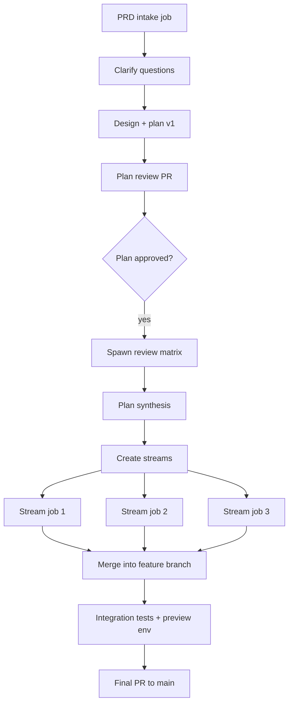

# PRD-Driven Epic Workflow

> Status: Idea
> Last Updated: 2026-01-26

## Summary

Define a reusable workflow + skill that takes a PRD as input, iterates on design and plan with human and multi-harness review, then decomposes work into parallel streams. The flow produces versioned plan docs inside the repo, runs work on a feature branch with per-job branches, and ends with a single PR plus integration tests (optionally on a short-lived feature environment).

PRD input can be anything from a full doc to a few rough sentences; the workflow normalizes it into a tracked file and drives a clarification loop before execution.

## Goals

- Accept a PRD (file or text) as the starting point for a job.
- Produce and version design + plan docs in-repo with explicit review checkpoints.
- Use multi-harness reviews in parallel, with configurable blocking vs advisory reviews.
- Decompose work into parallel streams using the job model and dependencies.
- Deliver work via a feature branch and short-lived per-job branches.
- Gate merging with review and integration tests (preview env if available).
- Keep the workflow configurable per project and per run.
- Respect job depth (EPIC -> story -> task) and allow late decomposition.
- Avoid one project saturating the worker pool while staying work-conserving.

## Non-goals

- Replace pipelines or workflows; this is a higher-level orchestration on top of them.
- Build a new UI; the CLI + Git hosting review flow is enough for now.
- Guarantee fully deterministic execution; the primary path remains agent-driven.

## Existing Capabilities to Leverage

- Job lifecycle, hierarchy, dependencies, and review gates. See `docs/system/job-api.md`.
- Orchestration skill pattern (`waits_for` relations + `eve.status = "waiting"`). See `docs/system/orchestration-skill.md`.
- Harness selection via job fields (`harness`, `harness_profile`, `harness_options`). See `docs/system/agent-harness-design.md`.
- Manifest-defined pipelines/workflows and workflow invocation. See `docs/system/manifest.md` and `docs/system/workflow-invocation.md`.
- `create-pr` pipeline action with default review gating. See `docs/system/manifest.md`.
- Event spine + trigger matching for automation. See `docs/system/events.md`.
- Environment gating via `env_name`. See `docs/system/environment-gating.md`.
- Skills system and skillpacks for reusable workflow logic. See `docs/system/skills.md`.
- Job scheduling priority and FIFO ordering. See `docs/system/job-api.md`.

## Skill Architecture (Proposed)

Use discrete skills for each phase and review type, with a top-level orchestrator skill that
connects them and teaches customization.

```
skills/
  eve-prd-epic/             # top-level orchestrator
  eve-prd-intake/           # normalize PRD + questions
  eve-prd-plan/             # draft plan/design
  eve-prd-synthesis/        # aggregate review feedback
  eve-review-design/        # review design docs
  eve-review-plan/          # review plan docs
  eve-review-security/      # security review (plan or code)
  eve-review-simplicity/    # simplicity/elegance review
  eve-review-tests/         # test coverage review
  eve-review-bugs/          # bug hunt review
```

The orchestrator skill should explain how to swap or add review skills via configuration
and how to run standalone review workflows on any PR.

## Proposed Repo Artifacts

Store all PRD and plan iterations in the repo so they are versioned and reviewable.

```
/docs
  /prd
    <slug>.md
  /design
    <slug>-design-v1.md
    <slug>-design-v2.md
  /plans
    <slug>-plan-v1.md
    <slug>-plan-v2.md
  /reviews
    <slug>-review-security-v1.md
    <slug>-review-simplicity-v1.md
    <slug>-review-tests-v1.md
  /workstreams
    <slug>-streams.md
```

Each versioned doc should include:
- `Status` (draft, review, approved)
- `Version` and `Date`
- `Review History` (links to review docs and job IDs)

## Workflow Phases (Draft)

1) Intake and normalization
- Create a root job (issue_type=epic) with the PRD description or file path.
- Normalize the PRD into `docs/prd/<slug>.md` if it is not already in the repo (no template required).
- Write an initial `docs/plans/<slug>-plan-v0.md` and a question list.
- Submit for review if clarification is required.

2) Clarification loop
- Human answers questions via PR review or direct edit.
- On approval, the root job continues with updated inputs.

3) Design and plan iteration
- Create a design doc (v1) and plan doc (v1) on a feature branch.
- Open a plan PR (or a dedicated doc PR) using `create-pr`.
- Require human review before moving to execution.

4) Parallel review matrix
- Spawn review jobs in parallel (security, performance, testing gaps, simplicity, UX, etc.).
- Each review job outputs a review doc and optional fix suggestions.
- The root job waits only on blocking reviews, but continues to accept advisory reviews.
- A synthesis job aggregates review outputs and updates the plan/design versions.

5) Plan synthesis
- Aggregate review feedback and update `docs/plans/<slug>-plan-vN.md`.
- Update `docs/workstreams/<slug>-streams.md` with stream decomposition.

6) Stream execution
- Create story-level child jobs per stream, each targeting the feature branch.
- Story jobs can spawn task-level jobs as needed (late decomposition).
- Each stream job works on a short-lived branch and opens a PR into the feature branch.

7) Integration and final PR
- After all stream jobs are done, run integration tests.
- If supported, deploy a short-lived preview environment tied to the feature branch.
- Create the final PR from the feature branch into main.

8) Continuous background review
- On every feature-branch update, trigger background reviews (security, tests, docs).
- Background reviewers can open incremental PRs or update plan/test gaps.

## Depth and On-Demand Decomposition

Use the three-level job model (EPIC -> story -> task) with late decomposition driven by
the `eve-orchestration` skill. Each job decides whether to split further based on scope
and the inherited target depth.

Example child header (include in descriptions):

```
Target depth: 3 (EPIC). Current depth: 1.
If current depth < target, you may create child jobs and use waits_for relations to parallelize.
If current depth >= target, execute directly.
```

## Job Graph Sketch



## Branching and PR Strategy

- Epic feature branch: `feat/<slug>` (created once, long-lived for the epic).
- Per-job branches: `job/<job-id>-<short>` created off `feat/<slug>`.
- Merge flow: job branch -> feature branch (review required) -> main PR.
- Use `create-pr` actions for both plan doc PRs and code PRs.

## Job Git Controls (Proposed)

Jobs currently clone the project default branch. For PRD work we want explicit ref control and
automatic branch creation/push on change. Proposed job git config:

```json
{
  "git": {
    "ref": "feat/my-epic",
    "ref_policy": "explicit",
    "branch": "job/${job_id}",
    "create_branch": "if_missing",
    "commit": "manual",
    "push": "on_success",
    "remote": "origin"
  }
}
```

Behavior:
- If `git.ref` is set, the worker checks out that ref.
- If `git.branch` is set, the worker creates or checks out the branch before work starts.
- If `push` is `on_success` and there are commits, the worker pushes the branch.
- For agent-only reviews, a PR is optional; the diff can be attached to job output.

## Review Matrix and Harness Selection

A configurable review matrix lets us parallelize review across harnesses and intents.

Example matrix (blocking vs advisory):
- Blocking: security, data safety, correctness, API compatibility
- Advisory: performance, simplicity, docs, test coverage

Each review job resolves a harness profile to `harness` plus options and writes to a dedicated review doc. The
root job aggregates results and updates plan versions accordingly. For human review,
the job submission should link to the PR; for agent-only review, the job output
can include a patch or diff summary.

## Review Personas (Draft)

Define review personas as separate markdown descriptors with metadata. The orchestrator
uses these to decide which review skills to run at each phase.

```
skills/prd-workflow/personas/security.md
---
name: security
skill: eve-review-security
stage: [plan, code]
mode: [primary, background]
blocking_default: true
profile: primary-reviewer
auto_fix: false
---
```

The persona points at a skill (instructions) and carries defaults for profile,
blocking, and when it should run. Profiles are resolved via a project harness policy.

## Harness Policy and Availability (Draft)

Harness selection is configured per project and filtered by available credentials.
Profiles map to multiple harness/model combinations that can run in parallel.

```yaml
# .eve/manifest.yaml
x-eve:
  agents:
    version: 1
    availability:
      drop_unavailable: true
    profiles:
      primary-orchestrator:
        - harness: mclaude
          model: opus-4.5
          reasoning_effort: high
      primary-reviewer:
        - harness: mclaude
          model: opus-4.5
          reasoning_effort: high
        - harness: codex
          model: gpt-5.2-codex
          reasoning_effort: x-high
      planning-council:
        - profile: primary-planner
        - harness: gemini
          model: gemini-3
```

If a profile includes a harness that is unavailable (missing credentials), the
workflow either drops it or fails the job based on `availability` policy.

## Background Review Jobs

Use event triggers to re-run reviews as the feature branch evolves:
- `github.push` on `feat/*` -> workflow `review-on-push`
- `github.pull_request` on any PR -> workflow `review-on-pr`
- `cron.tick` nightly -> workflow `deep-audit`
- `system.pipeline.failed` -> remediation workflow

Background reviewers can:
- open incremental PRs via `create-pr`
- add missing tests
- update review docs and plan gaps
 - optionally comment-only instead of auto-fix (configurable)

## Feature Environment Strategy

Target: run integration tests and preview via short-lived environments.

Options:
1) Preview env pool (future): `env_name=preview-<slug>` with TTL and reset hook.
2) Shared preview env (current fallback): serialize with `env_name=preview` gate.

Requires manifest support for ephemeral envs or a dedicated `preview` env in
`.eve/manifest.yaml`.

## Resource Governance and Prioritization

Current scheduling selects ready jobs by priority (0 highest) and FIFO within a
priority bucket. This is simple but can allow a single project to saturate the
worker pool. Proposed extensions:

- Per-project concurrency caps (max active jobs per project and per worker type).
- Org-level fairness (token bucket or weighted round-robin across projects).
- Priority aging (old low-priority jobs get bumped over time).
- Work-conserving behavior (use idle capacity when higher-priority queues are empty).

These controls keep large epics fast without starving unrelated work.

## Configuration Model (Draft)

Provide a repo-local config file that the workflow skill reads:

```yaml
# Default: skills/prd-workflow/config.yaml
# Override: .eve/skills/prd-workflow/config.yaml
version: 1
feature_branch_prefix: feat/
job_branch_prefix: job/
plan_dir: docs/plans
review_dir: docs/reviews
target_depth: 3
git:
  ref: feat/${slug}
  ref_policy: explicit
  create_branch: job/${job_id}
  push: on_success
review_matrix:
  - name: security
    profile: primary-reviewer
    blocking: true
  - name: simplicity
    profile: primary-reviewer
    blocking: false
  - name: tests
    profile: primary-reviewer
    blocking: true
personas_dir: personas
agents_ref: x-eve.agents
synthesis_profile: primary-orchestrator
background_reviews:
  on_push: [security, tests]
  nightly: [security, simplicity, performance]
scheduling:
  max_active_per_project: 6
  max_active_by_worker_type:
    default-worker: 6
    python-worker: 2
```

Invocation can override defaults via workflow inputs:

```json
{
  "prd_path": "docs/prd/my-feature.md",
  "feature_branch": "feat/my-feature",
  "review_matrix_override": ["security", "tests"],
  "preview_env": true
}
```

## CLI/UX (Draft)

- `eve workflow run prd-epic --input '{"prd_path":"docs/prd/x.md"}'`
- Optional convenience: `eve prd start --file docs/prd/x.md` (wrapper for workflow).
- Follow-up actions use standard job commands: `eve job tree`, `eve job follow`,
  `eve job submit`, `eve job approve`.

## Related Plans

- `docs/plans/job-git-controls.md` - job-level ref resolution, branch creation, and push policy.
- `docs/plans/harness-policy-and-reasoning-controls.md` - per-project harness profiles and reasoning controls.

## Gaps and Required Extensions

- Ability to provide PRD content or file path cleanly at job creation.
- Job git controls (ref selection, create branch, push on success). See `docs/plans/job-git-controls.md`.
- Trigger-driven workflow/pipeline execution for `github.push` and `cron.tick`.
- Ephemeral/preview environment support (TTL, reset hook, naming).
- Create-pr action enhancements for inner-branch PRs (job branch -> feature branch).
- Scheduler fairness controls (per-project concurrency, priority aging).
- Review persona registry and metadata parsing.
- Harness policy and availability reporting for multi-model review.

## Phased Delivery

1) Skillpack-only pilot
- Add `eve-prd-epic` skill to skillpacks.
- Use manual `eve job create` + `eve job dep add` for orchestration.

2) Workflow wrapper
- Define `workflows.prd-epic` in manifest with standard prompt and inputs.
- Add `.eve/prd-workflow.yaml` config support in the skill.

3) Continuous review automation
- Add event-triggered background review workflows.
- Wire `create-pr` outputs into review gating.

4) Preview environments
- Add ephemeral env support and hooks for feature branches.

## Open Questions

- Should plan review be handled via job review or GitHub PR review (or both)?
- Do we want a standard PRD template and validation schema?
- How should we represent review matrix results in the job model (labels vs hints)?
- Should background review jobs ever auto-merge into the feature branch?
