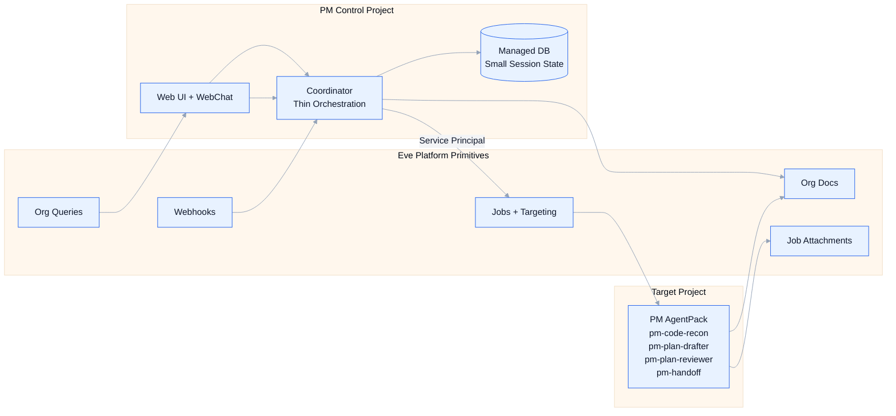
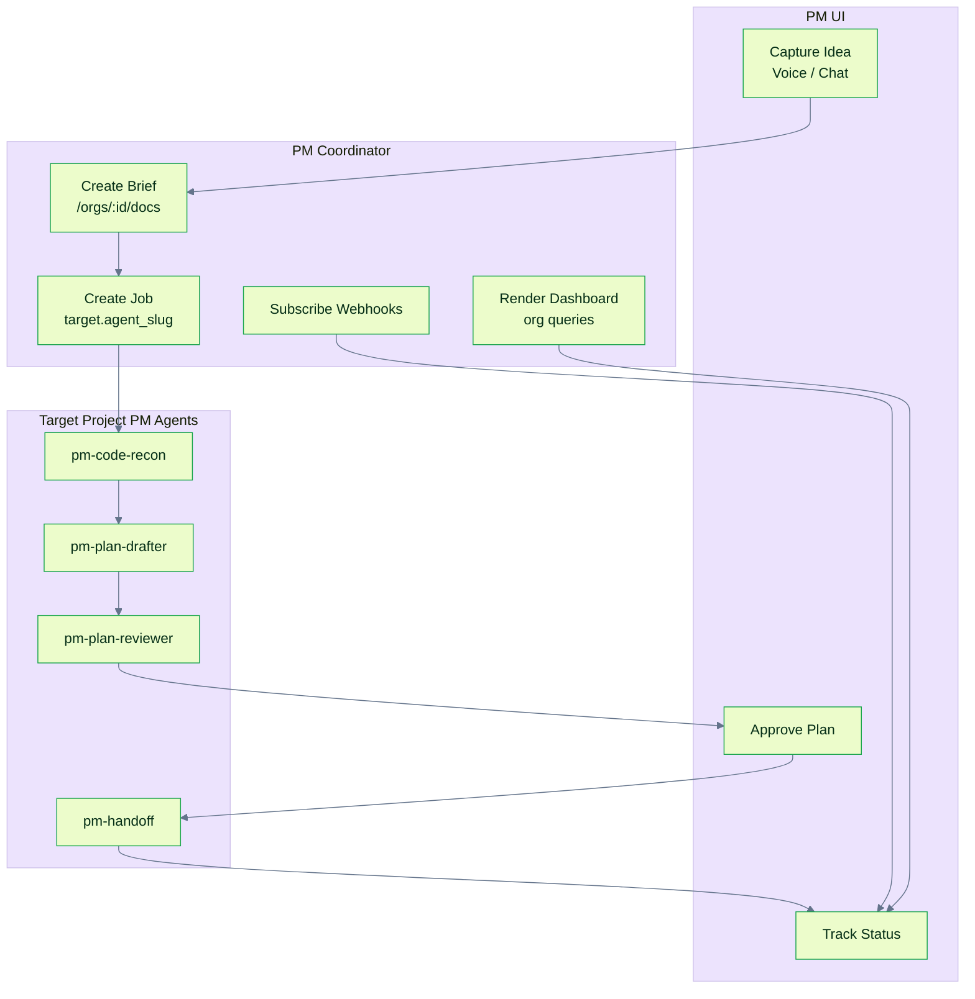
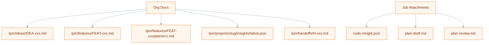

# Agentic PM App (Reimagined on Full Eve Primitives)

> Status: Superseded
> Superseded By: `docs/plans/eve-pm-living-spec-plan.md`
> Last Updated: 2026-02-12
>
> Inputs:
> - `docs/ideas/pm-app-agentic-product-management.md`
> - `docs/ideas/agentic-pm-native-app-platform-gap-analysis.md`
> - `docs/plans/agentic-app-identity-auth-access-plan.md`
> - `docs/plans/agentic-app-context-intelligence-plan.md`
> - `docs/plans/agentic-app-infra-provisioning-plan.md`
> - `docs/system/manifest.md`
> - `docs/system/job-cli.md`
> - `docs/system/pipelines.md`

## Brief

Re-imagine the PM app as a thin orchestration layer on top of Eve primitives, now that Plan A (identity), Plan B (context plane), and Plan C (infra) are implemented or in-flight. The PM app stops being a custom backend-heavy product and becomes a clean composition of Eve jobs, org docs, attachments, webhooks, and cross-project queries.

## North Star

PMs interact through a native agentic UI that converts ideas into grounded, code-aware plans and hands off to execution with zero ceremony. The PM app is an Eve app, but the artifacts live in Eve’s shared org intelligence plane.

## Design Principles

- **Thin coordinator**: orchestration and event relay only; no bespoke data plane.
- **Artifacts live in Eve**: org docs + job attachments are the canonical store.
- **Intent-based execution**: jobs are created by agent slug/team/workflow, not by resolved IDs.
- **Event-driven UI**: webhook subscriptions replace polling.
- **Portfolio-native**: org-level queries power PM dashboards without N+1 queries.

## Architecture Overview

The PM control project is a light web app with a minimal coordinator service. PM agents are split across the PM project and each target project via AgentPacks. The Eve platform primitives provide storage, routing, and orchestration.



## Core Flow



## Artifact Plane (Org Docs + Attachments)



## How the PM App Uses Eve Primitives

- **Service principals** for PM backend auth and scoped API access.
- **Job targeting** with `target.agent_slug` and `resource_refs` for context passing.
- **Job attachments** for durable job-scoped outputs.
- **Org docs** for canonical PM artifacts with search and metadata.
- **Cross-project queries** for portfolio dashboards.
- **Webhooks** for real-time UI updates.
- **Project bootstrap** for new initiatives with packs preinstalled.
- **Native registry** (`registry: eve`) for zero-config image pushes.
- **Managed Postgres** (`role: managed_db`) for minimal PM state.
- **WebChat provider** for browser-native concierge workflows.

## Proposed PM Control Manifest Sketch

```yaml
schema: eve/compose/v2
project: eve-pm

registry: eve

services:
  db:
    x-eve:
      role: managed_db
      managed:
        class: db.p1
        engine: postgres
        engine_version: "16"

  coordinator:
    build:
      context: ./apps/coordinator
    ports: [3000]
    environment:
      DATABASE_URL: ${managed.db.url}
      EVE_API_URL: ${EVE_API_URL}
    x-eve:
      ingress:
        public: true
        port: 3000

  web:
    build:
      context: ./apps/web
    ports: [8080]
    depends_on: [coordinator]
    x-eve:
      ingress:
        public: true
        port: 8080
```

## PM Agent Roster (Summary)

- PM-side agents: `pm-concierge`, `pm-synthesizer`, `pm-voice-processor`.
- Target project agents: `pm-code-recon`, `pm-plan-drafter`, `pm-plan-reviewer`, `pm-feasibility-check`, `pm-handoff`.

## Action Items

- Define PM control project manifest using `registry: eve` and `managed_db`.
- Create service principal and bind a `pm_manager` custom role.
- Publish PM artifact path conventions for org docs and attachments.
- Implement coordinator flow for capture → grounding → plan → review → handoff.
- Configure webhook subscriptions for jobs, pipelines, and threads.
- Wire WebChat provider into the PM UI.
- Use project bootstrap for new initiatives with PM + factory packs installed.
- Build portfolio dashboard queries using org-level endpoints.

## Testing and Validation

- Service principal scope enforcement for jobs, docs, and webhooks.
- Job targeting and `resource_refs` visibility in agent workspaces.
- Org doc CRUD and search for briefs, insights, and plans.
- Job attachment creation and retrieval.
- Webhook delivery, retry, and UI update propagation.
- Project bootstrap creates repo, manifest, packs, and envs correctly.
- WebChat session continuity across reconnects and threads.
- End-to-end workflow generating epic + child job graph.

## Remaining Platform Gaps

- Unified resource plane merging attachments and org docs with version history and ACLs.
- `docs.updated` events and version listing for org docs.
- Structured metadata queries for org docs beyond full-text search.
- Auto-mount `resource_refs` into agent workspaces at stable paths.
- Webhook replay and backfill for missed events.
- Batch job creation for atomic epic + child graphs.
- Agent-to-agent cross-project messaging primitive.
- Org-level analytics for pipelines, releases, deployments, and env health.
- OpenAPI parity for threads, events, and webhooks endpoints.

## Open Questions

- Should PM artifacts be canonical in org docs, or dual-written into PM DB?
- How much orchestration should live in coordinator vs. workflows/pipelines?
- Should the PM app be single-org or multi-org with isolated principals?
