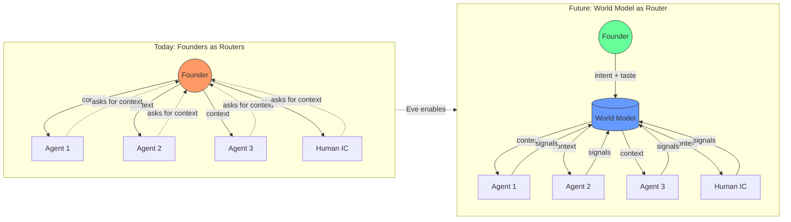
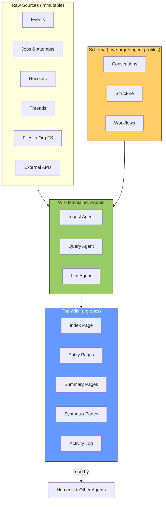
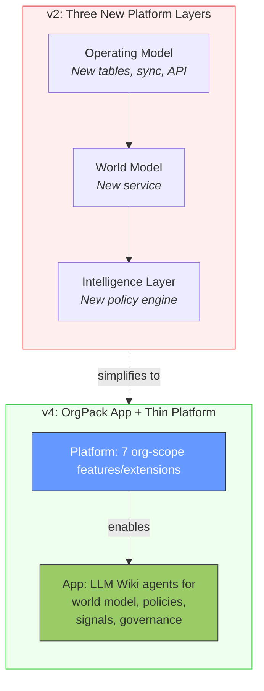
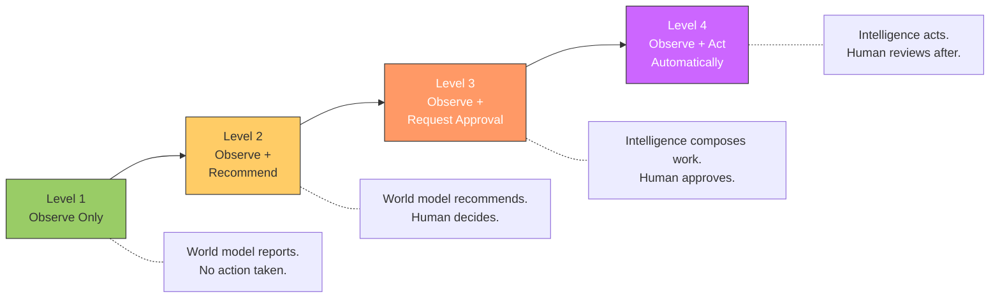
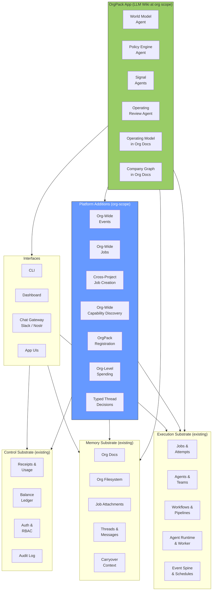
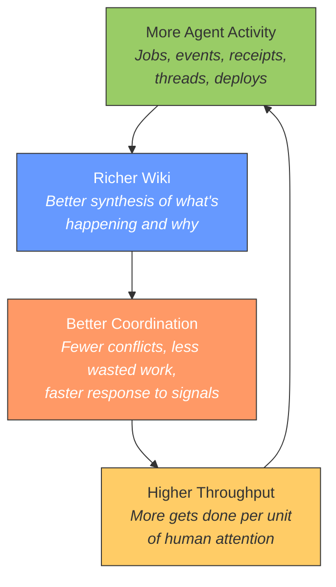
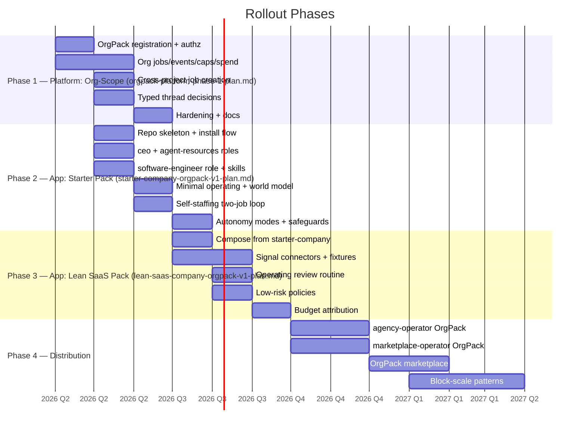

# Company as Intelligence: Design Plan

> **Status**: Design
> **Created**: 2026-04-03
> **Updated**: 2026-04-08 (v7 — align starter/lean-saas execution details and staffing flow)
> **Priority**: Strategic (shapes platform direction)
> **Prior art**: `docs/ideas/governance-layer-paperclip-synthesis.md` (v1 — Paperclip analysis), `docs/ideas/company-as-intelligence-v2.md`, `docs/ideas/company-as-intelligence-v2-original.md`
> **Context**: Block's "Company as Intelligence" thesis (Sequoia, April 2026), adapted to Eve Horizon's actual customer wedge
> **Prerequisite status**: `docs/plans/llm-wiki-platform-enhancements.md` implemented on 2026-04-05 (indexing, CLI, and wiki substrate improvements shipped)
> **Implementation plans**:
> - `docs/plans/orgpack-platform-phase-1-plan.md`
> - `docs/plans/starter-company-orgpack-v1-plan.md`
> - `docs/plans/lean-saas-company-orgpack-v1-plan.md`

---

## Why This Matters

For two thousand years, hierarchy has been the only coordination mechanism available to organizations. The Roman contubernium, the Prussian General Staff, McCallum's railroad org chart, Taylor's scientific management, McKinsey's matrix — every innovation in organizational design has been a variation on the same theme: humans routing information through layers of command.

The constraint is span of control. A leader can manage three to eight people. Narrowing span means adding layers. More layers means slower information flow. Two millennia of organizational innovation has tried to work around this tradeoff without breaking it.

Block's thesis is that AI breaks it. For the first time, a system can maintain a continuously updated model of an entire business and use it to coordinate work in ways that previously required humans relaying information through management layers.

Eve Horizon's question is not whether Block is right. It's whether Eve can be the platform that makes this real — starting with lean teams today, scaling to Block-like organizations tomorrow.

---

## Thesis

Block is pointing at a real end state: replace the information-routing function of hierarchy with a continuously updated company model plus an intelligence layer that composes capabilities into action.

Eve should support that end state, but **the first customer is not a 5,000-person company**. The first customer is a 3-50 person org that wants to scale output far faster than headcount. These companies don't need an AI org chart. They need a system that lets a handful of humans operate dozens of agents, capabilities, workflows, and customer loops without the founders becoming permanent routers of context.

For small orgs, the constraint is not middle-management overhead. It is **founder bandwidth**. Context lives in heads, Slack threads, PR comments, call notes, dashboards, and half-finished docs. People repeat the same goals, tradeoffs, and priorities over and over. Agents start work without enough company context, and humans become the glue.



> **Product positioning**: Not "replace middle management for large enterprises." Instead: *Run a company with a very small number of humans because your operating context, coordination, and execution all live on one platform.*

---

## Two Patterns

This plan introduces two complementary patterns. The first is general-purpose and applies to any team on Eve. The second builds on the first to enable company-wide coordination.

### Pattern 1: The LLM Wiki

A persistent, compounding knowledge base maintained by agents over Eve's org docs.

Most people's experience with LLMs and documents looks like RAG: upload files, retrieve chunks at query time, generate an answer. The LLM rediscovers knowledge from scratch on every question. Nothing accumulates.

The LLM Wiki is different. Instead of retrieving from raw sources at query time, agents **incrementally build and maintain a persistent wiki** — a structured, interlinked collection of documents that sits between users and the raw data. When new data arrives, the agent doesn't just index it. It reads it, extracts what matters, and integrates it into the existing wiki — updating entity pages, revising summaries, noting contradictions, strengthening or challenging the evolving synthesis.

**The wiki is a persistent, compounding artifact.** The cross-references are already there. The contradictions have already been flagged. The synthesis already reflects everything that's been ingested. It gets richer with every source added and every question asked.

### Pattern 2: The OrgPack

An Eve-compatible app that uses the LLM Wiki pattern at org-scope to provide company-wide coordination.

The OrgPack's agents maintain a wiki that synthesizes company state from events, jobs, receipts, and external signals. Other agents read this wiki instead of making 20 API calls or asking the founder for context. Intelligence policies evaluate the wiki and compose work across projects.

The OrgPack is the most important instance of the LLM Wiki pattern on Eve — but it is not the only one.

---

## The LLM Wiki on Eve

With the LLM Wiki substrate enhancements now implemented, team-scoped LLM Wikis are available on current Eve primitives. The base pattern no longer depends on speculative platform work. What remains is a thinner problem: making Eve's existing org-scope surfaces good enough for an installable coordination app.

### Architecture



### Mapping to Eve Primitives

| LLM Wiki Layer | Eve Primitive |
| --- | --- |
| **Raw sources** | Events, jobs, receipts, threads, org filesystem, external APIs |
| **The wiki** | Org docs (versioned, searchable, structured metadata, REST API) |
| **The schema** | Agent profiles (harness profiles) + config files in the project repo |
| **Ingest** | Agents that read sources and write/update org docs |
| **Query** | Agents (or humans via CLI) that search org docs and synthesize answers |
| **Lint** | Agents that health-check the wiki: find stale pages, contradictions, gaps |
| **Index** | An org doc that catalogs all wiki pages with summaries and links |
| **Log** | An append-only org doc recording ingests, queries, and maintenance |

### Operations

**Ingest.** An agent reads new raw data (events, files, external API responses), extracts what matters, and integrates it into the wiki. A single source might touch many wiki pages — updating summaries, entity pages, cross-references, and the index. Ingestion can be triggered by schedule (poll for new events every N minutes), by Eve events (react to a `system.doc.created` event), or by manual request (human asks agent to process a specific source).

**Query.** An agent or human searches the wiki for relevant pages, reads them, and synthesizes an answer. Good answers get filed back into the wiki as new pages — a comparison, an analysis, a connection worth preserving. This way explorations compound in the knowledge base just like ingested sources do.

**Lint.** Periodically, an agent health-checks the wiki. It looks for: contradictions between pages, stale claims superseded by newer data, orphan pages with no inbound links, important concepts mentioned but lacking their own page, missing cross-references, data gaps that could be filled. The agent suggests maintenance actions and, depending on trust level, executes them.

### Why Org Docs Are the Indexed Wiki Layer

The practical substrate is two-layered: agents read and write normal files in org-fs, and Eve indexes the durable wiki into org docs for search, versioning, and structured queries. Org docs are the right canonical indexed layer for this pattern because they add capabilities a raw markdown tree does not:

| Need | Org Docs Capability |
| --- | --- |
| Versioning | Immutable version history, diff any two versions |
| Search | Full-text search with BM25 ranking and headline snippets |
| Structured queries | Metadata queries with 6 operators (eq, in, gte, lte, exists, prefix) |
| Lifecycle | `review_due`, `expires_at`, `lifecycle_status` fields |
| API access | REST API plus org-fs auto-indexing — agents can use either direct API writes or normal file tools |
| Concurrency | Multiple agents can update different pages simultaneously |
| Scope | Org-wide by default — visible to all projects and agents in the org |

### Examples Beyond Company Coordination

Any team on Eve can run an LLM Wiki for their domain. Each is a project with agents that maintain structured knowledge in org docs:

| Wiki | Raw Sources | Maintained By | Who Reads It |
| --- | --- | --- | --- |
| **Customer Intelligence** | Support threads, call transcripts, NPS data, usage analytics | customer-intel agent | Product team, support agents |
| **Competitive Analysis** | Web scrapes, news feeds, product changelogs, analyst reports | research agent | Strategy, product, sales |
| **Technical Knowledge Base** | Incident reports, postmortems, architecture decisions, runbooks | docs agent | Engineering, infra agents |
| **Regulatory/Compliance** | Legal docs, audit reports, policy changes, regulator communications | compliance agent | Legal, governance |
| **Market Research** | Papers, articles, interviews, data sets | research agent | Strategy team |

These are all standard Eve projects with standard AgentPacks. They don't need org-wide scope. They read from their own sources and write to org docs.

The OrgPack is different because it needs to see across ALL projects. That's where the platform additions come in.

---

## The OrgPack: Company Coordination as an App

The v2 design proposed adding three new platform layers (Operating Model, World Model, Intelligence Layer) to Eve's core. That's wrong. It turns the platform into the product and puts months of core engineering between us and value.

The right architecture: **the coordination layer is an Eve-compatible app** that uses the LLM Wiki pattern at org-scope.



### Why this is better

1. **Dogfooding** — The most sophisticated Eve app IS the coordination layer. It proves the platform works for complex agentic applications.
2. **Platform stays lean** — Eve's core remains execution + memory + control + auth. No new domain-specific tables for company graphs, policy engines, or world models.
3. **Independent shipping** — The coordination app releases on its own cadence, no platform deploys required.
4. **Marketplace-native** — `starter-company`, `lean-saas-company`, `agency-operator`, and `marketplace-operator` aren't platform templates. They're different OrgPack apps. Anyone could build one.
5. **Proves the thesis** — If Eve can't support this app on its existing primitives, that's a signal the primitives are wrong. Fix the primitives, don't build around them.

---

## What the Platform Still Needs

Eve is no longer purely project-scoped. It already ships org docs, org threads, org-wide jobs/events queries, and org/project spend plus analytics. The OrgPack still needs seven thin additions or extensions to make those surfaces usable as a coordination app rather than a collection of unrelated endpoints.

All seven are general-purpose features that benefit any org-scoped app, not just the coordination pack. Some are net-new. Some are extensions of org-scope reads that already exist.

> **Implementation plan**: every capability in this section is specified in full (migration numbers, touchpoint files, authz mechanism, verification loops) in [`orgpack-platform-phase-1-plan.md`](./orgpack-platform-phase-1-plan.md). This section is the strategic rationale; the Phase 1 plan is the execution contract.

### 1. OrgPack Registration

The platform needs to know which project IS the org pack. This is the gate that enables elevated permissions.

```bash
eve org set-pack <org_id> --project <project-slug>   # registers
eve org get-pack <org_id>                            # inspects
eve org unset-pack <org_id>                          # revokes
```

Registration grants the pack project's agents:
- Org-wide event access (including the SSE stream)
- Cross-project job creation rights (with rate limits + circuit breakers)
- Org-wide job and capability queries (including attention-oriented views)
- Org-level receipt/spend queries (including group_by breakdowns)
- Reserved-prefix writes in org docs and org fs under `/operating-model/**` and `/world-model/**`
- Typed decision writes on org threads

Registration is not a super-admin bypass. Pack agents get org-wide metadata/query access and the right to write under reserved prefixes only; every other org-doc and org-fs path still composes with access groups and scoped bindings.

**Implementation**: A `pack_project_id` column on the `orgs` table, a `PackAuthService.isPackToken()` helper used inside the pack-gated endpoints, and a reserved-prefix override inside `ScopedAccessService.can()` for docs/fs writes. Details in [`orgpack-platform-phase-1-plan.md`](./orgpack-platform-phase-1-plan.md#6-phase-1a-orgpack-registration--permission-model).

### 2. Org-Wide Event Feed Upgrades

The baseline already exists: `GET /orgs/{org_id}/events` ships today. The remaining gap is turning that paginated query surface into an OrgPack-grade feed with real-time delivery and richer filters.

```
GET /orgs/{org_id}/events                  # shipped: all events across the org
    ?type=system.job.*                     # shipped: filter by type
    ?since=2026-04-05T14:00:00Z            # shipped: ISO timestamp filter
GET /orgs/{org_id}/events/stream           # proposed: SSE/polling for real-time
    ?type=system.job.failed
    ?source=github                         # Filter by source
    ?project_id=proj_xxx                   # Filter by project
```

The world model agent subscribes to this stream and synthesizes company state.

**Implementation**: Reuse the existing org events query across `events` joined through `projects.org_id`, then add SSE/polling plus richer filters similar to org-fs events stream. Do not build a second event system.

### 3. Org-Wide Job Visibility Upgrades

The baseline already exists: `GET /orgs/{org_id}/jobs` and `GET /orgs/{org_id}/jobs/stats` ship today. The remaining gap is making those surfaces attention-oriented enough for the world model and operating review.

```
GET /orgs/{org_id}/jobs                    # shipped: cross-project job listing
    ?status=active                         # shipped: filter by phase/status
    ?agent_slug=infra-agent                # shipped: what is this agent doing?
    ?project_id=proj_xxx                   # shipped: restrict to one project
GET /orgs/{org_id}/jobs/stats             # shipped: aggregate counts
GET /orgs/{org_id}/jobs?status=blocked    # proposed ergonomic/derived view
GET /orgs/{org_id}/jobs?since=...         # proposed recent-activity filter
```

**Implementation**: Extend the existing org job query across `jobs` joined through `projects.org_id` with derived views such as `blocked`, `stalled`, and `recent_failures`. Permission-gated to org pack agents and org admins.

### 4. Cross-Project Job Creation

When the OrgPack's intelligence policy decides "infra-agent should investigate this alert," it needs to create a job in infra-agent's project. This is the "compose capabilities into action" primitive. Without it, the OrgPack can observe but never coordinate.

```
POST /projects/{target_project}/jobs
Authorization: org-pack agent token
```

**Implementation**: Extend job creation authorization to allow org pack agents to create jobs in any project within the org. The job's `created_by` tracks the originating pack agent for audit.

### 5. Org-Wide Capability Discovery

Every OrgPack needs to answer: "What can this org do?" The platform already knows — agents are synced via manifests, workflows are declared, pipelines exist, services are deployed. This data just isn't queryable as a unified surface today.

```
GET /orgs/{org_id}/capabilities            # Everything the org can do
    ?type=agent                            # Filter by type
    ?type=workflow
    ?type=pipeline
    ?type=service
    ?project=infra                         # Filter by project
    ?search=deploy                         # Full-text search
```

Returns a unified list across the org:

| Capability Type | Source | What It Returns |
| --- | --- | --- |
| **Agents** | `project_agent_configs` | Slug, project, description, harness, status |
| **Workflows** | Parsed manifests | Name, project, trigger conditions, steps |
| **Pipelines** | Parsed manifests | Name, project, stages, trigger events |
| **Deployed services** | Environment deployments | Component, project, environment, health |
| **App CLIs** | Parsed manifests | Commands, project, description |

This is the capability registry — built from data the platform already has. The OrgPack then enriches these with ownership, SLOs, cost profiles, and health assessments stored in org docs.

**Implementation**: Aggregate query across `project_agent_configs`, parsed manifests, and environment deployments, joined through `projects.org_id`.

### 6. Org-Level Spend Breakdown Queries

Baseline spend visibility already exists via `eve org spend <org_id>` and org-level analytics. The missing piece for OrgPack is grouped, receipt-aware breakdowns that can be attributed to outcomes, capabilities, and policies.

```
GET /orgs/{org_id}/spend                   # shipped: total org spend for a window
    ?since=2026-04-01T00:00:00Z            # shipped
    ?until=2026-04-05T23:59:59Z            # shipped
GET /orgs/{org_id}/spend
    ?group_by=project                      # Proposed: spend by project
    ?group_by=agent_slug                   # Proposed: spend by agent
    ?group_by=workflow                     # Proposed: spend by workflow
```

**Implementation**: Extend the existing spend surface with grouped receipt aggregation over `job_attempts` joined through jobs and projects. The admin balance/usage surfaces already exist; this adds org-pack-accessible attribution views.

### 7. Typed Thread Decisions

Org-wide threads already exist. The remaining gap is governance state on top of them: structured decisions, approval status, risk class, and audit-friendly rationale.

```json
{
  "thread_type": "approval",
  "decision_status": "pending|approved|rejected",
  "risk_class": "low|medium|high|critical",
  "decided_by": "user_xxx",
  "decided_at": "2026-04-05T...",
  "linked_job_id": "proj-abc123",
  "rationale": "..."
}
```

**Implementation**: The simplest path is a new `decision JSONB` column on `threads` (nullable) so each approval thread carries its current decision state alongside its normal message history. Today `thread_messages` has no `kind` column (only `direction`), so introducing a message-level enum would be a larger change than necessary for v1. Promote to a dedicated `thread_decisions` table only if multi-step approval history outgrows a single current-state JSONB. See `orgpack-platform-phase-1-plan.md` Phase 1D for the full schema and endpoint shape.

---

## The Nine Coordination Primitives

Everything below lives in the OrgPack app. The platform provides org-scope access; the app provides coordination logic using the LLM Wiki pattern.

### 1. Org Operating Model

The `.eve-org/` directory in the pack's repo defines company intent. The pack's agents sync this into org docs on every deploy — this is the **schema** layer of the LLM Wiki.

```yaml
# .eve-org/mission.yaml
title: "Ship a self-serve developer platform that feels instant"

# .eve-org/outcomes.yaml
first-deploy:
  title: "New developers deploy in under 5 minutes"
  owner: founder
  measures:
    - metric: onboarding.time_to_first_deploy
      target: "< 5m"

# .eve-org/capabilities.yaml
deploy-runtime:
  owner: infra-agent
  project: infra
  interfaces:
    - type: workflow
      ref: deploy
  slos:
    - "deploy success > 99%"
    - "median deploy < 5m"
```

Stored in org docs at `/operating-model/mission`, `/operating-model/outcomes/first-deploy`, etc. Versioned, searchable, queryable by any agent.

### 2. Capability Registry (Enrichment Layer)

The platform provides raw capability discovery (platform feature #5) — what agents, workflows, pipelines, and services exist. The OrgPack enriches this with ownership, intent, and health. This is an **ingest** operation in LLM Wiki terms: the agent reads raw data (platform API) and integrates it with declared intent (`.eve-org/capabilities.yaml`) to produce enriched wiki pages.

```yaml
# /operating-model/capabilities/deploy-runtime — enriched capability doc
# --- platform data (from capability discovery) ---
type: workflow
project: infra
agent: infra-agent
status: active
last_job_at: "2026-04-05T10:30:00Z"

# --- org-pack enrichment (from .eve-org/ + world model) ---
owner: infra-agent
slos:
  - "deploy success > 99%"
  - "median deploy < 5m"
health: green
cost_7d_usd: 12.40
```

### 3. Company Graph

Stored in org docs as structured YAML. Not a database table — a document that the world model agent maintains.

```yaml
# /operating-model/company-graph
actors:
  founder:
    kind: human
    roles: [dri, player_coach]
  infra-agent:
    kind: agent
    project: infra
    roles: [ic]
  docs-agent:
    kind: agent
    project: docs
    roles: [ic]

edges:
  - { type: owns_outcome, from: founder, to: first-deploy }
  - { type: owns_capability, from: infra-agent, to: deploy-runtime }
  - { type: pulls_from, from: founder, to: infra-agent }
  - { type: coaches, from: founder, to: docs-agent }
```

**Node types**: humans, agents, teams, capabilities, outcomes, routines

**Edge types**: `owns_capability` (IC owns a building block), `owns_outcome` (DRI owns a business result), `pulls_from` (DRI can compose this agent), `coaches` (player-coach develops craft), `approves` (governance authority), `operates` (runtime responsibility), `informed_by` (receives signals)

**Role vocabulary**: `ic` (owns capabilities), `dri` (owns outcomes), `player_coach` (owns craft and development)

### 4. World Model

The world model is the core **wiki** maintained by the OrgPack. It replaces the founder's mental model as the source of company context. Every other agent reads these docs instead of making raw API calls — the cross-references are already there, the synthesis already reflects everything known.

**Implementation**: An agent that runs every 5 minutes:

1. Reads the org-wide event feed (platform feature #2)
2. Queries org-wide job status (platform feature #3)
3. Queries org-wide spending (platform feature #6)
4. Queries capability discovery (platform feature #5)
5. Reads current wiki state from org docs
6. Synthesizes an updated picture
7. Writes structured summaries to org docs

```
/world-model/state                    # Current synthesis (the index)
/world-model/execution-state          # Active jobs, blocked work, health
/world-model/resource-state           # Budget burn, agent load, cost trends
/world-model/strategic-context        # Outcome health vs targets
/world-model/signals/                 # Latest signal snapshots
```

This is what replaces middle management. A manager's job is to know what's happening and relay context. The world model does this continuously, for the entire org, without lossy human summarization at each layer.

### 5. Signal Feeds

Signal agents perform **ingest** operations — they pull external data and normalize it into wiki pages:

```yaml
# .eve-org/signals.yaml
onboarding.time_to_first_deploy:
  source: analytics
  connector: posthog
  query: onboarding_ttfd_7d

production.error_rate:
  source: sentry
  project: api
  threshold: 2%

support.volume:
  source: org_threads
  query: "help OR broken OR stuck"
```

Signal agents run on schedule, pull data from configured sources, write normalized snapshots to `/world-model/signals/`. The world model agent reads these during its synthesis cycle.

This is how "customer reality generates the backlog" without requiring every company to build its own internal platform first.

### 6. Intelligence Policies

The policy engine agent performs **query** operations against the wiki and composes action when conditions are met:

```yaml
# .eve-org/intelligence.yaml
policies:
  onboarding-regression:
    when:
      all:
        - metric: onboarding.time_to_first_deploy
          op: ">"
          value: "10m"
        - trend: worsening_7d
    then:
      create_job:
        project: platform
        workflow: onboarding-regression-review
        owner: founder
        attach_world_model: true
    approval: none

  error-spike:
    when:
      metric: production.error_rate
      op: ">"
      value: "2%"
    then:
      create_job:
        project: infra
        agent: infra-agent
        title: "Investigate error spike: {{metric.value}}"
    approval: required
    risk_class: medium
```

The policy engine reads world model state from org docs, evaluates each policy, and uses cross-project job creation (platform feature #4) to compose action. When approval is required, it creates an approval thread (platform feature #7) and waits.

### 7. Governance Gates

Approval workflows that use the platform's typed thread decisions, with a trust progression path:



The app orchestrates the workflow. The platform provides the decision record on threads.

### 8. Budget Attribution

The OrgPack queries org-level spending (platform feature #6) and attributes costs to outcomes, capabilities, and policies. This is a **query** operation — reading receipts and the company graph, synthesizing attribution reports, and filing them back into the wiki:

```
/operating-model/budgets/by-outcome/first-deploy
/operating-model/budgets/by-capability/deploy-runtime
/operating-model/budgets/by-agent/infra-agent
```

### 9. Operating Packs (Distribution)

The OrgPack itself IS the distributable operating template. Different packs for different company types:

| Pack | Focus | Ships With |
| --- | --- | --- |
| `starter-company` | Minimal generic company pack | `ceo`, `agent-resources`, `software-engineer`, world-model basics, self-staffing loop, app-building loop, no domain assumptions. |
| `lean-saas-company` | Developer-tool startups | Deploy, docs, support agents. GitHub/Sentry/Stripe signal connectors. |
| `agency-operator` | Service businesses | Client management, project tracking, billing agents. |
| `marketplace-operator` | Two-sided marketplaces | Supply/demand signals, matching, trust/safety agents. |
| `platform-company` | API-first businesses | Usage analytics, developer experience, reliability agents. |

A startup that wants the thinnest path installs `starter-company` and gets working coordination infrastructure in an afternoon. A startup that wants a more opinionated operating model installs `lean-saas-company`. In both cases, the mechanism is the same: register the coordination project as the org pack.

#### `starter-company`: Three-Role Base Pack

> **Implementation plan**: this pack is specified in full — repo shape, install contract, two-job self-staffing loop, autonomy modes, verification scenarios — in [`starter-company-orgpack-v1-plan.md`](./starter-company-orgpack-v1-plan.md).

The first installable OrgPack should be smaller than `lean-saas-company`. It should ship with exactly three durable roles — the minimum set that lets a company both grow its own org chart and ship software on Eve:

- `ceo` — owns goals, priorities, company design, and delegation authority
- `agent-resources` (`ar`) — owns the mechanical agent lifecycle: add, update, retire, and sync agents
- `software-engineer` (`se`) — builds Eve-compatible apps from a spec: scaffolds projects, writes manifests, deploys, and debugs

The user's setup work is intentionally small: set mission, goals, budgets, repo credentials, and the desired autonomy posture. After that, the pack can operate conservatively or fully autonomously depending on configuration.

This is the simplest credible answer to the "Paperclip but with less setup" wedge. The user does not need to predefine a whole org chart or hand-scaffold any apps. They install one pack, set the goals, and let the org both grow *and* ship from there.

**Why three roles and not two**: two roles (`ceo` + `ar`) prove the self-modification story — the pack can grow its own org chart. But a growing org chart alone does nothing; the pack still needs someone who can actually ship software onto Eve when the CEO identifies a new product capability. The software engineer closes that loop. Without the SE, every non-staffing capability gap becomes a human request. With the SE, the pack can scaffold and deploy new Eve-compatible apps end-to-end under the same autonomy posture that governs staffing.

**Agent responsibilities**

- `ceo` reads the operating model and world model, decides when existing capabilities are enough, and decides whether a gap needs a new durable agent role (delegates to `ar`) or a new Eve-compatible app (delegates to `se`).
- `agent-resources` is the staffing specialist. Its skill explicitly loads `eve-read-eve-docs` and treats `references/agents-teams.md`, `references/jobs.md`, and `references/skills-system.md` as the operating manual for how Eve actually adds agents, profiles, packs, and syncs.
- `software-engineer` is the app-shipping specialist. Its skill loads the full `eve-*` skill stack (`eve-fullstack-app-design`, `eve-agentic-app-design`, `eve-new-project-setup`, `eve-manifest-authoring`, `eve-pipelines-workflows`, `eve-deploy-debugging`, `eve-local-dev-loop`, `eve-app-cli`, `eve-auth-and-secrets`) and treats those as the operating manual for scaffolding and deploying new Eve-compatible apps.

**Self-staffing loop**

1. The `ceo` sees a persistent capability gap from goals, world-model state, or repeated work.
2. The `ceo` creates a staffing job for `agent-resources` or performs the same loop itself when configured for direct action.
3. `agent-resources` edits the OrgPack repo: `pack/agents/agents.yaml`, any new harness profiles, `.eve/manifest.yaml` pack references, and the relevant `.eve-org/` docs such as the company graph or governance docs.
4. `agent-resources` previews the effective config, creates a dependent apply job carrying `hints.staffing_branch`, then exits; the worker commits and pushes the branch after the job completes.
5. The apply job runs `eve project sync --project <orgpack-project> --ref <branch>` (with `eve agents sync` remaining a deprecated alias for agent-only sync), and the new agent appears in the org's capability registry and company graph so the `ceo` can immediately start assigning it work.

The important point: this does **not** require a special "hire agent" platform primitive. It is an OrgPack opinion built on repo-first agent config, pack resolution, existing job git controls, and project sync.

**Autonomy posture**

`starter-company` should support several postures with the same architecture:

- `advise` — `ceo` proposes staffing changes; humans approve
- `auto_staff` — `ceo` and `agent-resources` may change the pack's own agent roster without human approval
- `full_auto` — the pack may change its own staffing and operate policy-driven execution loops without human interaction

In other words: conservative is a default, not a platform law.

---

## Reference Implementation: `lean-saas-company` OrgPack

> **Implementation plan**: this pack is specified in full — pack-overlay strategy (it references `starter-company` via `x-eve.packs`), specialist roles, signal connector mechanism, operating review template, low-risk policies, and verification loops — in [`lean-saas-company-orgpack-v1-plan.md`](./lean-saas-company-orgpack-v1-plan.md).

`starter-company` is the minimal generic pack with three durable roles (`ceo`, `agent-resources`, `software-engineer`). `lean-saas-company` is the first richer vertical pack and can either be installed directly or reached incrementally as the starter pack's agents staff up new specialists and scaffold new apps over time.

### Repo Structure

```
eve-orgpack-lean-saas/
  .eve/
    manifest.yaml                    # Eve app manifest
  pack/
    eve/
      pack.yaml                      # Pack metadata
    agents/
      agents.yaml                    # Agent definitions
      profiles/                      # Harness profiles per agent
        world-model.md
        policy-engine.md
        signal-watcher.md
        operating-review.md
    workflows/
      workflows.yaml
  .eve-org/                          # Operating model templates
    mission.yaml
    outcomes.yaml
    capabilities.yaml
    company-graph.yaml
    signals.yaml
    intelligence.yaml
    governance.yaml
  skills/
    world-model/SKILL.md
    policy-engine/SKILL.md
    signal-connectors/SKILL.md
  README.md
```

### Installation

```bash
# 1. Create the coordination project
eve project ensure --name "Coordination" --slug coordination \
  --repo-url https://github.com/your-org/eve-orgpack-lean-saas \
  --org org_xxx

# 2. Register it as the org pack
eve org set-pack org_xxx --project coordination

# 3. Sync the project (manifest + agents)
eve project sync --project proj_coordination

# 4. Pack agents start running on schedule via the agent runtime
```

### Agent Definitions

```yaml
# pack/agents/agents.yaml
version: 1
agents:
  world_model:
    slug: world-model
    skill: orgpack-world-model
    description: >
      Synthesizes company state from org-wide events, jobs, receipts,
      and capability data. Writes structured summaries to org docs.
    harness_profile: world-model
    schedule:
      heartbeat_cron: "*/5 * * * *"
    context:
      docs:
        - path: /operating-model/
          recursive: true
        - path: /world-model/
          recursive: true

  policy_engine:
    slug: policy-engine
    skill: orgpack-policy-engine
    description: >
      Evaluates intelligence policies against world model state.
      Creates cross-project jobs when policies trigger.
      Routes approvals through typed thread decisions.
    harness_profile: policy-engine
    schedule:
      heartbeat_cron: "*/10 * * * *"
    context:
      docs:
        - path: /operating-model/intelligence
        - path: /world-model/state
        - path: /world-model/signals/
          recursive: true

  signal_watcher:
    slug: signal-watcher
    skill: orgpack-signal-watcher
    description: >
      Pulls external signals from configured sources (GitHub, Sentry,
      Stripe, PostHog) and writes normalized snapshots to org docs.
    harness_profile: signal-watcher
    schedule:
      heartbeat_cron: "*/15 * * * *"
    context:
      docs:
        - path: /operating-model/signals

  operating_review:
    slug: operating-review
    skill: orgpack-operating-review
    description: >
      Weekly synthesis. Reads world model, compares against outcomes
      and SLOs, writes review to an org thread, creates follow-up
      jobs for anything needing attention.
    harness_profile: operating-review
    schedule:
      heartbeat_cron: "0 9 * * 1"
    context:
      docs:
        - path: /operating-model/
          recursive: true
        - path: /world-model/
          recursive: true
```

### What Runs and When

```
Every 5 minutes — world-model (ingest + synthesize):
    → GET /orgs/{org_id}/events?since=<iso>         (shipped; Phase 1 adds stream/filter upgrades)
    → GET /orgs/{org_id}/jobs?status=active         (shipped; Phase 1 adds blocked/stalled views)
    → GET /orgs/{org_id}/spend?since=<iso>&until=<iso>
                                                   (shipped; Phase 1 adds grouped breakdowns)
    → GET /orgs/{org_id}/capabilities               (Phase 1 capability discovery)
    → reads /world-model/* from org docs            (existing: org docs API)
    → synthesizes updated state
    → writes /world-model/state, execution-state, resource-state

Every 10 minutes — policy-engine (query + compose):
    → reads /world-model/state from org docs
    → reads /operating-model/intelligence from org docs
    → evaluates each policy against current state
    → if triggered:
        → POST /projects/{target}/jobs              (platform: cross-project jobs)
        → if approval required:
            → creates approval thread               (platform: typed decisions)

Every 15 minutes — signal-watcher (ingest):
    → reads /operating-model/signals from org docs
    → for each configured source:
        → fetches data from external API
        → normalizes into structured snapshot
        → writes /world-model/signals/{name}

Every Monday 9am — operating-review (query + lint):
    → reads /world-model/** and /operating-model/**
    → compares outcomes against SLOs and trajectory
    → identifies stale data, contradictions, gaps
    → writes review summary to org thread
    → creates follow-up jobs for items needing attention
```

### Example: World Model State Document

```yaml
# /world-model/state — the wiki index, written every 5 minutes
synthesized_at: "2026-04-05T14:30:00Z"

health: amber
health_reason: "Onboarding TTFD regressing (8.2m vs 5m target)"

outcomes:
  first-deploy:
    status: at_risk
    target: "< 5m"
    current: "8.2m (7d avg)"
    trend: worsening
  reduce-churn:
    status: on_track
    target: "< 3% monthly"
    current: "2.1%"
    trend: stable

execution:
  active_jobs: 4
  blocked_jobs: 1
  blocked_summary: "infra-deploy-x8f2 waiting on approval"
  failed_24h: 2
  failed_summary: "docs-generation twice (timeout)"

resources:
  spend_24h_usd: 34.20
  spend_7d_usd: 198.50
  top_spender: "infra-agent ($89.30 / 7d)"
  budget_status: within_limits

capabilities:
  healthy: [deploy-runtime, support-triage]
  degraded: [docs-generation]
  degraded_reason: "2 failures in 24h"

attention_needed:
  - "Onboarding TTFD regressing — review will trigger if trend continues"
  - "docs-generation agent failing — may need profile adjustment"
```

### Example: Policy Trigger Flow

When `production.error_rate` crosses 2%:

```
1. signal-watcher writes:
   /world-model/signals/production.error_rate
   { value: 3.2, threshold: 2.0, source: "sentry", at: "2026-04-05T14:15:00Z" }

2. world-model reads signal, updates:
   /world-model/state → capabilities.deploy-runtime.status: "degraded"

3. policy-engine reads state, evaluates:
   policy "error-spike": metric > 2% → TRIGGERED

4. policy-engine composes:
   POST /projects/proj_infra/jobs
   { title: "Investigate error spike: 3.2%", agent_slug: "infra-agent",
     hints: { attach_docs: ["/world-model/state"] } }

   POST /orgs/{org_id}/threads
   { thread_type: "approval", risk_class: "medium",
     linked_job_id: "infra-inv-a3f2dd12",
     body: "Error rate 3.2% > 2%. Created investigation for infra-agent. Approve?" }

5. Human approves via Slack / Dashboard / CLI:
   eve thread decide thr_xxx --approve --rationale "DB connection pool issue"

6. Job runs. infra-agent investigates.
   World model picks up the result on next synthesis cycle.
```

### What the Founder Sees

**Before (founder as router):**
- Check Sentry for errors, mentally note
- Check Slack for support threads, mentally triage
- Check GitHub for PR status, mentally prioritize
- Open Linear, create issues for what they noticed
- Ping infra engineer in Slack, wait for response
- Write weekly update, summarize from memory

**After (world model as router):**
- Monday 9am: operating-review thread arrives with weekly synthesis
- Approval requests arrive when policies trigger
- Approve or reject with one command
- Check `/world-model/state` when they want the full picture
- Override priorities by editing `.eve-org/outcomes.yaml` and pushing

The founder's job shifts from routing information to setting intent and exercising judgment.

---

## The Eve Stack



---

## Design Rules

### 1. Build for 5 people before 5,000

If a primitive only makes sense once a company has management layers, it is too late in the stack.

### 2. Platform provides primitives, app provides opinions

The platform should never contain company-graph schemas, policy DSLs, or world-model synthesis logic. The platform provides org-scope access, execution, memory, and control. The OrgPack app provides coordination opinions.

### 3. The LLM Wiki is the implementation pattern

The world model, capability registry, signal feeds, and operating review are all instances of the same pattern: agents that read raw sources, maintain structured wiki pages in org docs, and expose the synthesis for other agents and humans to read. Don't build custom infrastructure for each. Use the pattern.

### 4. Reuse Eve's existing execution substrate

No second task system, no second memory system, no second runtime. The OrgPack's agents use the same jobs, org docs, threads, events, and agent runtime as every other Eve app.

### 5. Treat the world model as a materialized synthesis, not magic

The first world model should be structured and boring. It's an agent that reads events, jobs, and receipts and writes a summary to org docs. "What jobs are blocked?" is easy. "What should we prioritize?" is hard. Build from easy to hard.

### 6. Autonomy posture is a pack decision, not a platform decision

For most companies, trust is the bottleneck, so many packs will start at Level 2 or Level 3. That's fine. But the platform must also support Level 4 packs, including self-modifying staffing loops, when an org explicitly configures that posture. Conservative-by-default is sensible; a hard-coded human gate in the platform is not.

### 7. If the app can't do it, fix the platform

Every time the OrgPack app hits a wall, that's a platform gap. Fix the platform. Never work around it in app code.

### 8. Good answers become wiki pages

When a human or agent synthesizes something valuable — a comparison, an analysis, a connection — file it back into the wiki. Explorations compound just like ingested sources.

---

## The Compounding Loop



Every job that runs, every event that fires, every receipt recorded makes the wiki richer. A richer wiki means better coordination. Better coordination means more gets done. More getting done means more signals. It compounds.

The LLM Wiki makes this concrete: the tedious part of maintaining a knowledge base isn't the reading or thinking — it's the bookkeeping. Updating cross-references, keeping summaries current, noting when new data contradicts old claims. Humans abandon wikis because the maintenance burden grows faster than the value. LLM agents don't get bored, don't forget to update a cross-reference, and can touch 15 org docs in one pass. The wiki stays maintained because the cost of maintenance is near zero.

---

## How This Looks at Different Scales

### Lean company (7 people)

- Humans own mission and guardrails; conservative orgs keep final approvals, while fully autonomous orgs may delegate much of that judgment to OrgPack policy
- AI agents own capabilities: deploy/runtime, docs, support triage, pricing analysis, release operations
- The world model wiki watches activation, incidents, support friction, spend, and code health
- Intelligence policies create work when signals move
- Weekly operating review distills the wiki into an org thread
- No one spends their day routing status

### Mid-sized company (50-200 people)

- Multiple DRIs own different outcomes
- Multiple LLM Wikis: company coordination (OrgPack) + team-specific wikis (customer intelligence, technical knowledge base)
- Signal feeds include customer segments, revenue cohorts, competitive intelligence
- Intelligence policies handle more patterns autonomously at lower risk levels
- Governance gates enforce separation of concerns across teams
- Budget attribution reveals which outcomes justify their cost

### Block-scale company (thousands)

- The company graph becomes a full coordination topology across business units
- Signal feeds become the "economic graph" — rich, proprietary, compounding
- DRIs own large cross-cutting outcomes over fixed time horizons
- The world model supports forecasting and simulation, not just summaries
- Multiple OrgPacks may compose (platform-wide + team-specific)

**The important point**: Eve does not need one architecture for startups and another for Block. The platform provides primitives. OrgPacks provide opinions. Different packs for different scales.

---

## Lean Wedge Success Criteria

The first OrgPack does not need to prove post-hierarchical coordination for a Fortune 500. It needs to prove that a 3-50 person company becomes materially more legible and less founder-routed on Eve.

Success for `starter-company` v1:

- A small org can install the pack in under one day, set mission/goals/guardrails, and get `/operating-model/**` plus `/world-model/**` populated with `ceo`, `agent-resources`, and `software-engineer` running.
- In `full_auto` mode, the `ceo` + `agent-resources` loop can add at least one new agent end-to-end without human interaction: repo change -> push -> `eve project sync`.
- In `full_auto` mode, the `ceo` + `software-engineer` loop can scaffold, build, and deploy at least one new Eve-compatible app end-to-end without human interaction.
- Every staffing change and every app build is legible and auditable through job history, git history, pipeline runs, and updates to the company graph/world model.
- The pack stays bounded: org-wide query access, reserved-prefix writes, mutation of the OrgPack's own repo/config, and creation of new Eve projects the SE owns — not blanket super-admin powers.

Success for `lean-saas-company` v1:

- A small org can install the pack directly, or let `starter-company` grow into an equivalent shape by staffing specialist agents over time.
- The founder can answer the core weekly coordination questions from the world model and operating-review thread without manually checking 5 separate systems.
- At least one low-risk policy creates cross-project work with approval gating, audit trail, and rollback/circuit-breaker behavior.
- World model refresh stays comfortably inside the operating cadence for small orgs: minutes, not hours.
- Pack permissions remain bounded: org-wide query access plus reserved-prefix writes, not blanket data-plane super-admin powers.

---

## Rollout Sequence



### Phase 1: Platform — OrgPack-Ready Org Scope

Finish the seven platform additions/extensions that make Eve's existing org-scope surfaces usable for any OrgPack:

- OrgPack registration (`eve org set-pack <org_id> --project <slug>`)
- Org-wide event feed upgrades (SSE + richer filters over the existing endpoint)
- Org-wide job visibility upgrades (attention-oriented views over the existing endpoint)
- Cross-project job creation (with pack authorization)
- Org-wide capability discovery (unified query across manifests and deployments)
- Org-level spend breakdowns (grouped receipt aggregation over the existing spend surface)
- Typed thread decisions (approval workflows over existing org threads)

**Milestone**: The platform supports OrgPack-grade org-scoped apps. Team-level LLM Wikis already work on today's primitives; Phase 1 closes the remaining gaps for company-wide coordination.

### Phase 2: App — Lean Coordination

Build the first installable OrgPacks:

- `starter-company` (minimal pack with `ceo`, `agent-resources`, `software-engineer`, goals, guardrails, and optional full autonomy)
- Operating model sync agent (`.eve-org/` -> org docs)
- World model agent v1 (synthesize events, jobs, receipts into wiki pages)
- Company graph in org docs (nodes, edges, role vocabulary)
- Agent-resources staffing loop (repo mutation -> push -> `eve project sync`)
- Software-engineer app-building loop (scaffold -> manifest -> sync -> pipeline -> deploy)
- Operating review routine (weekly synthesis -> org thread)
- Capability enrichment agent (ownership, SLOs, health over platform discovery data)
- `lean-saas-company` as the richer vertical follow-on pack

**Milestone**: A small company can choose a minimal autonomous pack or a richer vertical pack and is no longer primarily founder-routed.

### Phase 3: App — Intelligence Policies

Add the reactive layer:

- Signal feed agents (GitHub, Slack, Stripe, Sentry connectors)
- Observe -> recommend policies (world model proposes, human decides)
- Observe -> request approval policies (intelligence composes, human approves)
- Selective observe -> act for low-risk domains
- Budget attribution reports (spend by outcome, capability, agent)

**Milestone**: The company operates more like an intelligence than a hierarchy.

### Phase 4: Distribution

Build more OrgPacks and a marketplace:

- `agency-operator` pack
- `marketplace-operator` pack
- OrgPack marketplace (install, configure, customize)
- Block-scale multi-entity coordination patterns

**Milestone**: Any company can install working coordination infrastructure in an afternoon.

---

## What Eve Should Not Build

1. **No second task system** — No `issues` table beside `jobs`. The OrgPack uses jobs for everything.
2. **No second runtime** — No special coordination engine. OrgPack agents run on the existing agent runtime.
3. **No company-graph database tables** — The graph is a document in org docs, maintained by the OrgPack.
4. **No policy engine in the platform** — Policy evaluation is app logic in the OrgPack's policy engine agent.
5. **No world-model service** — The world model is an agent that writes to org docs. Not a platform service.
6. **No wiki primitive** — Org docs already ARE the wiki layer. The LLM Wiki pattern emerges from how agents use them.
7. **No platform-enforced human gate** — Approval threads should exist as a pack primitive, but the platform must also support fully autonomous OrgPacks, including self-modifying staffing, when explicitly configured.

---

## Honest Assessment: What's Hard

### The wiki is only as good as the artifacts

Companies that don't generate machine-readable work won't get much value. Eve is best suited to remote-first, artifact-heavy organizations. This is a feature, not a bug — it selects for the right early customers.

**Mitigation**: Start with structured queries. "What jobs are blocked?" is easy. "What should we prioritize?" is hard. Build from easy to hard.

### Signal quality matters more than AI sophistication

A bad signal feed produces bad coordination. For many small orgs, the first job is not better reasoning — it's getting support, product, revenue, and operational signals into Eve in a usable form.

**Mitigation**: Ship signal feed connectors for the most common sources before shipping sophisticated reasoning.

### Trust adoption will be gradual

The intelligence layer composing and executing responses autonomously is powerful but terrifying. Most organizations won't trust it without extensive guardrails.

**Mitigation**: The four-level trust progression (observe -> recommend -> approve -> act) is the adoption path. Don't force Level 4.

### Cross-project job creation needs careful authorization

An OrgPack agent that can create jobs in any project is powerful but dangerous. A bug in the policy engine could spam the org with unwanted jobs.

**Mitigation**: Rate limits on cross-project job creation. Audit trail on every cross-project job. Circuit breakers that pause the pack if error rates spike.

### Wiki maintenance at scale is unproven

The LLM Wiki pattern works well at moderate scale (~100 sources, hundreds of pages). At org scale with thousands of events per day, the world model agent's synthesis cycle may need to become more sophisticated — incremental updates rather than full re-synthesis, priority-based attention, summarization hierarchies.

**Mitigation**: Start with small orgs where event volume is manageable. The 5-minute synthesis cycle is a starting point, not a final answer. The pattern's strength is that the agent can evolve its maintenance strategy without platform changes.

### This is a cultural transformation

Block acknowledges: "It will be a difficult transition, and parts of it will likely break before they work." Most organizations don't generate machine-readable artifacts and have deeply entrenched hierarchies.

**Mitigation**: Eve can't solve culture. But if installing an OrgPack gives you working coordination infrastructure in an afternoon, more organizations will try it.

---

## Competitive Position

```mermaid
quadrantChart
    title Platform Positioning
    x-axis "Static Control Plane" --> "Living Intelligence"
    y-axis "Single Company" --> "Platform for Any Company"
    quadrant-1 Eve Horizon (target)
    quadrant-2 Traditional DevOps
    quadrant-3 Paperclip
    quadrant-4 Block Internal
    Eve Horizon (target): [0.8, 0.85]
    Paperclip: [0.3, 0.55]
    Block Internal: [0.9, 0.15]
    Linear/Notion: [0.2, 0.7]
    Traditional DevOps: [0.15, 0.75]
```

- **Paperclip** gives you an org chart for AI agents. Useful, but static.
- **Block's internal system** gives you a company-as-intelligence, but it's one-off and custom.
- **Linear/Notion** gives you project management, but no execution substrate.
- **NotebookLM / ChatGPT** gives you RAG over documents, but nothing accumulates.
- **Eve** gives you the execution substrate, the LLM Wiki pattern, the OrgPack model, and org-scope primitives — as a platform that any org can adopt and customize.

---

## Summary

Block's thesis is directionally right: hierarchy is an information-routing workaround, and AI creates a new option.

Eve should support that future, but its immediate opportunity is smaller and better: **help lean organizations scale with very few humans** by making company context durable, machine-readable, and executable.

The v6 architecture achieves this with two patterns:

**The LLM Wiki** is a general-purpose pattern for building persistent, compounding knowledge bases using agents and org docs. Any team on Eve can use it. The agents do the bookkeeping — summarizing, cross-referencing, filing, health-checking — that humans abandon at scale. The wiki stays maintained because the cost of maintenance is near zero.

**The OrgPack** is the most important LLM Wiki instance: a company coordination app that runs on Eve, maintaining a world model, evaluating intelligence policies, composing cross-project work, and routing governance decisions. It needs seven thin platform additions or extensions for OrgPack-grade org-scope access — all general-purpose features, not coordination-specific. The first installable form should be a minimal `starter-company` pack with three roles — `ceo`, `agent-resources`, and `software-engineer` — that can both grow its own org chart and ship new Eve-compatible apps. Richer packs like `lean-saas-company` can either be installed directly or grown incrementally from there.

**The platform extends org-scope access (7 features):**

1. OrgPack registration
2. Org-wide event feed upgrades
3. Org-wide job visibility upgrades
4. Cross-project job creation
5. Org-wide capability discovery
6. Org-level spend breakdown queries
7. Typed thread decisions

**The OrgPack app provides coordination (9 primitives, all using the LLM Wiki pattern):**

1. Org operating model (schema)
2. Capability registry enrichment (ingest)
3. Company graph (wiki pages)
4. World model (ingest + synthesize)
5. Signal feeds (ingest)
6. Intelligence policies (query + compose)
7. Governance gates (thread decisions)
8. Budget attribution (query + synthesize)
9. Operating packs (distribution)

The platform stays lean. The LLM Wiki pattern is reusable. The app ships independently. Different OrgPacks serve different company types. The same architecture scales from 5 people to 5,000.

Block is proving the thesis with one company. Eve can make it a platform primitive — not by building Block's system into the platform, but by making the platform good enough that anyone can build their own.
