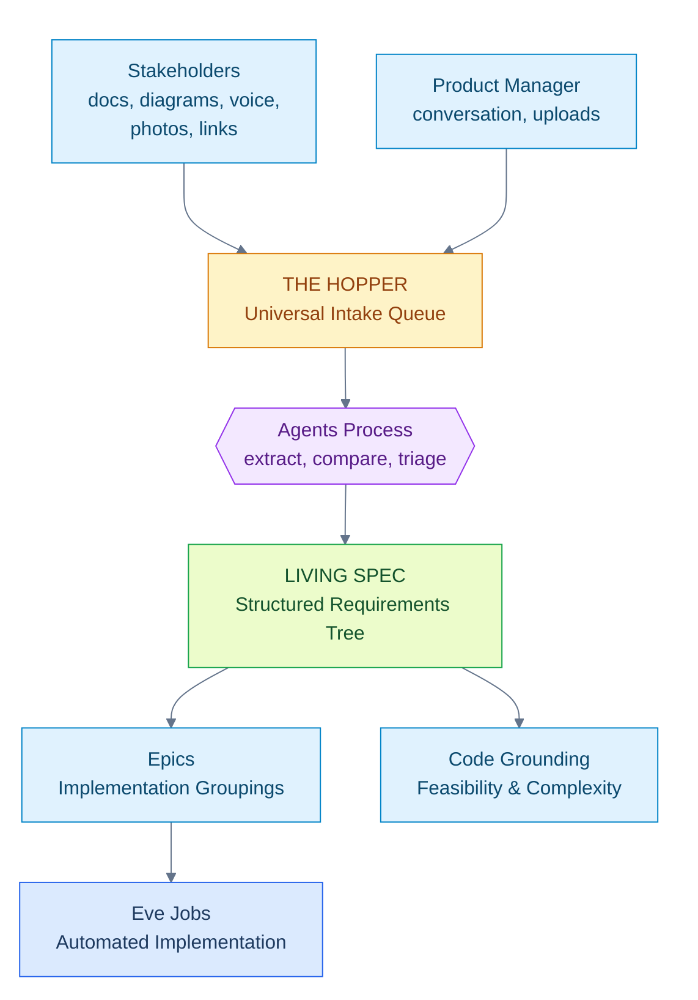
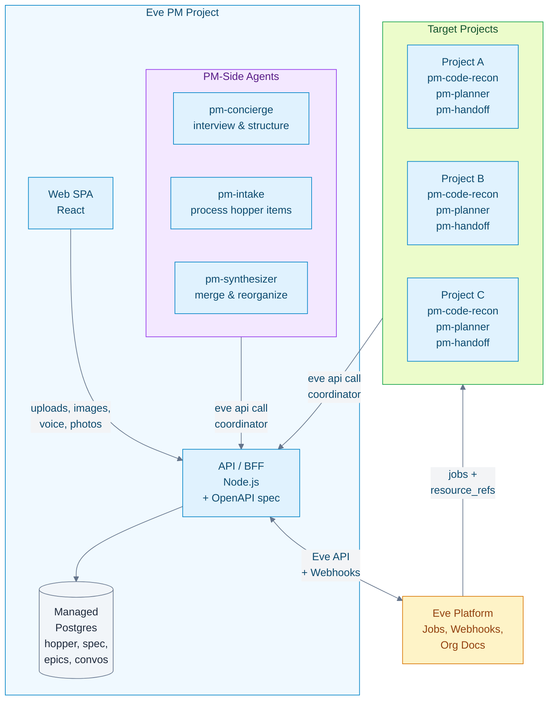
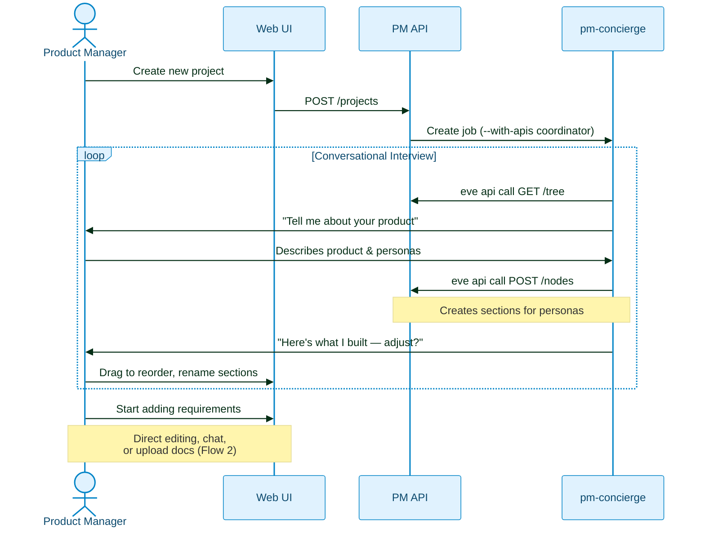
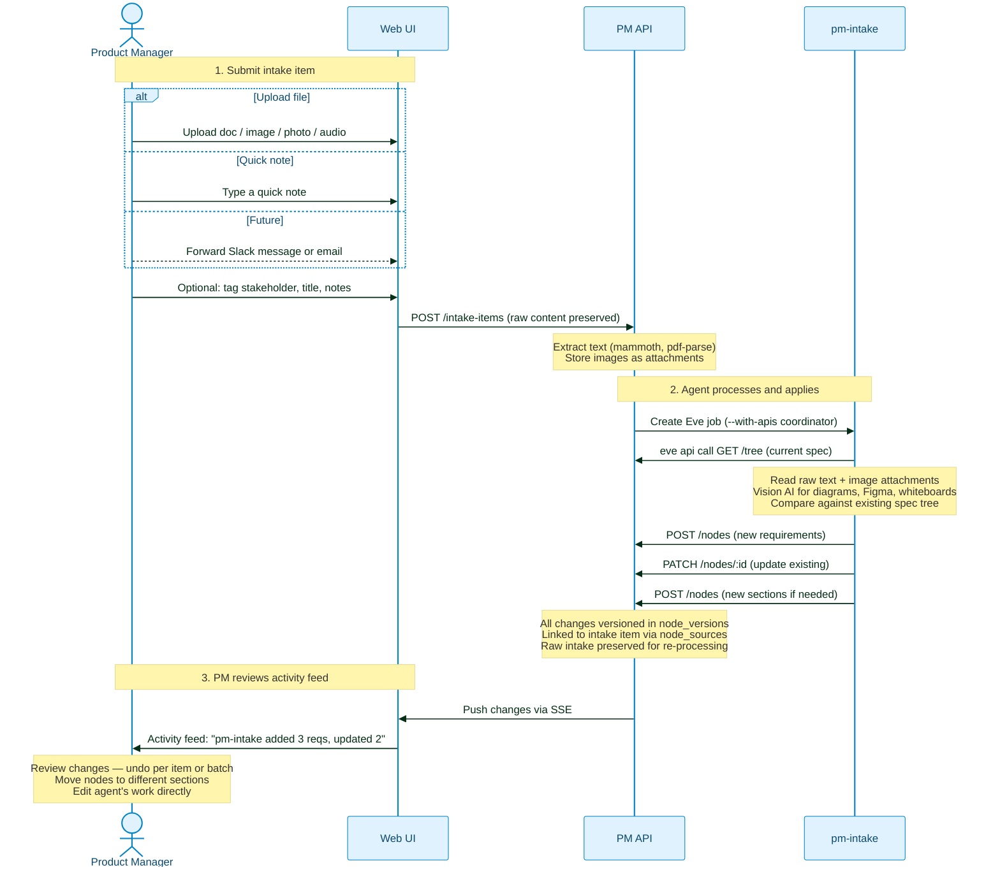
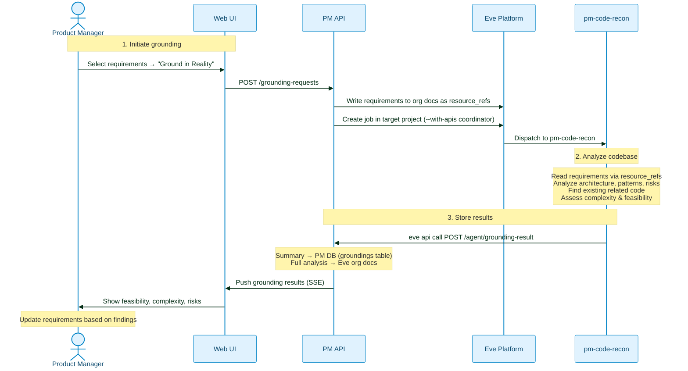
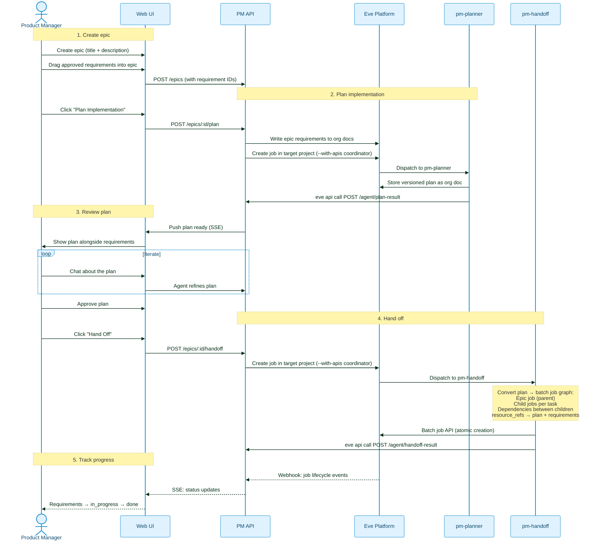
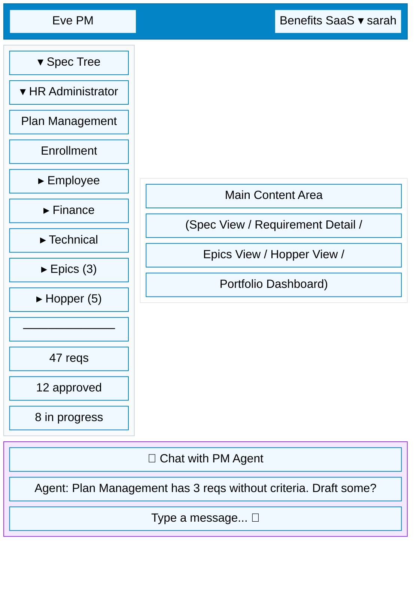

# Eve PM: Living Spec & Requirements Intelligence

> Status: Plan
> Last Updated: 2026-02-12
>
> Inputs:
> - `docs/ideas/pm-app-agentic-product-management.md`
> - `docs/ideas/agentic-pm-native-app-platform-gap-analysis.md`
> - `docs/plans/agentic-pm-app-reimagined-plan.md`
> - `docs/plans/agentic-pm-gap-closure-plan.md`
> - `docs/plans/agentic-app-identity-auth-access-plan.md` (Plan A)
> - `docs/plans/agentic-app-context-intelligence-plan.md` (Plan B)
> - `docs/plans/agentic-app-infra-provisioning-plan.md` (Plan C)
>
> Supersedes:
> - `docs/plans/agentic-pm-app-reimagined-plan.md` (thin coordinator approach)
>
> Platform Dependencies:
> - Web Auth: GoTrue + SSO broker + token exchange (PM login — implemented)
> - Plan A: Service principals (auth for PM backend → Eve API)
> - Plan B: Job attachments, job targeting, org docs, cross-project queries, webhooks
> - Plan C: Native registry, managed Postgres, WebChat gateway
> - Gap Closure: Versioned org docs, resource plane, batch job graph, org threads
> - Agent App API Access: `docs/plans/agent-api-tool-injection-plan.md` (agent → PM API via `eve api call`)

## Brief

Eve PM is a web application for non-technical product managers to build and maintain
a **living product specification** — a structured, agent-aided requirements hierarchy
that captures the full scope of a product, tracks each requirement through its
lifecycle, and hands off implementation to Eve jobs.

The PM never touches code. Requirements arrive from many sources — uploaded
documents, screenshots of Figma boards and Miro flows, voice memos, photos of
whiteboard sketches, meeting summaries, or casual conversation. Agents process
all of these, extract requirements, detect changes to existing requirements, and
weave everything into a structured spec tree. The PM works through a polished web
UI that feels like Linear meets Notion, not a developer tool.

## North Star

Requirements arrive from everywhere — documents, diagrams, conversations, photos,
voice memos. They land in the **Hopper**, a universal intake queue. Agents process
each item, extract requirements, and weave them into a living spec tree. The PM
reviews, refines, and approves. Approved requirements are grouped into epics,
grounded against real codebases, and handed off as Eve jobs for implementation.



## Design Principles

- **The spec is the product.** The requirements tree is the canonical description
  of what the product does and needs to do. Everything else derives from it.
- **Two node types, infinite structure.** Sections (groups) and requirements (leaves).
  Any depth. Agent-shaped, PM-controlled.
- **Spec vs epics are independent.** The spec is "what to build." Epics are "what
  we're building now." Reorganizing the spec doesn't disrupt in-flight work.
- **Agents act, PMs steer.** Agents make changes directly. Every change is
  versioned with full history. The PM reviews what happened and can undo any
  change — per item or per batch — with one click. No blocking review gates.
- **Anything in, structure out.** The killer feature: throw anything at the
  Hopper — docs, screenshots, diagrams, voice memos, photos of napkin sketches —
  and agents extract structured requirements mapped into the tree.
- **Raw sources are sacred.** Every intake item preserves the original source
  material exactly as received. Agents can re-process it as the spec evolves.
  Nothing is lost.
- **Own DB for the UI, Eve for execution.** The PM app owns its requirements data
  model (fast queries, relational integrity). Eve primitives handle code grounding,
  job execution, cross-project coordination, and analytics.

## Architecture



### What Lives Where

| Concern | Location | Why |
|---|---|---|
| Requirements hierarchy (spec tree) | PM DB | Relational integrity, fast UI queries, sort ordering, tree traversal |
| Epics and requirement selections | PM DB | Foreign keys to nodes, ordering, status tracking |
| Hopper (intake items + raw sources) | PM DB + file storage | Processing pipeline state, provenance, raw preservation |
| PM ↔ agent conversations | PM DB | UI control, structured metadata per message, context binding |
| Code grounding results | PM DB (summary) + Eve org docs (full) | Summary in DB for fast UI, full analysis in org docs for agent reuse |
| Implementation plans | Eve org docs | Versioned, shared with target project agents via resource_refs |
| Handoff job graphs | Eve batch job API | Atomic creation with dependencies and resource_refs |
| Cross-project agent coordination | Eve org-scoped threads | Agent-to-agent; PM never sees these directly |
| Real-time job status updates | Eve webhooks → PM API → SSE to browser | Job lifecycle events pushed to UI |
| Portfolio analytics | Eve analytics endpoints | Org-wide aggregates without N+1 queries |

## The Spec Tree

### Two Node Types

The spec uses exactly two node types:

- **Section** — a grouping node with children. Represents a persona, domain, area,
  module, or any other organizing concept.
- **Requirement** — a leaf node. Has acceptance criteria, priority, status,
  complexity. Represents a single thing the product must do.

### Flexible Depth

The agent proposes the structure. The PM reshapes it. Small products might be two
levels deep; large platforms might be five. The UI adapts automatically.

```
Product Spec (root section)
├── User Types                          ← section (depth 1)
│   ├── HR Administrator                ← section (depth 2)
│   │   ├── Plan Management             ← section (depth 3)
│   │   │   ├── Create benefit plan     ← requirement (leaf)
│   │   │   ├── Clone plan as template  ← requirement (leaf)
│   │   │   └── Bulk plan import        ← requirement (leaf)
│   │   ├── Enrollment Management       ← section
│   │   │   └── ...
│   │   └── Reporting                   ← section
│   │       └── ...
│   ├── Employee                        ← section
│   │   └── ...
│   └── Finance Team                    ← section
│       └── ...
├── Technical Requirements              ← section
│   ├── Performance                     ← section
│   │   └── Page load under 2s          ← requirement
│   └── Security                        ← section
│       └── SSO via SAML                ← requirement
└── Integrations                        ← section
    └── Payroll API                     ← requirement
```

### Requirement Lifecycle

Every requirement tracks its lifecycle independently:


- **draft**: Captured but not fully specified (may lack acceptance criteria).
- **refined**: Has clear description and acceptance criteria. Ready for review.
- **approved**: PM has signed off. Can be added to an epic.
- **in_progress**: Part of an active epic with linked Eve jobs.
- **done**: Implementation complete and verified.

### Tags for Cross-Cutting Views

Requirements can be tagged for views that cut across the tree:

- `persona:admin`, `persona:user` — find all requirements for a persona
- `priority:critical` — find hot items regardless of section
- `sprint:2026-q1` — temporal grouping
- `risk:high` — items needing extra attention

Tags complement the tree; they don't replace it.

## Data Model

### Core Tables

```sql
-- Projects linked to Eve
CREATE TABLE projects (
  id              UUID PRIMARY KEY DEFAULT gen_random_uuid(),
  eve_org_id      TEXT NOT NULL,
  eve_project_id  TEXT,           -- NULL if not yet linked to a specific Eve project
  name            TEXT NOT NULL,
  slug            TEXT NOT NULL,
  description     TEXT,
  status          TEXT NOT NULL DEFAULT 'active'
                    CHECK (status IN ('active', 'archived')),
  created_at      TIMESTAMPTZ NOT NULL DEFAULT now(),
  updated_at      TIMESTAMPTZ NOT NULL DEFAULT now(),
  UNIQUE(eve_org_id, slug)
);

-- The spec tree: sections and requirements
CREATE TABLE nodes (
  id                    UUID PRIMARY KEY DEFAULT gen_random_uuid(),
  project_id            UUID NOT NULL REFERENCES projects(id) ON DELETE CASCADE,
  parent_id             UUID REFERENCES nodes(id) ON DELETE CASCADE,
  node_type             TEXT NOT NULL CHECK (node_type IN ('section', 'requirement')),
  title                 TEXT NOT NULL,
  description           TEXT,
  -- Requirement-specific (NULL for sections)
  acceptance_criteria   JSONB,
  priority              TEXT CHECK (priority IN ('critical', 'high', 'medium', 'low')),
  status                TEXT NOT NULL DEFAULT 'draft'
                          CHECK (status IN ('draft', 'refined', 'approved',
                                            'in_progress', 'done')),
  complexity            TEXT CHECK (complexity IN ('xs', 's', 'm', 'l', 'xl')),
  -- Shared
  tags                  TEXT[] DEFAULT '{}',
  sort_order            INT NOT NULL DEFAULT 0,
  metadata              JSONB DEFAULT '{}',
  created_at            TIMESTAMPTZ NOT NULL DEFAULT now(),
  updated_at            TIMESTAMPTZ NOT NULL DEFAULT now()
);

CREATE INDEX idx_nodes_project ON nodes(project_id);
CREATE INDEX idx_nodes_parent ON nodes(parent_id);
CREATE INDEX idx_nodes_status ON nodes(project_id, status)
  WHERE node_type = 'requirement';
CREATE INDEX idx_nodes_tags ON nodes USING GIN(tags);
CREATE INDEX idx_nodes_sort ON nodes(parent_id, sort_order);
```

### Epics (Implementation Groupings)

```sql
CREATE TABLE epics (
  id              UUID PRIMARY KEY DEFAULT gen_random_uuid(),
  project_id      UUID NOT NULL REFERENCES projects(id) ON DELETE CASCADE,
  title           TEXT NOT NULL,
  description     TEXT,
  status          TEXT NOT NULL DEFAULT 'planning'
                    CHECK (status IN ('planning', 'grounding', 'review',
                                      'approved', 'in_progress', 'done')),
  eve_batch_id    TEXT,          -- links to Eve batch job graph after handoff
  eve_org_doc     TEXT,          -- path to implementation plan in Eve org docs
  created_at      TIMESTAMPTZ NOT NULL DEFAULT now(),
  updated_at      TIMESTAMPTZ NOT NULL DEFAULT now()
);

CREATE TABLE epic_requirements (
  epic_id         UUID NOT NULL REFERENCES epics(id) ON DELETE CASCADE,
  node_id         UUID NOT NULL REFERENCES nodes(id) ON DELETE CASCADE,
  sort_order      INT NOT NULL DEFAULT 0,
  PRIMARY KEY (epic_id, node_id)
);

CREATE INDEX idx_epics_project ON epics(project_id);
CREATE INDEX idx_epic_reqs_node ON epic_requirements(node_id);
```

### The Hopper (Universal Intake)

The Hopper replaces a simple "documents" table with a universal intake model that
handles any input type from any source channel.

```sql
-- Universal intake: anything from any source
CREATE TABLE intake_items (
  id                UUID PRIMARY KEY DEFAULT gen_random_uuid(),
  project_id        UUID NOT NULL REFERENCES projects(id) ON DELETE CASCADE,
  -- Source tracking
  source_type       TEXT NOT NULL
                      CHECK (source_type IN ('upload', 'slack', 'email',
                                              'voice_memo', 'link', 'note')),
  source_channel    TEXT,                -- 'web', 'slack:#payments', 'email:jeff@acme.com'
  stakeholder       TEXT,                -- who sent this in (name or identifier)
  title             TEXT NOT NULL,       -- brief description of the item
  -- Raw content (preserved exactly as received)
  raw_text          TEXT,                -- original text content (if text-based)
  attachments       JSONB DEFAULT '[]',  -- [{name, mime_type, size_bytes, storage_key}]
  -- Processed content
  extracted_text    TEXT,                -- text extracted from all sources
                                        --   (OCR from images, text from docs,
                                        --    transcription from audio)
  -- Processing pipeline
  processing_status TEXT NOT NULL DEFAULT 'pending'
                      CHECK (processing_status IN ('pending', 'processing', 'done')),
  eve_job_id        TEXT,                -- Eve job that processed this item
  created_at        TIMESTAMPTZ NOT NULL DEFAULT now(),
  updated_at        TIMESTAMPTZ NOT NULL DEFAULT now()
);

-- Provenance: which requirements came from which intake items
CREATE TABLE node_sources (
  id              UUID PRIMARY KEY DEFAULT gen_random_uuid(),
  node_id         UUID NOT NULL REFERENCES nodes(id) ON DELETE CASCADE,
  intake_item_id  UUID NOT NULL REFERENCES intake_items(id) ON DELETE CASCADE,
  source_excerpt  TEXT,                  -- relevant passage, region description, or timestamp
  created_at      TIMESTAMPTZ NOT NULL DEFAULT now(),
  UNIQUE(node_id, intake_item_id)
);

CREATE INDEX idx_intake_project ON intake_items(project_id);
CREATE INDEX idx_intake_status ON intake_items(project_id, processing_status);
CREATE INDEX idx_intake_stakeholder ON intake_items(project_id, stakeholder);
CREATE INDEX idx_node_sources_intake ON node_sources(intake_item_id);
```

#### Attachment Storage

Attachments (images, PDFs, Word docs, audio files) are stored on disk or object
storage, referenced by `storage_key` in the attachments JSONB array:

```json
[
  {
    "name": "miro-board-screenshot.png",
    "mime_type": "image/png",
    "size_bytes": 245000,
    "storage_key": "intake/proj_xxx/abc123/miro-board-screenshot.png"
  },
  {
    "name": "meeting-notes.docx",
    "mime_type": "application/vnd.openxmlformats-officedocument.wordprocessingml.document",
    "size_bytes": 48000,
    "storage_key": "intake/proj_xxx/abc123/meeting-notes.docx"
  }
]
```

V1 uses local filesystem storage under a configurable `INTAKE_STORAGE_PATH`.
Future: migrate to S3 or Eve's resource plane.

#### How Intake Processing Works

The agent acts directly on the spec tree — no intermediate triage JSON, no
blocking review gate. For each intake item, the agent:

1. Reads the current spec tree via `eve api call coordinator GET /tree`
2. Extracts requirements from the source material
3. Compares against existing requirements to detect overlaps
4. Creates new nodes (`POST /nodes`) or updates existing ones (`PATCH /nodes/:id`)
5. Creates new sections if content doesn't fit existing structure
6. Links changes via `node_sources` for provenance

Every change is versioned in `node_versions` with the `eve_job_id` of the intake
job, so the PM can review what the agent did and undo any change — per node or
as a batch (all changes from one intake item).

#### Supported Input Types (V1)

| Input Type | Source Type | Processing |
|---|---|---|
| Markdown files | upload | Direct text extraction |
| Word documents (.docx) | upload | Server-side extraction (mammoth.js) |
| PDF documents | upload | Server-side extraction (pdf-parse) |
| Images / screenshots | upload | Vision AI (multimodal LLM) — extracts text, describes diagrams, identifies user flows |
| Photos (whiteboard, napkin) | upload | Vision AI — OCR + structural understanding |
| Plain text / notes | note | Direct (no extraction needed) |
| Voice memos | upload | Speech-to-text transcription (server-side) |

#### Future Input Channels (Designed For, Not Built in V1)

| Channel | Source Type | How It Would Work |
|---|---|---|
| Slack | slack | Bot or slash command forwards message/thread to Hopper. Preserves thread context and attachments. |
| Email | email | Forwarding address (pm-intake@org.example.com) creates intake items. Preserves attachments. |
| Links (Figma, Miro) | link | Agent fetches or screenshots the linked content. Stores snapshot + URL. |
| Meeting recordings | upload | Audio/video transcription → text extraction → triage. |
| API (external tools) | note | REST endpoint for programmatic intake from other systems. |

The `intake_items` table and processing pipeline handle all of these identically —
only the ingestion channel differs. Adding a new channel means adding a new
entry point that creates intake items, not changing the processing pipeline.

### Code Grounding

```sql
CREATE TABLE groundings (
  id              UUID PRIMARY KEY DEFAULT gen_random_uuid(),
  node_id         UUID NOT NULL REFERENCES nodes(id) ON DELETE CASCADE,
  eve_job_id      TEXT NOT NULL,
  eve_project_id  TEXT NOT NULL,         -- which target project was analyzed
  status          TEXT NOT NULL DEFAULT 'pending'
                    CHECK (status IN ('pending', 'running', 'complete', 'failed')),
  analysis        JSONB,                 -- structured result: modules, patterns, risks, feasibility
  summary         TEXT,                  -- human-readable summary for UI display
  created_at      TIMESTAMPTZ NOT NULL DEFAULT now(),
  updated_at      TIMESTAMPTZ NOT NULL DEFAULT now()
);

CREATE INDEX idx_groundings_node ON groundings(node_id);
```

### Conversations

```sql
CREATE TABLE conversations (
  id              UUID PRIMARY KEY DEFAULT gen_random_uuid(),
  project_id      UUID NOT NULL REFERENCES projects(id) ON DELETE CASCADE,
  context_type    TEXT NOT NULL
                    CHECK (context_type IN ('project', 'section', 'requirement',
                                            'epic', 'document')),
  context_id      UUID,                  -- ID of the entity this conversation is about
  title           TEXT,
  created_at      TIMESTAMPTZ NOT NULL DEFAULT now(),
  updated_at      TIMESTAMPTZ NOT NULL DEFAULT now()
);

CREATE TABLE messages (
  id                UUID PRIMARY KEY DEFAULT gen_random_uuid(),
  conversation_id   UUID NOT NULL REFERENCES conversations(id) ON DELETE CASCADE,
  role              TEXT NOT NULL CHECK (role IN ('user', 'assistant', 'system')),
  content           TEXT NOT NULL,
  metadata          JSONB DEFAULT '{}',  -- structured data: proposed changes, extraction results, etc.
  created_at        TIMESTAMPTZ NOT NULL DEFAULT now()
);

CREATE INDEX idx_conversations_context ON conversations(project_id, context_type, context_id);
CREATE INDEX idx_messages_convo ON messages(conversation_id, created_at);
```

## Agent Roster

### How Agents Access the PM API

All PM agents — both PM-side and target-side — interact with the PM app's API
using the Eve CLI. The PM coordinator publishes its OpenAPI spec via
`x-eve.api_spec` in the manifest. Agents use three commands:

```bash
eve api spec coordinator        # Read the OpenAPI spec (discover endpoints)
eve api call coordinator GET /api/projects/:id/tree    # Read the spec tree
eve api call coordinator POST /api/projects/:id/nodes \
  --json '{"type":"requirement","title":"..."}'         # Create a node
eve api call coordinator PATCH /api/nodes/:id \
  --json '{"description":"updated..."}'                 # Update a node
eve api call coordinator GET /api/projects/:id/nodes/search?q=password  # Search
```

Auth is automatic — `eve api call` uses `EVE_JOB_TOKEN` when running inside a
job. The PM coordinator verifies these tokens against Eve's signing key using
`@eve-horizon/auth` middleware.

Jobs are created with `--with-apis coordinator` which appends an instruction
block telling the agent about the available API and how to use it. See
`docs/plans/agent-api-tool-injection-plan.md` for the platform feature.

### PM-Side Agents (Run in the PM Project)

These agents run in the Eve PM project itself. They read/write the PM database
via the PM API using `eve api call coordinator`.

#### pm-concierge

The conversational setup agent. Interviews the PM to build the initial spec tree,
refine requirements, and answer questions about the product.

- **Input**: Conversation context + current spec tree state
- **Output**: Direct tree modifications (new sections, requirements, restructuring)
- **Behavior**: Acts directly on the spec tree via the PM API. The PM sees changes
  appear in real time and can undo any change via the activity feed.
- **Harness**: Deep reasoning profile (needs to understand product context)
- **API usage**:
  - `GET /api/projects/:id/tree` — read current tree to understand structure
  - `GET /api/projects/:id/nodes/search` — find existing requirements
  - `POST /api/projects/:id/nodes` — create sections and requirements
  - `PATCH /api/nodes/:id` — update requirements
  - `POST /api/nodes/:id/move` — reorganize tree structure

#### pm-intake

The universal intake processor. Handles any item from the Hopper — documents,
images, screenshots, photos, voice transcripts. Extracts requirements, detects
deltas to existing requirements, and maps everything to the spec tree.

- **Input**: Intake item (raw text + attachments) + current spec tree structure
- **Processing by type**:
  - Text/markdown/Word/PDF → extracts requirements from text content
  - Images/screenshots (Figma, Miro, whiteboard photos) → uses vision AI to
    read diagrams, extract text, identify user flows and requirements
  - Voice transcripts → extracts requirements from conversational content
- **Output**: Direct tree modifications — new nodes created, existing nodes updated
- **Behavior**: Acts directly on the spec tree. Creates new requirements, updates
  existing ones, creates new sections as needed. All changes versioned and linked
  to the intake item via `node_sources`. PM reviews changes in the activity feed.
- **Harness**: Deep reasoning profile (multimodal for image inputs)
- **API usage**:
  - `GET /api/projects/:id/tree` — read current tree for delta detection
  - `GET /api/projects/:id/nodes/search` — find potential matching requirements
  - `GET /api/intake/:id` — read intake item details and attachments
  - `POST /api/projects/:id/nodes` — create new requirements / sections
  - `PATCH /api/nodes/:id` — update existing requirements (deltas)

#### pm-synthesizer

Reorganizes and improves the spec tree. Merges duplicates, suggests better
structure, fills gaps.

- **Input**: Current spec tree + optional PM instructions
- **Output**: Direct restructuring — merges duplicates, moves nodes, fills gaps
- **Behavior**: Acts directly. PM reviews changes in the activity feed and can batch-undo.
- **Trigger**: On PM request or when the tree exceeds complexity thresholds
- **Harness**: Standard profile
- **API usage**:
  - `GET /api/projects/:id/tree` — read full tree
  - `GET /api/projects/:id/nodes/search` — find duplicates and related items
  - `GET /api/projects/:id/stats` — understand requirement distribution

### Target-Side Agents (AgentPack in Target Projects)

These agents run inside target project workspaces with full codebase access.
They call back to the PM API via `eve api call coordinator` to store results.

#### pm-code-recon

Analyzes a target project's codebase to ground requirements in reality.

- **Input**: Requirements to ground (via resource_refs) + full codebase
- **Output**: Feasibility assessment, relevant modules, existing patterns, risks,
  complexity estimate
- **Writes to**: PM API (grounding result via `eve api call`) + Eve org docs (full analysis)
- **Git**: Read-only (commit: never, push: never)
- **Harness**: Deep reasoning profile
- **API usage**:
  - `POST /api/agent/grounding-result` — store structured grounding analysis

#### pm-planner

Drafts implementation plans for epic requirements, grounded in actual code.

- **Input**: Epic requirements + grounding results + codebase
- **Output**: Implementation plan with task breakdown
- **Writes to**: Eve org docs (versioned plan document)
- **Git**: Read-only
- **Harness**: Deep reasoning profile
- **API usage**:
  - `POST /api/agent/plan-result` — acknowledge plan written to org docs

#### pm-handoff

Converts an approved implementation plan into an Eve batch job graph.

- **Input**: Approved plan (via resource_refs) + codebase
- **Output**: Batch job graph (epic + child jobs + dependencies + resource_refs)
- **Calls**: Eve batch job API
- **Harness**: Deep reasoning profile
- **API usage**:
  - `POST /api/agent/handoff-result` — store batch job ID linkage to epic

## Core Flows

### Flow 1: Project Setup (Conversational)



### Flow 2: Hopper Intake

Anything the PM (or their stakeholders) throw at the Hopper gets processed into
the spec tree. The agent acts directly — no blocking review gate. Every change is
versioned and the PM can undo anything from the activity feed.



### Flow 3: Code Grounding



### Flow 4: Epic Creation & Handoff



## UI Design

### Layout

The UI follows a master-detail pattern with a persistent chat panel.



### Main Views

**Spec View** (tree selected in nav)
- Left: collapsible tree navigator
- Right: requirements list for the selected section
- Each requirement shows: title, priority badge, status badge, grounding indicator
- Inline editing for titles and descriptions
- Drag-and-drop for reordering and moving between sections
- Filters: status, priority, tags, grounded/ungrounded

**Requirement Detail** (requirement selected)
- Full description and acceptance criteria
- Code grounding panel (if grounded): feasibility, complexity, risks, relevant code
- Source provenance: which documents contributed to this requirement
- Tags editor
- History / changelog

**Epics View**
- Cards or list of epics with status, requirement count, progress
- Epic detail: selected requirements, implementation plan, linked Eve jobs
- Job status from Eve (via webhooks) displayed inline
- "Create Epic" flow: select requirements → agent suggests grouping

**Hopper View**
- Upload zone (drag-and-drop for any file type: docs, images, photos, audio)
- Quick-note input (for capturing ideas in the moment)
- Intake queue with processing status and stakeholder attribution
- Raw source viewer: see original image, document, or transcript alongside what was extracted
- Source mapping: which requirements came from which intake items

**Activity Feed** (global or per-entity)
- Chronological feed of all agent and human changes to the spec tree
- Grouped by action: "pm-intake processed meeting-notes.docx → added 3 requirements, updated 2"
- One-click undo per change, or batch undo for all changes from a single agent action
- Diff view: see exactly what changed for each node (before/after)

**Portfolio Dashboard** (project selector or org-level)
- Project cards with requirement counts, status distribution
- Cross-project status (via Eve analytics endpoints)
- Active epics across projects

### Chat Panel

Always present at the bottom of the screen. Contextual to the current view:

- **Viewing a section**: Agent can discuss the section, add requirements, restructure
- **Viewing a requirement**: Agent can refine criteria, explain grounding, make changes
- **Viewing an epic**: Agent can discuss implementation approach, add requirements
- **Viewing an intake item**: Agent can explain extraction, re-process with different instructions
- **Voice input**: Mic button uses Web Speech API for browser-native speech-to-text

### Status Lens Filters

The spec tree can be viewed through different lenses:

| Lens | Shows | Use Case |
|---|---|---|
| All | Full tree | Understanding complete product scope |
| Drafts | Requirements in draft/refined status | What needs work |
| Approved | Ready for implementation | What can be added to epics |
| In Progress | Linked to active Eve jobs | What's being built |
| Done | Completed requirements | What's shipped |
| Ungrounded | No code grounding yet | What needs reality-checking |

## Manifest

```yaml
schema: eve/compose/v2
project: eve-pm

registry: eve

services:
  db:
    x-eve:
      role: managed_db
      managed:
        class: db.p1
        engine: postgres
        engine_version: "16"

  api:
    build:
      context: ./apps/api
    ports: [3000]
    environment:
      DATABASE_URL: ${managed.db.url}
      EVE_API_URL: ${EVE_API_URL}
      EVE_SERVICE_TOKEN: ${secret.EVE_SERVICE_TOKEN}
    depends_on:
      db:
        condition: service_healthy
    x-eve:
      ingress:
        public: true
        port: 3000
      api_spec:
        type: openapi
        spec_url: /openapi.json

  web:
    build:
      context: ./apps/web
    ports: [8080]
    depends_on: [api]
    x-eve:
      ingress:
        public: true
        port: 8080

  migrate:
    build:
      context: ./apps/api
      target: migrate
    x-eve:
      role: job

environments:
  staging:
    pipeline: deploy

x-eve:
  requires:
    secrets: [EVE_SERVICE_TOKEN]

  defaults:
    harness: mclaude
    harness_profile: pm-deep
    env: staging

  agents:
    version: 1
    profiles:
      pm-deep:
        - harness: mclaude
          model: opus-4.5
          reasoning_effort: high
      pm-standard:
        - harness: mclaude
          model: sonnet-4.5
          reasoning_effort: medium
```

## PM AgentPack (Target Projects)

Installed into each target project that the PM app manages.

### Pack Structure

```
eve-pm-agents/
├── skills/
│   ├── pm-code-recon/SKILL.md
│   ├── pm-planner/SKILL.md
│   └── pm-handoff/SKILL.md
├── eve/
│   ├── pack.yaml
│   ├── agents.yaml
│   └── x-eve.yaml
└── README.md
```

### Agent Definitions

```yaml
# eve/agents.yaml
version: 1
agents:
  pm_code_recon:
    slug: pm-code-recon
    skill: pm-code-recon
    harness_profile: deep-reasoning
    description: >
      Analyzes codebase to ground PM requirements in code reality.
      Returns structured feasibility and complexity assessment.
    policies:
      permission_policy: auto_edit
      git: { commit: never, push: never }

  pm_planner:
    slug: pm-planner
    skill: pm-planner
    harness_profile: deep-reasoning
    description: >
      Drafts implementation plan from approved requirements,
      grounded in actual codebase patterns and architecture.
    policies:
      permission_policy: auto_edit
      git: { commit: never, push: never }

  pm_handoff:
    slug: pm-handoff
    skill: pm-handoff
    harness_profile: deep-reasoning
    description: >
      Converts approved implementation plan into Eve batch
      job graph with dependencies and resource refs.
    policies:
      permission_policy: auto_edit
      git: { commit: never, push: never }
```

### Target Project Installation

```yaml
# Target project .eve/manifest.yaml
x-eve:
  packs:
    - id: pm-agents
      source: https://github.com/org/eve-pm-agents
      ref: <sha>
```

No PM-specific secrets needed in target projects. Agents access the PM API
using `eve api call coordinator`, which uses `EVE_JOB_TOKEN` for auth. The PM
coordinator's API is registered via `x-eve.api_spec` and discoverable
automatically.

Jobs targeting these agents are created with `--with-apis coordinator` so
agents know the PM API is available.

## API Surface (PM App)

### Projects

```
GET    /api/projects                         List linked projects
POST   /api/projects                         Create/link project
GET    /api/projects/:id                     Project detail
PATCH  /api/projects/:id                     Update project settings
```

### Spec Tree (Nodes)

```
GET    /api/projects/:id/tree                Full tree (sections + requirements)
GET    /api/projects/:id/nodes               List nodes (with filters)
POST   /api/projects/:id/nodes               Create node (section or requirement)
GET    /api/nodes/:id                        Node detail
PATCH  /api/nodes/:id                        Update node
DELETE /api/nodes/:id                        Delete node (cascades children)
POST   /api/nodes/:id/move                   Move node (reparent or reorder)
GET    /api/projects/:id/nodes/search        Search nodes (full-text + tags)
GET    /api/projects/:id/stats               Requirement counts by status/priority
```

### Epics

```
GET    /api/projects/:id/epics               List epics
POST   /api/projects/:id/epics               Create epic
GET    /api/epics/:id                        Epic detail + requirements + jobs
PATCH  /api/epics/:id                        Update epic
POST   /api/epics/:id/requirements           Add requirements to epic
DELETE /api/epics/:id/requirements/:nodeId   Remove requirement from epic
POST   /api/epics/:id/ground                 Trigger code grounding
POST   /api/epics/:id/plan                   Trigger implementation planning
POST   /api/epics/:id/handoff                Trigger handoff to Eve jobs
```

### Hopper (Intake)

```
POST   /api/projects/:id/intake              Submit intake item (multipart: text + files)
GET    /api/projects/:id/intake              List intake items (filter by status, stakeholder)
GET    /api/intake/:id                       Intake item detail
POST   /api/intake/:id/process               Trigger (re)processing
GET    /api/intake/:id/attachments/:key      Download raw attachment
```

### Activity Feed

```
GET    /api/projects/:id/activity            Activity feed (filter by agent, time, node)
POST   /api/nodes/:id/revert                 Revert node to a previous version
POST   /api/activity/batch-revert            Revert all changes from a specific eve_job_id
GET    /api/nodes/:id/versions               Version history for a node
GET    /api/nodes/:id/versions/:v/diff       Diff between two versions
```

### Conversations

```
GET    /api/projects/:id/conversations        List conversations
POST   /api/projects/:id/conversations        Start conversation
GET    /api/conversations/:id/messages         List messages
POST   /api/conversations/:id/messages         Send message
```

### Agent Callbacks

Called by agents via `eve api call coordinator` from target project jobs:

```
POST   /api/agent/grounding-result            Store code grounding analysis
POST   /api/agent/plan-result                 Acknowledge plan written to org docs
POST   /api/agent/handoff-result              Store batch job ID linkage
```

Auth: agents use `EVE_JOB_TOKEN` (passed automatically by `eve api call`).
The PM API verifies the token against Eve's signing key and extracts
`job_id` and `project_id` from the claims.

### Webhooks (from Eve)

```
POST   /api/webhooks/eve                     Receive Eve webhook events
```

Handles `system.job.completed`, `system.job.failed` to update grounding, epic,
and requirement status in the PM database.

## Phased Delivery

### Phase 1: Foundation + Conversational Setup

Build the core app shell and the conversational project setup flow.

**Deliverables:**
1. PM app repo bootstrapped from Eve starter
2. Managed Postgres with projects, nodes, conversations, messages tables
3. API: project CRUD, tree CRUD (nodes), conversation + messages
4. OpenAPI spec served at `/openapi.json` (declared in manifest via `x-eve.api_spec`)
5. `@eve-horizon/auth` middleware to verify `EVE_JOB_TOKEN` on agent callback routes
6. Web UI: project list, spec tree view with expand/collapse, inline requirement editing
7. pm-concierge agent: conversational project setup (personas → areas → requirements)
   — uses `eve api call coordinator` for all spec tree operations
8. Chat panel in UI connected to pm-concierge
9. Deploy to Eve staging

**Validates:** Core data model, tree manipulation, agent → PM API via `eve api call` pattern

### Phase 2: The Hopper

The differentiating feature: throw anything at the Hopper, get structured
requirements. This is what makes agents indispensable.

**Deliverables:**
1. `intake_items` table + multipart upload API + attachment storage
2. Hopper UI with drag-and-drop (docs, images, photos), quick-note input
3. Server-side text extraction (mammoth.js for Word, pdf-parse for PDF)
4. Image/screenshot processing via multimodal LLM (Figma boards, Miro
   screenshots, whiteboard photos, napkin sketches)
5. pm-intake agent with extraction, delta detection, and direct tree modification
6. Activity feed UI: chronological changes with per-item and batch undo
7. Raw source viewer alongside what the agent extracted
8. `node_sources` provenance tracking (intake item → requirement)
9. `node_versions` with `eve_job_id` for batch revert capability
10. Stakeholder attribution on intake items
11. Voice input via Web Speech API (mic button → text → intake item)

**Validates:** Universal intake pipeline, image processing, delta detection,
act-and-undo trust model, provenance

### Phase 3: Code Grounding

Connect requirements to codebases.

**Deliverables:**
1. PM AgentPack repo with pm-code-recon skill
2. Groundings table + API (including agent callback endpoint)
3. "Ground in Reality" button in the UI (per-requirement and bulk)
4. Grounding results displayed in requirement detail panel
5. Job creation with `--with-apis coordinator` so agent can call back to PM API
6. Eve webhook subscription for job completion → grounding status updates

**Validates:** Cross-project agent execution, `eve api call` callback pattern, resource_refs

### Phase 4: Epics + Handoff

Complete the loop from requirements to implementation.

**Deliverables:**
1. Epics table + API
2. Epic management UI: create epic, drag requirements in, track status
3. pm-planner agent: draft implementation plan from grounded requirements
4. Plan review UI (rendered from Eve org docs)
5. pm-handoff agent: create Eve batch job graph from approved plan
6. Job status tracking via webhooks → SSE to browser
7. Requirement status auto-updates as linked jobs complete

**Validates:** End-to-end flow from requirements → code-grounded plan → Eve jobs

### Phase 5: Portfolio Intelligence

Multi-project views and analytics.

**Deliverables:**
1. Portfolio dashboard consuming Eve analytics endpoints
2. Cross-project requirement status views
3. pm-synthesizer agent for spec maintenance (dedup, gap analysis, restructuring)
4. Spec health metrics (coverage, staleness, ungrounded count)

**Validates:** Multi-project PM workflow, org-level analytics consumption

### Phase 6: Polish + Advanced Features

**Deliverables:**
1. Richer voice input (Deepgram for quality transcription)
2. Slack integration via Eve chat gateway
3. Export/import spec as markdown
4. Requirement dependency tracking (within the spec)

## Platform Dependencies

### Required Before Phase 1

| Primitive | Source | Why |
|---|---|---|
| Web auth (GoTrue + SSO + exchange) | Implemented | PM login via browser — no CLI needed |
| Managed Postgres | Plan C Phase 2 | PM app's own database |
| Native registry | Plan C Phase 1 | Zero-config image push for PM app |

### Required Before Phase 3

| Primitive | Source | Why |
|---|---|---|
| Service principals | Plan A Phase 1 | PM backend → Eve API authentication |
| Job targeting (agent_slug) | Plan B Phase 2 | Create jobs targeting pm-code-recon |
| Job attachments | Plan B Phase 1 | Pass requirements context to grounding jobs |
| Webhook subscriptions | Plan B Phase 5 | Job completion → PM status updates |
| Agent app API access | `agent-api-tool-injection-plan.md` | Agents call PM API via `eve api call` with `EVE_JOB_TOKEN` auth |

### Required Before Phase 4

| Primitive | Source | Why |
|---|---|---|
| Org docs (versioned) | Plan B Phase 3 + Gap Closure P1 | Store implementation plans |
| Resource refs + hydration | Plan B Phase 2 + Gap Closure P2 | Pass plans to handoff agent as files |
| Batch job graph API | Gap Closure P4 | Atomic epic + child job creation |

### Required Before Phase 5

| Primitive | Source | Why |
|---|---|---|
| Cross-project queries | Plan B Phase 4 | Portfolio dashboard data |
| Org analytics | Gap Closure P6 | Org-wide status aggregates |

### Soft Dependencies (Enhance But Don't Block)

| Primitive | Source | Enhancement |
|---|---|---|
| Custom roles | Plan A Phase 3 | PM-specific permission profile |
| Org-scoped threads | Gap Closure P5 | Cross-project agent coordination |
| Webhook replay | Gap Closure P3 | Recover missed status updates |
| WebChat gateway | Plan C Phase 4 | Embeddable chat widget alternative |

## Testing Strategy

### Unit Tests

- Tree manipulation: create, move, reparent, reorder, delete (cascade)
- Extraction parsing: document → structured extraction → node creation
- Status transitions: requirement lifecycle, epic lifecycle
- Query filters: status, tags, full-text search

### Integration Tests

- Full tree CRUD via API
- Hopper intake (doc upload) → agent creates nodes directly → version history recorded
- Hopper intake (image upload) → vision extraction → nodes created with provenance
- Hopper delta detection → existing requirement updated → diff visible in activity feed
- Batch revert: undo all changes from a single intake job
- Single node revert: restore a node to a previous version
- Agent callback → grounding stored → UI updated
- Epic handoff → batch job created → webhook received → status updated

### End-to-End Scenario

1. Create project via UI
2. Chat with pm-concierge to set up personas and areas (agent builds tree directly)
3. Upload a requirements document to the Hopper → agent creates new requirements
4. Review activity feed → undo one requirement the agent got wrong
5. Upload a screenshot of a Miro board → agent extracts and creates requirements
6. Upload a second document that refines existing requirements → agent updates nodes
7. Batch revert the second document's changes → verify nodes restored to prior state
8. Verify provenance: trace a requirement back to its source intake item
9. Ground requirements against target project
10. Create epic, add approved requirements
11. Trigger planning and review the plan
12. Hand off → verify Eve batch job graph created
13. Simulate job completion → verify requirement status updates

## Resolved Decisions

1. **Text extraction for Word docs:** Server-side using mammoth.js (Word) and
   pdf-parse (PDF) in the API. More reliable for complex formatting, tables,
   and large files. The API server already exists — no new infrastructure.

2. **Agent conversation persistence:** PM DB only. Agents get conversation context
   via job descriptions and resource_refs when dispatched. Clean boundary — PM app
   owns conversation data, Eve owns execution. No dual-write complexity.

3. **Requirement versioning:** Full version history. Every edit creates an immutable
   snapshot in a `node_versions` table. This is the core safety primitive — agents
   act directly, and the PM can revert any change (per node or batch by job).
   Enables diffing, undo, and full audit trail. Small storage cost for high value.

4. **Spec export format:** Both structured markdown (for human sharing and review)
   and JSON (for backup, migration, and tool integration). Export produces both
   files. Markdown is the default action; JSON is available alongside.

5. **Multi-project requirements:** One project per requirement. Each requirement
   belongs to exactly one project's spec tree. Cross-project impact is documented
   in descriptions and visible through the portfolio dashboard. Keeps the tree
   model clean and grounding unambiguous.

6. **Offline / degraded mode:** Read-only degraded mode. When Eve API is
   unreachable, the PM app still serves the spec tree, conversations, and
   documents from its local database. Edits to the spec work (local DB writes).
   Agent features (grounding, handoff, concierge chat) pause with a clear
   UI banner. No hard dependency on Eve for core browsing and editing.

## Additional Schema (From Resolved Decisions)

### Node Version History

```sql
CREATE TABLE node_versions (
  id              UUID PRIMARY KEY DEFAULT gen_random_uuid(),
  node_id         UUID NOT NULL REFERENCES nodes(id) ON DELETE CASCADE,
  version         INT NOT NULL,
  -- Snapshot of node state at this version
  title           TEXT NOT NULL,
  description     TEXT,
  acceptance_criteria JSONB,
  priority        TEXT,
  status          TEXT NOT NULL,
  complexity      TEXT,
  tags            TEXT[],
  metadata        JSONB,
  -- Who/what made this change
  changed_by      TEXT,            -- user ID or 'agent:pm-concierge'
  change_summary  TEXT,            -- brief description of what changed
  eve_job_id      TEXT,            -- Eve job that made this change (for batch revert)
  intake_item_id  UUID REFERENCES intake_items(id),  -- intake item that triggered this change
  created_at      TIMESTAMPTZ NOT NULL DEFAULT now(),
  UNIQUE(node_id, version)
);

CREATE INDEX idx_node_versions_node ON node_versions(node_id, version DESC);
CREATE INDEX idx_node_versions_job ON node_versions(eve_job_id)
  WHERE eve_job_id IS NOT NULL;
```

Write behavior: every update to a node first inserts the current state into
`node_versions` with an incremented version number, then applies the update.
The `nodes` table always reflects the latest state. The `eve_job_id` column
enables batch revert — undo all changes from a single agent action in one click.
