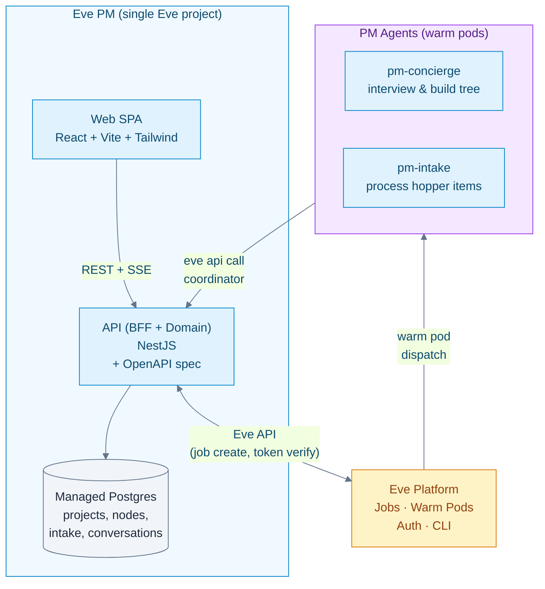
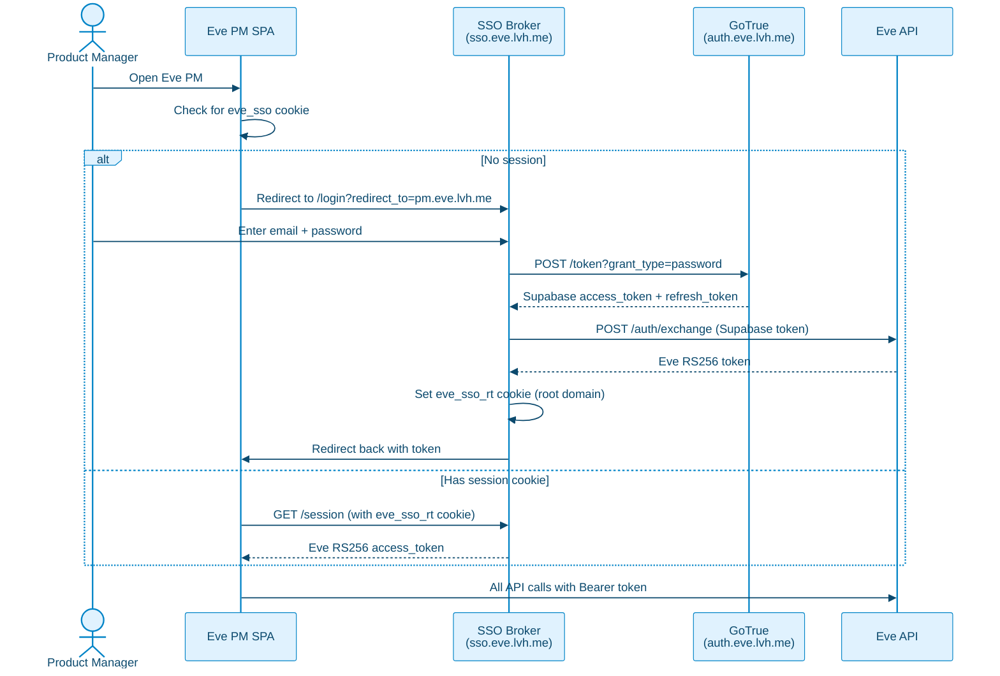
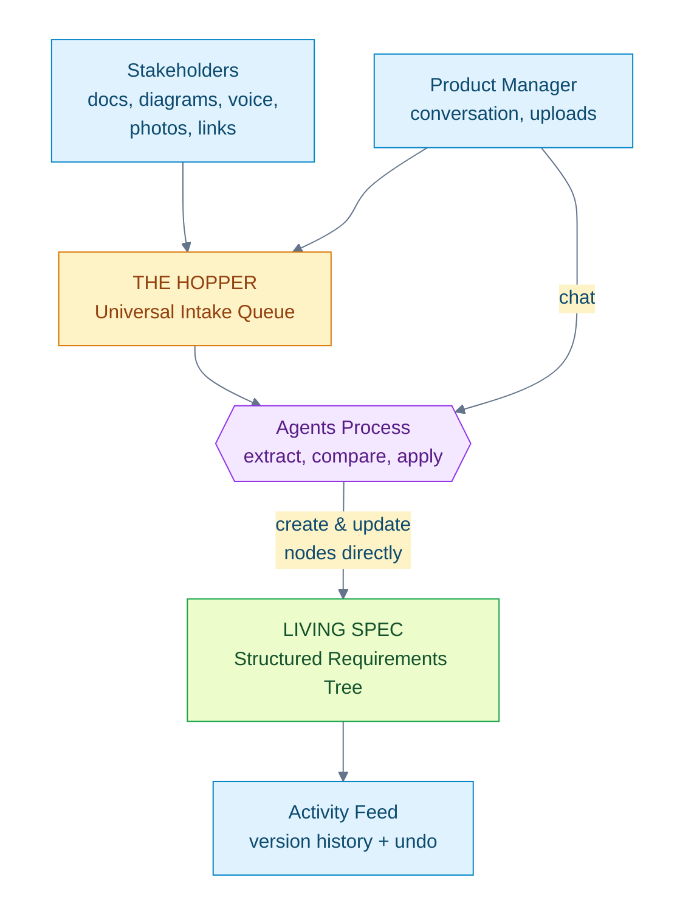
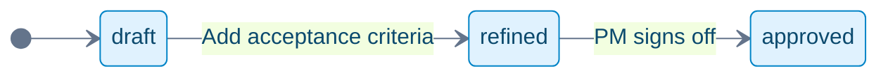
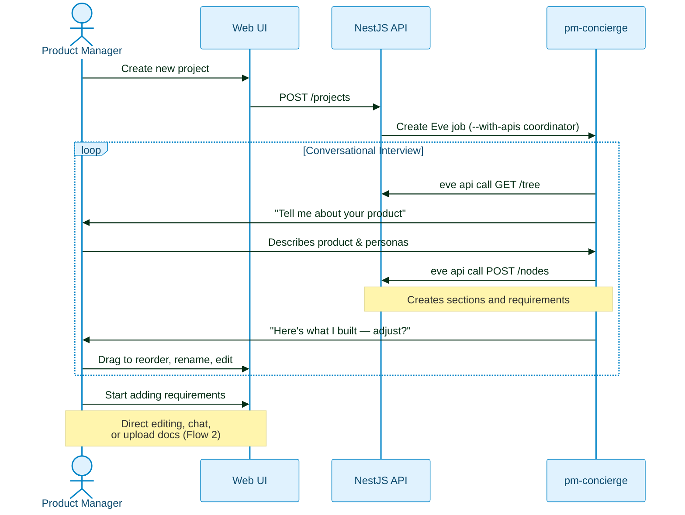
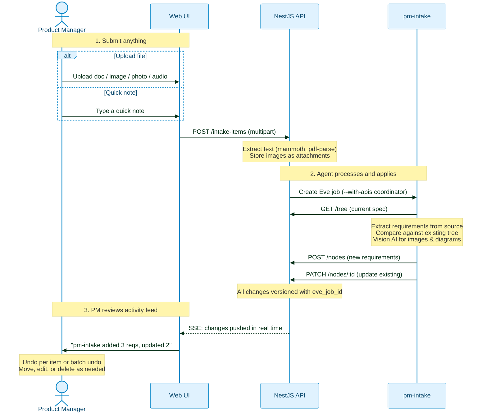
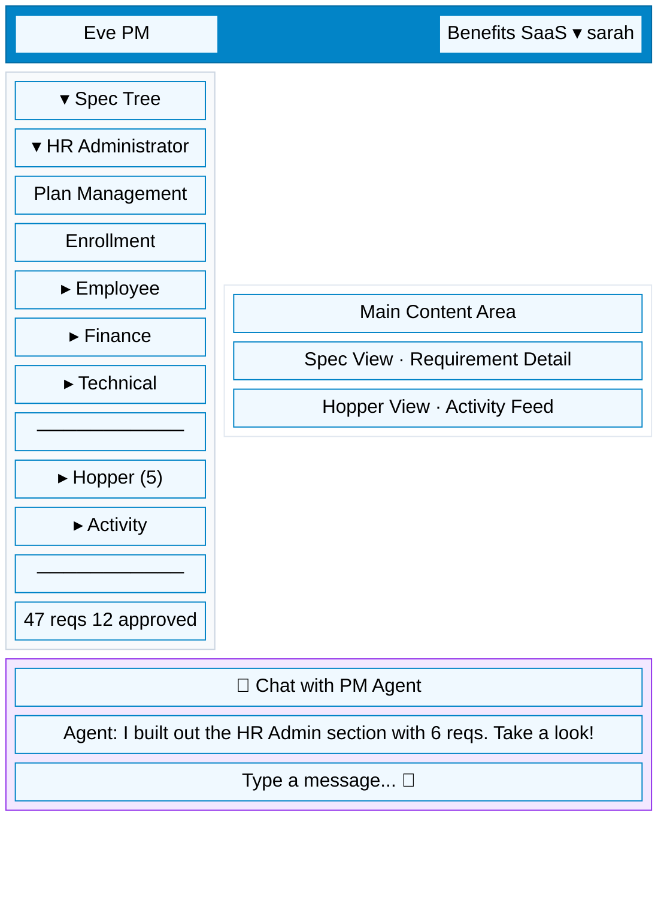
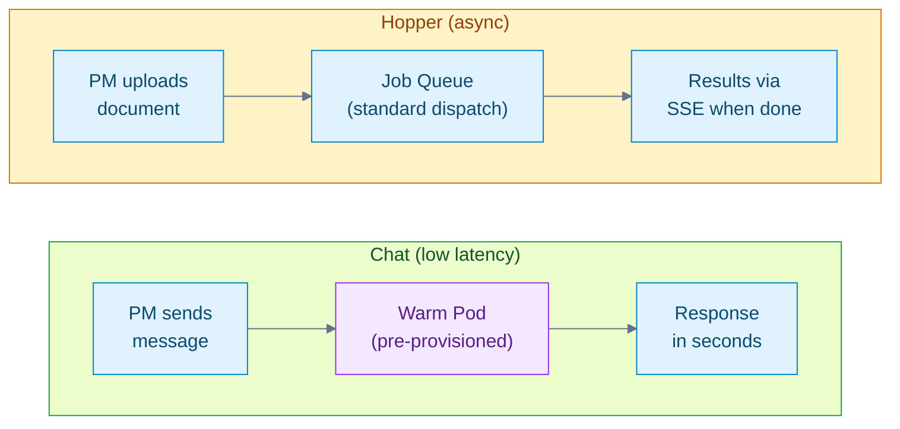
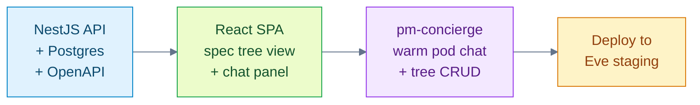

# Eve PM: MVP Plan

> Status: Plan
> Last Updated: 2026-02-12
>
> Parent: `docs/plans/eve-pm-living-spec-plan.md` (full vision)
> Auth: Eve platform web auth (GoTrue + SSO broker + token exchange)

## Goal

Ship the core PM experience: a non-technical product manager can build and
maintain a living product specification through conversation and document upload.
Agents act directly on the spec tree. History and undo are first-class.

**In scope:** Spec tree, Hopper intake, conversational setup, activity feed, chat.
**Out of scope:** Code grounding, epics, handoff to Eve jobs, portfolio dashboard,
target project AgentPacks. These come post-MVP.

## Architecture



### Tech Stack

| Layer | Technology | Notes |
|---|---|---|
| Frontend | React 18 + Vite + TailwindCSS + TanStack Query | Same stack as eve-horizon-dashboard |
| Backend | NestJS (Node.js) | TypeScript, OpenAPI via `@nestjs/swagger`, SSE for real-time |
| Database | Postgres 16 (Eve managed) | Prisma or TypeORM for migrations |
| Auth | Eve web auth (GoTrue + SSO + token exchange) | Platform-provided — email/password login, no custom auth code |
| Agent runtime | Eve warm pods | Org-scoped, pre-provisioned for low-latency chat |
| Agent ↔ API | `eve api call coordinator` | Agents call back to NestJS API using `EVE_JOB_TOKEN` |

### Auth (Eve Platform Web Auth)

No custom auth system. The Eve platform now provides a full web auth stack:

- **GoTrue (Supabase Auth)** — email/password signup and login
- **SSO Broker** — hosted login page, root-domain cookies, session management
- **Token Exchange** — swap Supabase tokens for Eve RS256 tokens
- **Auth Config Discovery** — `GET /auth/config` returns provider URLs dynamically

The PM app uses this directly — PMs are invited via `eve admin invite --web`,
receive an email, set their password, and log in through the browser. No CLI needed.



**What the PM app needs to implement:**

1. **On load**: check for `eve_sso` cookie. If missing, redirect to SSO login page.
2. **Session refresh**: call `GET sso.eve.lvh.me/session` with the cookie to get
   a fresh Eve RS256 token. The `eve_sso_rt` refresh token cookie is httpOnly and
   set on the root domain — it works across all Eve apps automatically.
3. **API calls**: attach the Eve RS256 token as `Authorization: Bearer` header.
4. **On 401**: redirect to SSO login page.
5. **NestJS guard**: validate the Eve RS256 token via `GET $EVE_API_URL/auth/me`
   (same as existing Eve API auth — dual-mode supports both CLI and web tokens).

**PM onboarding**: An admin runs `eve admin invite --web --email pm@company.com`
which sends a GoTrue invite email. The PM clicks the link, sets a password, and
can immediately log in to Eve PM. Zero CLI interaction required.

## Core Concepts



**Two node types, infinite depth.** The spec tree has Sections (groups) and
Requirements (leaves). Any depth. Agent-shaped, PM-controlled.

**Agents act, PMs steer.** Agents make changes directly. Every change is versioned.
The PM reviews what happened and can undo any change — per item or per batch.

**Anything in, structure out.** Throw anything at the Hopper — docs, screenshots,
photos, voice memos — agents extract requirements and weave them into the tree.

## Data Model

### Core Tables

```sql
CREATE TABLE projects (
  id              UUID PRIMARY KEY DEFAULT gen_random_uuid(),
  eve_org_id      TEXT NOT NULL,
  name            TEXT NOT NULL,
  slug            TEXT NOT NULL,
  description     TEXT,
  created_at      TIMESTAMPTZ NOT NULL DEFAULT now(),
  updated_at      TIMESTAMPTZ NOT NULL DEFAULT now(),
  UNIQUE(eve_org_id, slug)
);

-- The spec tree: sections and requirements
CREATE TABLE nodes (
  id                    UUID PRIMARY KEY DEFAULT gen_random_uuid(),
  project_id            UUID NOT NULL REFERENCES projects(id) ON DELETE CASCADE,
  parent_id             UUID REFERENCES nodes(id) ON DELETE CASCADE,
  node_type             TEXT NOT NULL CHECK (node_type IN ('section', 'requirement')),
  title                 TEXT NOT NULL,
  description           TEXT,
  acceptance_criteria   JSONB,            -- requirement-specific (NULL for sections)
  priority              TEXT CHECK (priority IN ('critical', 'high', 'medium', 'low')),
  status                TEXT NOT NULL DEFAULT 'draft'
                          CHECK (status IN ('draft', 'refined', 'approved')),
  tags                  TEXT[] DEFAULT '{}',
  sort_order            INT NOT NULL DEFAULT 0,
  metadata              JSONB DEFAULT '{}',
  created_at            TIMESTAMPTZ NOT NULL DEFAULT now(),
  updated_at            TIMESTAMPTZ NOT NULL DEFAULT now()
);

CREATE INDEX idx_nodes_project ON nodes(project_id);
CREATE INDEX idx_nodes_parent ON nodes(parent_id);
CREATE INDEX idx_nodes_status ON nodes(project_id, status) WHERE node_type = 'requirement';
CREATE INDEX idx_nodes_tags ON nodes USING GIN(tags);
CREATE INDEX idx_nodes_sort ON nodes(parent_id, sort_order);
```

### Version History (the safety net)

```sql
CREATE TABLE node_versions (
  id              UUID PRIMARY KEY DEFAULT gen_random_uuid(),
  node_id         UUID NOT NULL REFERENCES nodes(id) ON DELETE CASCADE,
  version         INT NOT NULL,
  -- Snapshot
  title           TEXT NOT NULL,
  description     TEXT,
  acceptance_criteria JSONB,
  priority        TEXT,
  status          TEXT NOT NULL,
  tags            TEXT[],
  metadata        JSONB,
  -- Provenance
  changed_by      TEXT,                -- user email or 'agent:pm-concierge'
  change_summary  TEXT,                -- "Added acceptance criteria"
  eve_job_id      TEXT,                -- for batch revert (all changes from one agent action)
  intake_item_id  UUID,                -- intake item that triggered this change
  created_at      TIMESTAMPTZ NOT NULL DEFAULT now(),
  UNIQUE(node_id, version)
);

CREATE INDEX idx_node_versions_node ON node_versions(node_id, version DESC);
CREATE INDEX idx_node_versions_job ON node_versions(eve_job_id) WHERE eve_job_id IS NOT NULL;
```

### Hopper (Universal Intake)

```sql
CREATE TABLE intake_items (
  id                UUID PRIMARY KEY DEFAULT gen_random_uuid(),
  project_id        UUID NOT NULL REFERENCES projects(id) ON DELETE CASCADE,
  source_type       TEXT NOT NULL CHECK (source_type IN ('upload', 'note', 'voice_memo')),
  stakeholder       TEXT,
  title             TEXT NOT NULL,
  raw_text          TEXT,
  attachments       JSONB DEFAULT '[]',    -- [{name, mime_type, size_bytes, storage_key}]
  extracted_text    TEXT,
  processing_status TEXT NOT NULL DEFAULT 'pending'
                      CHECK (processing_status IN ('pending', 'processing', 'done')),
  eve_job_id        TEXT,
  created_at        TIMESTAMPTZ NOT NULL DEFAULT now(),
  updated_at        TIMESTAMPTZ NOT NULL DEFAULT now()
);

-- Provenance: which requirements came from which intake items
CREATE TABLE node_sources (
  id              UUID PRIMARY KEY DEFAULT gen_random_uuid(),
  node_id         UUID NOT NULL REFERENCES nodes(id) ON DELETE CASCADE,
  intake_item_id  UUID NOT NULL REFERENCES intake_items(id) ON DELETE CASCADE,
  source_excerpt  TEXT,
  created_at      TIMESTAMPTZ NOT NULL DEFAULT now(),
  UNIQUE(node_id, intake_item_id)
);

CREATE INDEX idx_intake_project ON intake_items(project_id);
CREATE INDEX idx_intake_status ON intake_items(project_id, processing_status);
CREATE INDEX idx_node_sources_intake ON node_sources(intake_item_id);
```

### Conversations

```sql
CREATE TABLE conversations (
  id              UUID PRIMARY KEY DEFAULT gen_random_uuid(),
  project_id      UUID NOT NULL REFERENCES projects(id) ON DELETE CASCADE,
  context_type    TEXT NOT NULL CHECK (context_type IN ('project', 'section', 'requirement')),
  context_id      UUID,
  title           TEXT,
  created_at      TIMESTAMPTZ NOT NULL DEFAULT now(),
  updated_at      TIMESTAMPTZ NOT NULL DEFAULT now()
);

CREATE TABLE messages (
  id                UUID PRIMARY KEY DEFAULT gen_random_uuid(),
  conversation_id   UUID NOT NULL REFERENCES conversations(id) ON DELETE CASCADE,
  role              TEXT NOT NULL CHECK (role IN ('user', 'assistant', 'system')),
  content           TEXT NOT NULL,
  metadata          JSONB DEFAULT '{}',
  created_at        TIMESTAMPTZ NOT NULL DEFAULT now()
);

CREATE INDEX idx_conversations_context ON conversations(project_id, context_type, context_id);
CREATE INDEX idx_messages_convo ON messages(conversation_id, created_at);
```

## Requirement Lifecycle (MVP)



MVP uses three statuses. Post-MVP adds `in_progress` and `done` when epics
and Eve job handoff are implemented.

## Agents

### How Agents Access the PM API

Agents use `eve api call coordinator` with `EVE_JOB_TOKEN` for auth:

```bash
eve api spec coordinator                              # Read OpenAPI spec
eve api call coordinator GET /api/projects/:id/tree   # Read the spec tree
eve api call coordinator POST /api/projects/:id/nodes \
  --json '{"type":"requirement","title":"..."}'        # Create a node
eve api call coordinator PATCH /api/nodes/:id \
  --json '{"description":"updated..."}'                # Update a node
```

Jobs are created with `--with-apis coordinator` so agents know the API exists.

### pm-concierge

Conversational setup agent. Interviews the PM to build the initial spec tree.

- **Trigger**: PM starts a conversation in the chat panel
- **Behavior**: Acts directly on the spec tree. Creates sections, requirements,
  restructures as the conversation progresses. PM sees changes appear in real time.
- **API calls**: `GET /tree`, `POST /nodes`, `PATCH /nodes/:id`, `POST /nodes/:id/move`

### pm-intake

Universal intake processor. Handles any Hopper item.

- **Trigger**: New intake item submitted
- **Behavior**: Reads the spec tree, extracts requirements from the source material,
  creates new nodes or updates existing ones directly. All changes versioned with
  the `eve_job_id` for batch undo.
- **API calls**: `GET /tree`, `GET /nodes/search`, `POST /nodes`, `PATCH /nodes/:id`

## Core Flows

### Flow 1: Project Setup



### Flow 2: Hopper Intake



## UI Design



### Views

**Spec Tree** — Left nav shows collapsible tree. Main area shows requirements
for the selected section. Inline editing, drag-and-drop reorder and reparent.
Filters: status, priority, tags.

**Requirement Detail** — Full description, acceptance criteria, tags, version
history with diff view and per-version undo.

**Hopper** — Upload zone (drag-and-drop any file), quick-note input, intake
queue with processing status, raw source viewer alongside extracted results.

**Activity Feed** — Chronological feed of all changes. Grouped by action
("pm-intake processed meeting-notes.docx → added 3 reqs, updated 2"). One-click
undo per change or batch undo for all changes from one agent action. Diff view.

**Chat Panel** — Always present at bottom. Contextual to current view. Voice
input via Web Speech API.

## API Surface

### Projects

```
GET    /api/projects                         List projects
POST   /api/projects                         Create project
GET    /api/projects/:id                     Project detail
PATCH  /api/projects/:id                     Update project
```

### Spec Tree (Nodes)

```
GET    /api/projects/:id/tree                Full tree
POST   /api/projects/:id/nodes               Create node
GET    /api/nodes/:id                        Node detail
PATCH  /api/nodes/:id                        Update node
DELETE /api/nodes/:id                        Delete node (cascades)
POST   /api/nodes/:id/move                   Move node (reparent / reorder)
GET    /api/projects/:id/nodes/search        Search (full-text + tags)
GET    /api/projects/:id/stats               Counts by status / priority
```

### Activity & Version History

```
GET    /api/projects/:id/activity            Activity feed
GET    /api/nodes/:id/versions               Version history
GET    /api/nodes/:id/versions/:v/diff       Diff between versions
POST   /api/nodes/:id/revert                 Revert to a previous version
POST   /api/activity/batch-revert            Revert all changes from an eve_job_id
```

### Hopper (Intake)

```
POST   /api/projects/:id/intake              Submit item (multipart)
GET    /api/projects/:id/intake              List items
GET    /api/intake/:id                       Item detail
POST   /api/intake/:id/process               Trigger (re)processing
GET    /api/intake/:id/attachments/:key      Download raw attachment
```

### Conversations

```
POST   /api/projects/:id/conversations       Start conversation
GET    /api/conversations/:id/messages        List messages
POST   /api/conversations/:id/messages        Send message
```

### Agent Callbacks

```
POST   /api/agent/intake-complete            pm-intake reports completion
```

Auth: `EVE_JOB_TOKEN` verified against Eve API (same as full plan).

## Warm Pod Reuse for Chat Latency

> **Critical for UX**: Chat with the PM agent must feel conversational, not
> batch-job-slow. Each message should get a response in seconds, not minutes.

Eve's agent runtime provides **warm, org-scoped pods** (`docs/system/agent-runtime.md`)
that stay pre-provisioned for chat-triggered jobs. The PM app must use this
path — not cold job dispatch — for all conversational interactions.

**What this means for the PM app:**

1. **pm-concierge chat → warm pod path.** When the PM sends a chat message, the
   API creates a job via the chat/agent-runtime route (not the standard job queue).
   The warm pod picks it up immediately — no container cold start, no image pull.

2. **pm-intake → standard job path.** Hopper processing is async and the PM
   doesn't wait for it. Standard job dispatch is fine here. The PM sees results
   arrive via SSE when the agent finishes.

3. **Pod affinity.** The warm pod retains org context between messages. This means
   the agent doesn't re-read the full spec tree on every message — it has the
   conversation context from previous turns.

4. **Verify during Phase 1.** Before building the Hopper, confirm that the warm
   pod path delivers sub-2-second first-token latency for chat. If the platform
   doesn't yet support this for app-created jobs, flag it as a blocker.



## Manifest

```yaml
schema: eve/compose/v2
project: eve-pm

registry: eve

services:
  db:
    x-eve:
      role: managed_db
      managed:
        class: db.p1
        engine: postgres
        engine_version: "16"

  api:
    build:
      context: ./apps/api
    ports: [3000]
    environment:
      DATABASE_URL: ${managed.db.url}
      EVE_API_URL: ${EVE_API_URL}
    depends_on:
      db:
        condition: service_healthy
    x-eve:
      ingress:
        public: true
        port: 3000
      api_spec:
        type: openapi
        spec_url: /openapi.json

  web:
    build:
      context: ./apps/web
    ports: [8080]
    depends_on: [api]
    x-eve:
      ingress:
        public: true
        port: 8080

  migrate:
    build:
      context: ./apps/api
      target: migrate
    x-eve:
      role: job
```

## Phased Delivery

### Phase 1: Shell + Concierge Chat



**Deliverables:**
1. NestJS app with Postgres: `projects`, `nodes`, `node_versions`, `conversations`, `messages`
2. OpenAPI spec served at `/openapi.json` (auto-generated by `@nestjs/swagger`)
3. Web auth via Eve SSO (redirect to SSO login, session cookie, token exchange)
4. NestJS auth guard validating Eve RS256 tokens via `GET /auth/me`
5. API: project CRUD, tree CRUD, conversations + messages, version history
6. React SPA: project list, spec tree with expand/collapse, inline editing, drag-and-drop
7. Chat panel connected to pm-concierge via Eve warm pod path
8. Activity feed showing all changes with per-item undo
9. **Verify warm pod latency** — sub-2s first-token for chat messages
10. Deploy to Eve staging

**Validates:** NestJS + React stack, web auth via Eve SSO, tree manipulation,
agent → API via `eve api call`, warm pod chat latency, act-and-undo model.

### Phase 2: The Hopper

**Deliverables:**
1. `intake_items` + `node_sources` tables + multipart upload API
2. Hopper UI: drag-and-drop upload zone, quick-note input
3. Server-side text extraction (mammoth.js for Word, pdf-parse for PDF)
4. Image/screenshot processing via multimodal LLM
5. pm-intake agent: extract, compare, apply directly to tree
6. Raw source viewer alongside extracted results
7. Stakeholder attribution on intake items
8. Voice input via Web Speech API (mic button → text → intake item)

**Validates:** Universal intake pipeline, vision AI extraction, delta
detection, provenance tracking.

### Phase 3: Polish + Refinement

**Deliverables:**
1. Batch undo (revert all changes from one agent action)
2. Diff view in activity feed and version history
3. Spec tree filters: status, priority, tags, search
4. Requirement detail view with full history and provenance
5. Improved drag-and-drop (cross-section moves, multi-select)
6. Export spec as markdown

**Validates:** PM workflow end-to-end, ready for code grounding integration.

## Post-MVP Roadmap

These features are designed in the full plan (`eve-pm-living-spec-plan.md`)
and bolt on cleanly after the MVP:

| Feature | What It Adds |
|---|---|
| Code Grounding | pm-code-recon agent analyzes target codebases for feasibility |
| Epics + Handoff | Group requirements → plan → hand off as Eve batch jobs |
| Portfolio Dashboard | Multi-project views via Eve analytics |
| pm-synthesizer | Auto-reorganize and dedup the spec tree |
| Service Principals | PM backend → Eve API auth (replaces user token for server-to-server) |

## Project Structure

```
eve-pm/
├── apps/
│   ├── api/                      # NestJS backend
│   │   ├── src/
│   │   │   ├── app.module.ts
│   │   │   ├── auth/             # Eve RS256 token guard (via /auth/me)
│   │   │   ├── projects/         # Project CRUD
│   │   │   ├── nodes/            # Spec tree CRUD + versioning
│   │   │   ├── intake/           # Hopper intake + file processing
│   │   │   ├── conversations/    # Chat persistence
│   │   │   ├── activity/         # Activity feed + revert
│   │   │   └── agent/            # Agent callback endpoints
│   │   ├── prisma/
│   │   │   └── schema.prisma
│   │   └── Dockerfile
│   └── web/                      # React SPA
│       ├── src/
│       │   ├── api/              # API client + SSO auth (cookie + session)
│       │   ├── contexts/         # Auth, project, tree state
│       │   ├── components/       # Tree, chat, hopper, activity feed
│       │   └── pages/            # Login, project list, spec view
│       ├── package.json
│       └── Dockerfile
├── .eve/
│   └── manifest.yaml
└── package.json                  # Monorepo root (pnpm workspaces)
```
