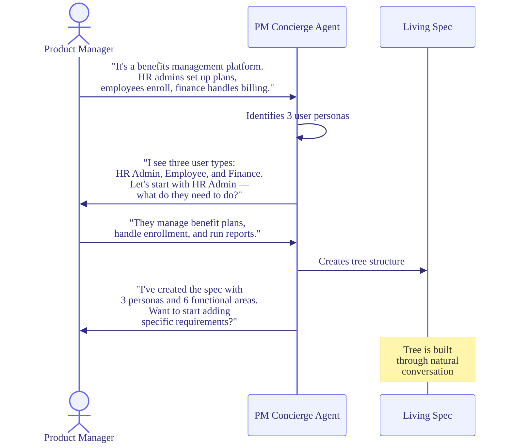
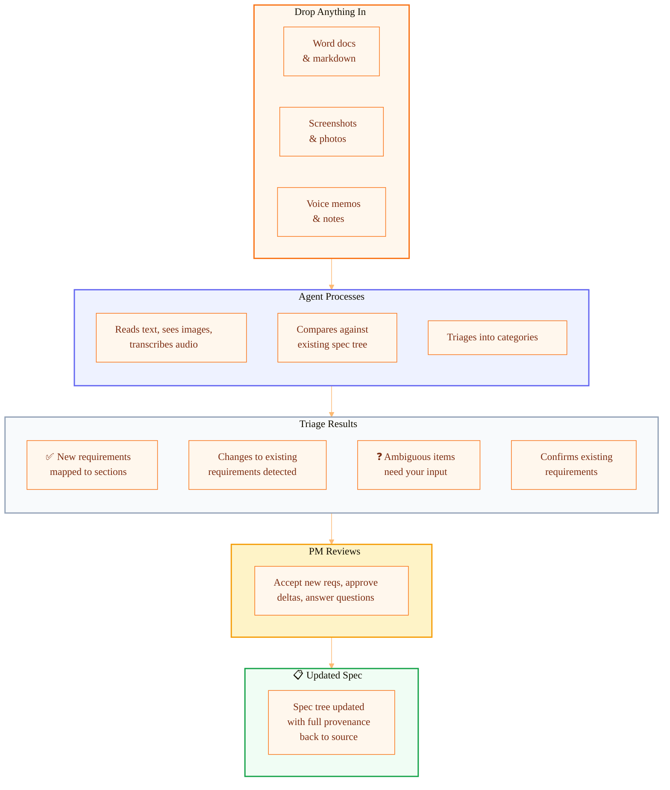
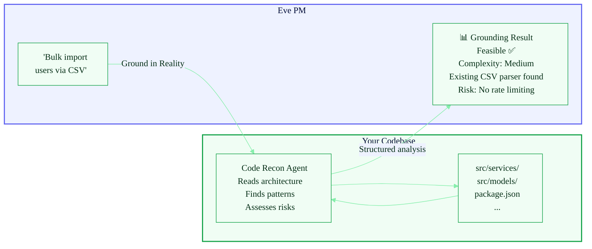
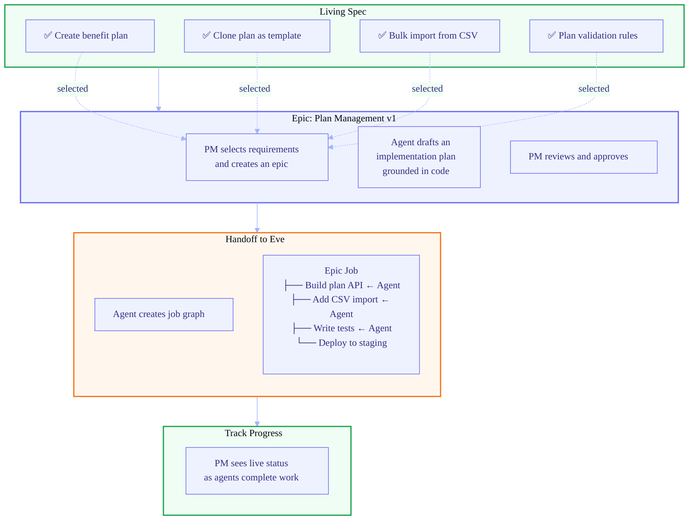
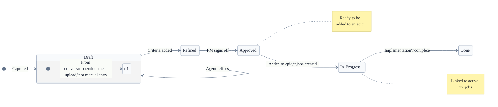
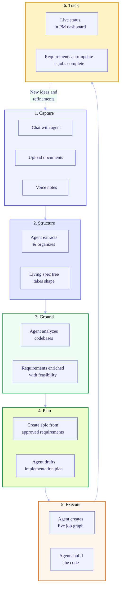
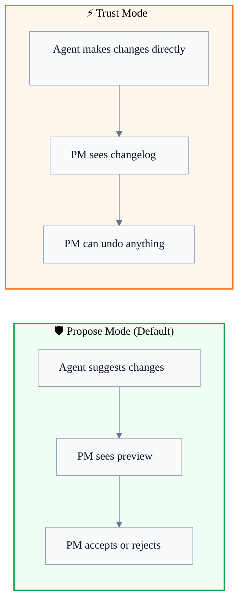
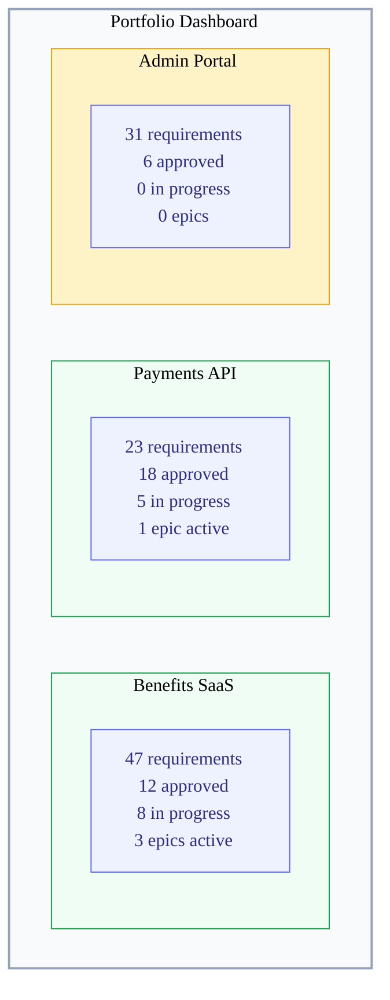

# Eve PM: How It Works

> A visual overview of Eve PM — the requirements intelligence app.
> For the full technical design, see [eve-pm-living-spec-plan.md](./eve-pm-living-spec-plan.md).

## What Is Eve PM?

Eve PM is where product managers turn messy ideas, documents, and conversations
into a structured, living product specification — then hand off implementation
to agents who build it.

```mermaid
%%{init: {"theme": "base", "themeVariables": {"primaryColor": "#EEF2FF", "primaryTextColor": "#312E81", "primaryBorderColor": "#6366F1", "lineColor": "#A5B4FC", "secondaryColor": "#F0FDF4", "tertiaryColor": "#FFF7ED", "fontFamily": "Inter, system-ui, sans-serif"}}}%%
flowchart LR
    subgraph INPUT["What Goes In"]
        direction TB
        A["💬 Conversations"]
        B["📄 Documents"]
        C["🎤 Voice Notes"]
    end

    subgraph EVEPM["Eve PM"]
        direction TB
        D["🧠 AI Agents\nStructure & Organize"]
        E["📋 Living Spec\nYour Product's Truth"]
    end

    subgraph OUTPUT["What Comes Out"]
        direction TB
        F["✅ Grounded Plans\nCode-Aware"]
        G["⚡ Implementation\nEve Jobs"]
    end

    INPUT --> EVEPM
    EVEPM --> OUTPUT

    style INPUT fill:#EEF2FF,stroke:#6366F1,stroke-width:2px
    style EVEPM fill:#F0FDF4,stroke:#16A34A,stroke-width:2px
    style OUTPUT fill:#FFF7ED,stroke:#F97316,stroke-width:2px
```

## The Living Spec

At the heart of Eve PM is a **living specification** — a structured tree that
captures everything your product needs to do. It's organized however makes sense
for your product, and it evolves as your product evolves.

```mermaid
%%{init: {"theme": "base", "themeVariables": {"primaryColor": "#F0FDF4", "primaryTextColor": "#052E16", "primaryBorderColor": "#16A34A", "lineColor": "#86EFAC", "secondaryColor": "#EEF2FF", "tertiaryColor": "#FEF3C7", "fontFamily": "Inter, system-ui, sans-serif"}}}%%
graph TD
    ROOT["📦 Benefits SaaS Platform"]

    ROOT --> P1["👤 HR Administrator"]
    ROOT --> P2["👤 Employee"]
    ROOT --> P3["👤 Finance Team"]
    ROOT --> P4["🔧 Technical Requirements"]

    P1 --> A1["📁 Plan Management"]
    P1 --> A2["📁 Enrollment Management"]
    P1 --> A3["📁 Reporting"]

    P2 --> A4["📁 Plan Browsing"]
    P2 --> A5["📁 Onboarding"]

    P3 --> A6["📁 Invoicing"]

    P4 --> A7["📁 Performance"]
    P4 --> A8["📁 Security"]

    A1 --> R1["✅ Create benefit plan\nwith coverage tiers"]
    A1 --> R2["📝 Clone plan as template"]
    A1 --> R3["📝 Bulk import from CSV"]

    A5 --> R4["✅ Guided setup wizard"]
    A5 --> R5["🔨 Dependent enrollment"]

    A8 --> R6["📝 SSO via SAML"]

    style ROOT fill:#F0FDF4,stroke:#16A34A,stroke-width:2px,color:#052E16
    style P1 fill:#EEF2FF,stroke:#6366F1,stroke-width:1px
    style P2 fill:#EEF2FF,stroke:#6366F1,stroke-width:1px
    style P3 fill:#EEF2FF,stroke:#6366F1,stroke-width:1px
    style P4 fill:#FEF3C7,stroke:#F59E0B,stroke-width:1px
    style A1 fill:#F8FAFC,stroke:#94A3B8,stroke-width:1px
    style A2 fill:#F8FAFC,stroke:#94A3B8,stroke-width:1px
    style A3 fill:#F8FAFC,stroke:#94A3B8,stroke-width:1px
    style A4 fill:#F8FAFC,stroke:#94A3B8,stroke-width:1px
    style A5 fill:#F8FAFC,stroke:#94A3B8,stroke-width:1px
    style A6 fill:#F8FAFC,stroke:#94A3B8,stroke-width:1px
    style A7 fill:#F8FAFC,stroke:#94A3B8,stroke-width:1px
    style A8 fill:#F8FAFC,stroke:#94A3B8,stroke-width:1px
    style R1 fill:#DCFCE7,stroke:#16A34A,stroke-width:1px
    style R2 fill:#FEF9C3,stroke:#CA8A04,stroke-width:1px
    style R3 fill:#FEF9C3,stroke:#CA8A04,stroke-width:1px
    style R4 fill:#DCFCE7,stroke:#16A34A,stroke-width:1px
    style R5 fill:#DBEAFE,stroke:#2563EB,stroke-width:1px
    style R6 fill:#FEF9C3,stroke:#CA8A04,stroke-width:1px
```

> **Legend:** ✅ Approved  📝 Draft  🔨 In Progress

The tree is flexible. You decide the shape — by persona, by domain, by module,
or any structure that fits your product. AI agents help you build and maintain it.

## How You Use It

### 1. Start a Conversation

You don't fill out forms. You talk to an AI agent that interviews you about your
product and builds the spec structure from the conversation.

### 2. The Hopper: Throw Anything In

Requirements arrive from everywhere — PRDs, Figma screenshots, photos of
whiteboard sketches, meeting summaries, voice memos. Throw it all into the
Hopper. An agent processes each item, extracts requirements, and detects
what's new vs what changes existing requirements.

The agent handles any input type:
- **Documents** (Word, PDF, markdown) — extracts text, identifies requirements
- **Screenshots** (Figma, Miro) — reads diagrams, identifies user flows and features
- **Photos** (whiteboard, napkin sketch) — OCR + structural understanding
- **Voice notes** — transcription, then extraction

Every requirement remembers exactly which source it came from. The raw source
is preserved, so it can be re-processed as the spec evolves.

### 3. Ground in Reality

Requirements written in isolation are just wishes. Eve PM sends agents into
your actual codebase to check what's feasible, what's complex, and what
already exists.

After grounding, you know exactly what you're asking for — not just what you
*think* you're asking for.

### 4. Create Epics and Hand Off

When requirements are ready for implementation, group them into **epics** —
focused bundles of work that get handed off to agents for building.

The spec is "everything the product needs." Epics are "what we're building now."
They're independent — reorganizing the spec never disrupts in-flight work.

## The Requirement Lifecycle

Every requirement flows through a clear lifecycle. You can filter the spec
by status to focus on what matters right now.

| Status | What It Means | What You See |
|---|---|---|
| **Draft** | Captured but not fully specified | Needs acceptance criteria |
| **Refined** | Has clear description and criteria | Ready for PM review |
| **Approved** | PM has signed off | Can be added to an epic |
| **In Progress** | Part of an active epic with Eve jobs running | Live job status |
| **Done** | Built, tested, and verified | Shipped |

## The Big Picture

Here's how everything connects — from your first idea to shipped code.

## Agent Trust Levels

You control how much autonomy the AI agents have. Each project can be set
to either mode:

- **Propose mode** is the safe default. The agent suggests, you decide.
- **Trust mode** is for power users who want speed. The agent acts, you review.

## Portfolio View

Eve PM works across all your projects. One dashboard, full visibility.

Each project has its own spec tree, but the PM sees everything from one place.
Click into any project to drill down into personas, areas, and requirements.

---

## Key Concepts

| Concept | What It Is |
|---|---|
| **Living Spec** | The structured tree of everything your product needs to do. Always up to date. |
| **Section** | A grouping in the tree (persona, area, domain — whatever fits your product). |
| **Requirement** | A specific thing the product must do. Has acceptance criteria, priority, and status. |
| **Epic** | A bundle of approved requirements grouped for implementation. Gets handed off as Eve jobs. |
| **Grounding** | When an agent analyzes your actual codebase to validate a requirement's feasibility. |
| **Document Ingestion** | Upload any doc and an agent extracts, organizes, and maps requirements into your spec. |

---

> **Technical details:** See the [full plan](./eve-pm-living-spec-plan.md) for
> data model, API surface, agent architecture, platform dependencies, and
> phased delivery roadmap.
