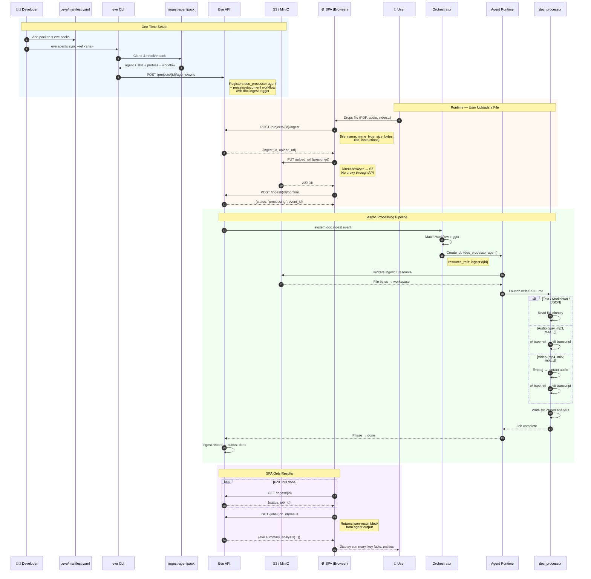

# ingest-agentpack Pack Plan

> **Status**: Plan (ready to build)
> **Date**: 2026-03-05
> **Depends on**: Document ingestion MVP (complete), media processing agent tooling (complete)
> **Scope**: Create `ingest-agentpack` repo under eve-horizon org, extract inline agent prompt into proper pack structure (agent + skill + profiles + workflow), add workflow support to pack system, update manual test scenario 30, verify on local k3d stack

## Goal

Extract the inline document ingestion agent (currently a ~40-line prompt hardcoded in manual test scenario 30) into a proper AgentPack at `github:eve-horizon/ingest-agentpack`. The pack provides the agent definition, harness profiles, processing skill, and workflow trigger — everything needed for document ingestion in a single `x-eve.packs` import. Apps that want to customize behavior (e.g., switch to a faster/cheaper model) overlay via their manifest. This makes document ingestion a composable, customizable, first-class Eve capability.

To make this work, we also extend the pack system to support optional `workflows` and `teams` imports (both currently required or missing from the schema).

## Non-Goals

- Multi-agent triage routing (single-agent MVP)
- Pi harness profiles or capability-adaptive skills (future pack version)
- Slack file download integration
- Org-fs watch-path triggers
- Provenance spans / deep linking
- Embeddings / vector search
- Speaker diarization

## Background

Today the document ingestion flow works end-to-end:

1. `eve ingest <file>` uploads to S3, creates ingest record, fires `system.doc.ingest` event
2. A workflow with `trigger.system.event: doc.ingest` creates a job
3. The agent-runtime hydrates the `ingest://` resource into the workspace
4. The agent processes the file (text directly, audio via whisper-cli, video via ffmpeg + whisper-cli)

But the workflow definition — including the agent prompt with tool instructions — is defined inline in the test scenario. Every project that wants document ingestion must copy-paste this ~40-line prompt. That's the wrong pattern. Eve has AgentPacks for exactly this: reusable, customizable agent configurations that projects import via `x-eve.packs`.

## Architecture

```
ingest-agentpack/                    # Repo (github:eve-horizon/ingest-agentpack)
├── README.md
├── eve/
│   ├── pack.yaml                  # Pack manifest (id: doc-ingest)
│   ├── agents.yaml                # doc_processor agent definition
│   ├── workflows.yaml             # process-document workflow with doc.ingest trigger
│   └── x-eve.yaml                 # Harness profiles (ingest, ingest-fast)
└── skills/
    └── doc-processor/
        └── SKILL.md               # Full processing instructions for the agent

App manifest — just one import, no boilerplate:
  x-eve:
    packs:
      - source: github:eve-horizon/ingest-agentpack
        ref: <40-char-sha>

Manual test scenario 30 updated to use the pack instead of inline workflow.
```

The pack is fully self-contained: agent + skill + profiles + workflow trigger. Apps import it with a single `x-eve.packs` entry and get working document ingestion.

**Platform change required**: The pack system (`PackYamlSchema`) currently supports `agents`, `teams` (required), `chat`, and `x_eve` imports. This plan adds optional `workflows` import support and makes `teams` optional. See Phase 0 below.

### End-to-End: SPA Web App Using Document Ingestion

This diagram shows the complete flow when an Eve-compatible web app adds document ingestion via the pack — from developer setup through runtime file processing.



### How It Connects (Summary)

```
eve agents sync (one-time) → resolves pack → registers agent + workflow
                                    │
eve ingest API (per file)           │
  1. Create record + presigned URL  │
  2. Browser uploads to S3          │
  3. Confirm → fires event ─────────┤
                                    ▼
            Orchestrator matches workflow trigger → creates job
                                    │
                                    ▼
            Agent-runtime hydrates ingest:// → runs doc_processor
                                    │
                                    ▼
            Agent follows SKILL.md → writes analysis → job done
```

## Detailed Design

### 1. Repository Structure

Following the established pattern from `eve-software-factory`:

#### `eve/pack.yaml`

```yaml
version: 1
id: doc-ingest
imports:
  agents: eve/agents.yaml
  workflows: eve/workflows.yaml
  x_eve: eve/x-eve.yaml
```

No `teams` import — this single-agent pack has no team routing. The `teams` field is made optional by the Phase 0 schema change.

#### `eve/agents.yaml`

```yaml
version: 1
agents:
  doc_processor:
    slug: doc-processor
    skill: doc-processor
    harness_profile: ingest
    description: "Processes ingested documents: text, audio, video. Extracts content, transcribes media, writes structured summaries."
    policies:
      permission_policy: auto_edit
      git: { commit: none, push: never }
```

#### `eve/x-eve.yaml`

```yaml
agents:
  profiles:
    ingest:
      - harness: mclaude
        model: opus-4.6
        reasoning_effort: medium

    ingest-fast:
      - harness: mclaude
        model: sonnet-4.6
        reasoning_effort: low
```

Two profiles: `ingest` for quality (Opus), `ingest-fast` for speed/cost (Sonnet).

**Profile selection**: The agent's `harness_profile: ingest` in `agents.yaml` is the default. Apps that want the cheaper/faster profile override it in their manifest:

```yaml
# In app's .eve/manifest.yaml
x-eve:
  agents:
    doc_processor:
      harness_profile: ingest-fast
```

This overlay merge happens during `agents sync` — the project's x-eve agents block overrides the pack's agent fields. No code change needed; this is the standard pack customization pattern (same as `notes-ops` in the fullstack-example).

#### `eve/workflows.yaml`

```yaml
workflows:
  process-document:
    trigger:
      system:
        event: doc.ingest
    steps:
      - agent:
          prompt: "Process the ingested document using your doc-processor skill."
```

The workflow binds the `doc.ingest` event trigger to the `doc_processor` agent. The ~40-line inline prompt from scenario 30 is replaced by a one-liner — all processing logic lives in `SKILL.md`. When `agents sync` resolves this pack, the workflow is merged into the project's effective manifest and registered with the orchestrator.

#### `skills/doc-processor/SKILL.md`

```markdown
---
name: doc-processor
description: Process ingested documents — text, audio, video — into structured summaries
---

# Document Processor

You are a document processing agent. A file has been ingested and placed in your workspace.

## Steps

1. Read `.eve/resources/index.json` to find the ingested file path, label, and MIME type
2. Determine file category from the MIME type (or fall back to file extension)
3. Process based on category:

### Audio (audio/*)

Supported: wav, mp3, m4a, ogg, flac, opus, aac, amr, wma

```bash
whisper-cli -m /opt/whisper/models/ggml-small.en.bin -f <file> -ovtt
```

Read the resulting `.vtt` transcript. Summarize the spoken content with key points and timestamps.

### Video (video/*)

Supported: mp4, mkv, mov, avi, webm, wmv, flv, m4v, mpeg, 3gp

```bash
# Extract audio track
ffmpeg -i <file> -vn -acodec pcm_s16le -ar 16000 -ac 1 /tmp/audio.wav

# Transcribe
whisper-cli -m /opt/whisper/models/ggml-small.en.bin -f /tmp/audio.wav -ovtt
```

Read the transcript. Summarize with key points and timestamps.

### Text (text/*, application/json, application/yaml, application/xml)

Supported: md, txt, csv, html, json, yaml, xml

Read the file directly. Summarize content and extract key points.

### Documents (application/pdf, application/msword, application/vnd.openxmlformats-*)

Read the file directly (if you are a multimodal model that handles PDFs natively).
If the file is unreadable, try: `pdftotext <file> /tmp/extracted.txt` and read that.

Summarize and extract key points.

## Context from Submitter

The ingest record may include user-supplied context. Check `.eve/resources/index.json` for:

- **title**: Display name for the file
- **description**: What the file is (e.g., "Q4 board deck")
- **instructions**: How to process it (e.g., "extract action items only")

Honor the submitter's instructions when deciding what to extract and how to structure your output.

## Output

Write your analysis, then output a `json-result` block so the result is retrievable via `eve job result`:

```json-result
{
  "eve": {
    "summary": "2-3 sentence overview of the document"
  },
  "analysis": {
    "summary": "...",
    "key_facts": ["...", "..."],
    "entities": ["...", "..."],
    "action_items": ["...", "..."],
    "source": {
      "file_type": "audio/wav",
      "duration_seconds": 180,
      "page_count": null
    }
  }
}
```

The `eve.summary` field is displayed by `eve job result`. The `analysis` object is the full structured output that apps retrieve via `GET /jobs/{id}/result`.

If tools are unavailable (whisper-cli, ffmpeg not in PATH), report what you can determine from the raw file and note the limitation in the summary.
```

### 2. GitHub Repository Creation

Create `eve-horizon/ingest-agentpack` as a public repo under the `eve-horizon` GitHub org.

```bash
# Create the repo
gh repo create eve-horizon/ingest-agentpack \
  --public \
  --description "Eve AgentPack for document ingestion — text, audio, video processing" \
  --clone

# Initialize with the pack structure
# (files from Phase 1)

git add .
git commit -m "feat: initial ingest-agentpack agent pack"
git push origin main
```

### 3. Manual Test Scenario Updates

Scenario 30 currently syncs an inline workflow manifest via raw API call (Phase 2 of the scenario). Replace this with a proper pack reference.

**Before** (current scenario 30, Phase 2):
```bash
# Raw API call with inline workflow YAML containing ~40-line agent prompt
api -X POST -H "Content-Type: application/json" \
  "$EVE_API_URL/projects/$PROJECT_ID/manifest" \
  -d "{\"yaml\": $(echo "$MANIFEST_YAML" | jq -Rs .)}"
```

**After** (using the pack):
```bash
# Clone the pack locally for test resolution
PACK_DIR=${PACK_DIR:-/tmp/ingest-agentpack}
if [ ! -d "$PACK_DIR" ]; then
  git clone https://github.com/eve-horizon/ingest-agentpack.git "$PACK_DIR"
fi

# Single-step sync: resolves agent + skill + profiles + workflow from pack
eve agents sync --project "$PROJECT_ID" --local --repo-dir "$PACK_DIR" --allow-dirty
```

One command replaces the entire Phase 2. The `agents sync` resolves the pack, merges agents/profiles/skills/workflows, and registers everything with the API. The ~40-line inline prompt is gone — processing logic lives in the pack's `SKILL.md`.

The rest of the scenario (Phases 3-5) remains unchanged — same `doc.ingest` trigger, same end-to-end flow.

### 4. Pack Customization Pattern

Apps customize the pack by overlaying in their manifest:

```yaml
# App's .eve/manifest.yaml — minimal: just import the pack
x-eve:
  packs:
    - source: github:eve-horizon/ingest-agentpack
      ref: abc123abc123abc123abc123abc123abc123abcd  # 40-char SHA required for remote

# That's it. Agent, skill, profiles, and workflow all come from the pack.

# To customize (optional):
x-eve:
  agents:
    # Switch to faster/cheaper profile
    doc_processor:
      harness_profile: ingest-fast

    # Or use a private model on pi harness
    # doc_processor:
    #   harness_profile: ingest-pi

  profiles:
    ingest-pi:
      - harness: pi
        model: anthropic/claude-sonnet-4
```

This follows the same overlay merge pattern already used by `notes-ops` in the fullstack-example.

## Phases

### Phase 0: Extend Pack System (eve-horizon)

Add workflow support and make teams optional in the pack schema and resolver. Small, contained changes:

1. **Make `teams` optional in `PackYamlSchema`** (`packages/shared/src/schemas/pack.ts`)
   - Change `teams: z.string().min(1)` → `teams: z.string().min(1).optional()`
   - Single-agent packs shouldn't need an empty teams file

2. **Add optional `workflows` import to `PackYamlSchema`**
   - Add `workflows: z.string().min(1).optional()` to the imports object

3. **Add `workflows` to `ResolvedPack` interface**
   - Add `workflows: Record<string, unknown> | null` field

4. **Load workflows in `resolvePack()`** (`packages/shared/src/lib/pack-resolver.ts`)
   - If `parsed.imports.workflows` exists, `loadYamlMap()` it; otherwise `null`
   - Same pattern as `chat` and `x_eve` handling

5. **Merge workflows in `resolvePacksAndMerge()`** (`packages/cli/src/commands/agents.ts`)
   - Collect workflow definitions from each pack (merge in order, later packs override)
   - Merge project-level workflows on top (from manifest)
   - Include merged workflows in the sync POST body

6. **Handle workflows in the sync API** (`apps/api/src/agents/agents-sync.service.ts` or equivalent)
   - Accept optional `workflows_yaml` in the sync body
   - If present, upsert into the project's manifest `workflows` block

7. **Tests**: Unit test for pack resolution with workflows, integration test for agents sync with workflow pack

**Files modified (eve-horizon):**
| File | Change |
|------|--------|
| `packages/shared/src/schemas/pack.ts` | `teams` optional, add `workflows` import |
| `packages/shared/src/lib/pack-resolver.ts` | Load workflows from pack |
| `packages/cli/src/commands/agents.ts` | Merge and sync workflows from packs |
| `apps/api/src/agents/` (sync handler) | Accept workflows in sync payload |

### Phase 1: Create Pack Repository

1. Create directory structure at `../ingest-agentpack` (sibling to this repo at `~/dev/eve-horizon/ingest-agentpack`)
2. Write `eve/pack.yaml`, `eve/agents.yaml`, `eve/workflows.yaml`, `eve/x-eve.yaml`
3. Write `skills/doc-processor/SKILL.md` (extracted and refined from scenario 30 inline prompt)
4. Write `README.md` with usage instructions
5. Create GitHub repo `eve-horizon/ingest-agentpack` (public)
6. Push initial commit

**Files created:**
| File | Purpose |
|------|---------|
| `eve/pack.yaml` | Pack manifest (id, imports) |
| `eve/agents.yaml` | doc_processor agent definition |
| `eve/workflows.yaml` | process-document workflow with doc.ingest trigger |
| `eve/x-eve.yaml` | Harness profiles (ingest, ingest-fast) |
| `skills/doc-processor/SKILL.md` | Agent processing instructions |
| `README.md` | Usage docs |

### Phase 2: Update Manual Test Scenario 30

1. Replace Phase 2 (inline workflow + manifest API call) with single `eve agents sync` from pack
2. Add a prerequisite step that clones the pack repo locally
3. Keep Phases 3-5 unchanged (they test the same end-to-end flow)
4. Update the "What This Tests" table to include pack resolution

**Files modified:**
| File | Change |
|------|--------|
| `tests/manual/scenarios/30-document-ingestion-mvp.md` | Replace inline workflow with pack reference |

### Phase 3: Verify on Local k3d Stack

1. `./bin/eh status` — confirm stack is running
2. Clone the pack to `/tmp/ingest-agentpack`
3. Run scenario 30 Phases 0-2: pack clone, project setup, agents sync with pack
4. Run scenario 30 Phases 3-5: ingest text, audio, video — verify all complete
5. Check that job logs show the agent used skills from the pack (not inline prompt)

**Acceptance criteria:**
- `eve agents sync` resolves the pack without error
- Workflow `process-document` is registered with `doc.ingest` trigger
- Text ingest → job completes → phase=done
- Audio ingest → job completes → whisper-cli invoked → phase=done
- Video ingest → job completes → ffmpeg + whisper-cli invoked → phase=done
- Ingest records all reach status=done

### Phase 4: Update CLAUDE.md and Sister Repos

1. Add `ingest-agentpack` to the sister repositories table in CLAUDE.md
2. Note the repo location: `../ingest-agentpack` (relative from eve-horizon) or `~/dev/eve-horizon/ingest-agentpack`
3. Add the workflow trigger snippet to `eve-skillpacks` reference docs if applicable

**Files modified:**
| File | Change |
|------|--------|
| `CLAUDE.md` | Add ingest-agentpack to sister repos table |

## File Change Summary

| File | Action | Location |
|------|--------|----------|
| `packages/shared/src/schemas/pack.ts` | Modify | eve-horizon repo |
| `packages/shared/src/lib/pack-resolver.ts` | Modify | eve-horizon repo |
| `packages/cli/src/commands/agents.ts` | Modify | eve-horizon repo |
| `apps/api/src/agents/` (sync handler) | Modify | eve-horizon repo |
| `eve/pack.yaml` | Create | ingest-agentpack repo |
| `eve/agents.yaml` | Create | ingest-agentpack repo |
| `eve/workflows.yaml` | Create | ingest-agentpack repo |
| `eve/x-eve.yaml` | Create | ingest-agentpack repo |
| `skills/doc-processor/SKILL.md` | Create | ingest-agentpack repo |
| `README.md` | Create | ingest-agentpack repo |
| `tests/manual/scenarios/30-document-ingestion-mvp.md` | Modify | eve-horizon repo |
| `CLAUDE.md` | Modify | eve-horizon repo |

## Key Decisions

| Decision | Rationale |
|----------|-----------|
| Public repo under `eve-horizon` org | Platform repo is private; packs must be public for app customization |
| Single agent (no triage team) | MVP simplicity; team routing is a future pack version |
| Skill in SKILL.md, not inline prompt | Proper pack pattern; agents get skill installed via on-clone hook |
| Two harness profiles (ingest, ingest-fast) | Quality vs speed trade-off; apps override via manifest overlay |
| Pin production pack refs | Avoids unreviewed `main`-based workflow or prompt changes reaching production |
| No git commit/push in agent policies | Ingest jobs don't modify repos; they process documents |
| Workflows in pack (new feature) | Packs should be self-contained; requiring apps to copy workflow boilerplate defeats the purpose |
| `teams` made optional in schema | Single-agent packs shouldn't need an empty teams file |
| Default profile is `ingest` (Opus) | Quality-first default; apps opt into `ingest-fast` (Sonnet) via manifest overlay |

## Risks

| Risk | Mitigation |
|------|-----------|
| Workflow merge from packs is new code path | Small surface area; follows same pattern as agents/teams/chat merge. Unit + integration tests in Phase 0. |
| Skill resolution from packs not tested with ingest agents | Test on k3d; skill installation already works for software-factory pack |
| Workflow name collisions across multiple packs | Later pack overrides earlier (same merge order as agents). Document this. |
| GitHub org `eve-horizon` may not have repo create permissions | Coordinate with org admin; fallback to creating under `the platform operator` org |
| Scenario 30 becomes dependent on external repo clone | Pack is cloned to `/tmp/` at test start; scenario remains self-contained |

## Relationship to Prior Work

| Document | What It Contributed |
|----------|-------------------|
| [document-ingestion-agent-packs.md](../ideas/document-ingestion-agent-packs.md) | Full architecture vision — triage teams, multi-harness, provenance, Slack integration. This plan implements the single-agent MVP subset. |
| [document-ingestion-mvp-plan.md](./document-ingestion-mvp-plan.md) | Ingest spine — records, API, events, hydration, CLI. All complete and working. |
| [media-processing-architecture.md](../ideas/media-processing-architecture.md) | Option C hybrid decision — tools in image, agent decides. Implemented. |
| [media-processing-agent-tooling-plan.md](./media-processing-agent-tooling-plan.md) | Docker images, CLI mime types, whisper.cpp build. All complete and verified. |
| Manual test scenario 30 | End-to-end verification with inline workflow. This plan extracts it into a pack. |
