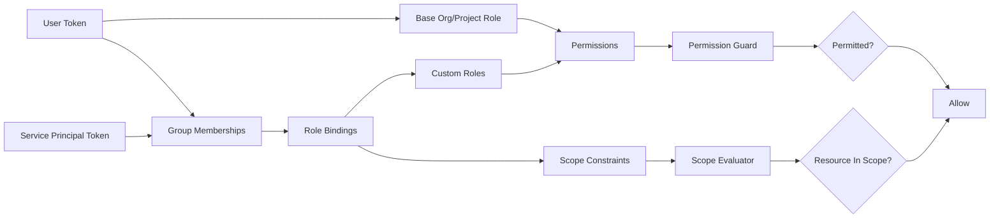
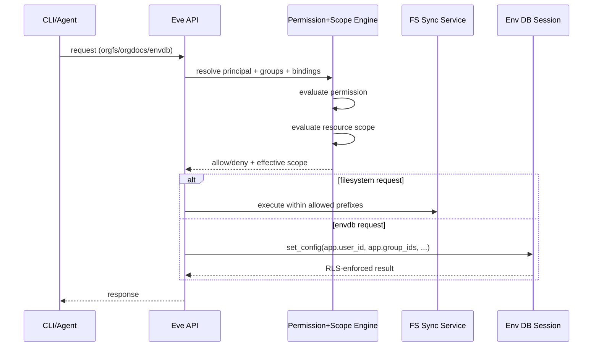
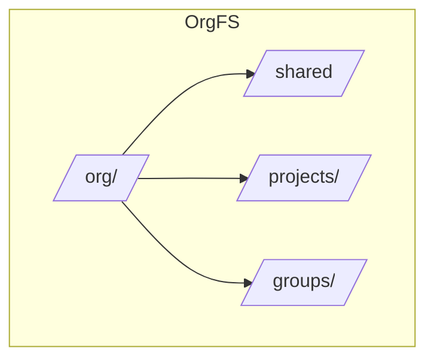

# Platform Groups + Scoped Resource Access Plan

> Status: Draft
> Last Updated: 2026-02-14
> Purpose: Introduce first-class access groups and scoped authorization for filesystem + database access using existing Eve auth primitives.
> Depends On:
> - `docs/plans/unified-permissions-plan.md`
> - `docs/plans/org-fs-sync-battle-hardening-plan.md`
> - `docs/plans/org-fs-sync-api-cli-spec.md`

## 0) Delivery Assumption (Breaking Changes Allowed)

This plan assumes pre-deployment conditions:

1. Backward compatibility is not required.
2. We can make breaking authz changes across API/CLI/runtime.
3. Sister repos and test fixtures will be updated to match the new model.

## 1) Why This Plan

Current access control is strong at the coarse permission layer, but weak for section-level data boundaries:

1. A user has one base role per org/project, plus additive custom roles.
2. There is no first-class "group" principal in authz.
3. Filesystem and org document access is org-wide once `orgs:read|write` is granted.
4. Env DB context carries user/project/env, but not group context for RLS segmentation.

We need one unified model so users and agents can safely collaborate in shared orgs while keeping sensitive sections isolated.

## 2) Goals

1. Keep existing Eve primitives (roles, bindings, permissions) and extend them cleanly.
2. Add first-class groups for both humans and service principals.
3. Support scoped access for:
   1. org filesystem paths
   2. org document paths
   3. environment DB schemas/tables/RLS predicates
4. Make memberships and effective access easy to inspect and update from CLI + API.
5. Enforce strict default-deny for data plane access for users, members, and agents.
6. Include fs hardening recommendations: `orgfs:*` permissions, scoped link tokens, scoped mounts, and path ACL enforcement.

Non-goals (initial rollout):

1. Nested groups (group-of-groups).
2. Explicit deny rules.
3. Cross-org groups.

## 3) Current Touchpoint Audit

## 3.1 Identity, Roles, and Memberships

1. One base org role per user (`UNIQUE(org_id, user_id)`): `packages/db/migrations/00018_add_auth_tables.sql:48`.
2. One base project role per user (`UNIQUE(project_id, user_id)`): `packages/db/migrations/00018_add_auth_tables.sql:66`.
3. Membership upsert is single-role replacement, not multi-role: `packages/db/src/queries/memberships.ts:48`.
4. Effective permissions are base role + custom role union: `apps/api/src/auth/rbac.service.ts:76`.

## 3.2 Custom Roles and Bindings

1. Custom role overlay already exists: `packages/db/migrations/00047_custom_roles.sql:9`.
2. Bindings support `user|service_principal` only: `packages/db/migrations/00047_custom_roles.sql:31`.
3. API and schema enforce same principal types: `apps/api/src/auth/auth.access.controller.ts:30`, `packages/shared/src/schemas/auth.ts:309`.
4. CLI bind/unbind supports only `--user` or `--service-principal`: `packages/cli/src/commands/access.ts:468`.

## 3.3 Permissions and Guards

1. Permission catalog has no `orgfs:*` namespace yet: `packages/shared/src/permissions.ts:29`.
2. `member` has `orgs:read`, `admin` adds `orgs:write`: `apps/api/src/auth/permissions.ts:23`.
3. Permission guard is already unified and extensible: `apps/api/src/auth/permission.guard.ts:65`.

## 3.4 Filesystem and Org Docs

1. Org docs API uses coarse `orgs:read|write`: `apps/api/src/org-documents/org-documents.controller.ts:78`.
2. Org fs sync API also uses coarse `orgs:read|write`: `apps/api/src/org-fs-sync/org-fs-sync.controller.ts:80`.
3. Org fs links have `remote_path` but no owner principal or ACL scope model: `packages/db/migrations/00059_org_fs_sync.sql:34`.
4. Internal fs ingestion/heartbeat/metrics rely on one shared internal token: `apps/api/src/org-fs-sync/org-fs-sync.controller.ts:244`.
5. Runtime mounts full `/org` and symlinks `.org` into workspace: `k8s/base/agent-runtime-deployment.yaml:52`, `apps/agent-runtime/src/invoke/invoke.service.ts:378`.

## 3.5 Env DB and RLS Context

1. Env DB API exposes RLS inspection (`/db/rls`), but group context is not propagated: `apps/api/src/environments/env-db.controller.ts:109`.
2. Session context sets only `app.user_id`, `app.project_id`, `app.env_name`: `apps/api/src/environments/env-db.service.ts:582`.

## 3.6 Query Surfaces and Membership Visibility

1. Org-level query access to projects is membership-based only (org or project membership), no custom binding/group projection: `packages/db/src/queries/org-queries.ts:334`.
2. Org/project member CLI commands exist and are simple, but group-aware views are missing: `packages/cli/src/commands/org.ts:133`, `packages/cli/src/commands/project.ts:258`.

## 3.7 Existing "Teams" Primitive Is Not Auth Grouping

1. `teams`/`team_members` are agent orchestration structures, not authorization groups: `packages/db/migrations/00032_add_agent_runtime_primitives.sql:50`.

## 4) Recommended Unified Model

## 4.1 Keep the Base Role Model

Keep:

1. one base org role per user (`owner|admin|member`)
2. one base project role per user
3. additive custom role bindings

But reinterpret role semantics:

1. Base roles are control-plane defaults.
2. Base roles DO NOT grant data-plane visibility to org fs/org docs/env db content.
3. Data-plane access requires explicit scoped grants via bindings (direct or group).

Rationale: least privilege and predictable multi-tenant segmentation.

## 4.2 Add First-Class Access Groups

Add new control-plane tables:

1. `access_groups`
   1. `id` (`grp_...`), `org_id`, `name`, `slug`, `description`, `created_by`, timestamps
2. `access_group_members`
   1. `group_id`, `principal_type`, `principal_id`, `added_by`, timestamps
   2. `principal_type IN ('user', 'service_principal')` in v1

Then extend `access_bindings`:

1. `principal_type IN ('user', 'service_principal', 'group')`
2. `principal_id` supports `group_id` when `principal_type='group'`

This lets one role binding apply to many members through group membership.

## 4.3 Add Scoped Grants to Bindings

Extend access bindings with optional scope constraints:

1. `scope_json JSONB NULL`

Example:

```json
{
  "orgfs": { "allow_prefixes": ["/groups/pm/**"], "read_only_prefixes": [] },
  "orgdocs": { "allow_prefixes": ["/groups/pm/**"] },
  "envdb": { "schemas": ["pm"], "tables": ["pm.*"] }
}
```

Semantics:

1. Permission check must pass (`orgfs:read`, etc.).
2. Scope match must pass for resource requests.
3. For data-plane permissions (`orgfs:*`, `orgdocs:*`, `envdb:*`), missing scope means deny.
4. No deny rules in v1; union of matching scopes applies.

## 4.4 Split Org-Wide FS/Docs Permissions

Add to permission catalog:

1. `orgfs:read|write|admin`
2. `orgdocs:read|write|admin`

Then migrate endpoints:

1. FS endpoints from `orgs:*` to `orgfs:*`
2. Org docs endpoints from `orgs:*` to `orgdocs:*`
3. Resource resolve endpoints evaluate resource-specific scope (`orgdocs` and job artifacts)
4. `orgs:*` remains for org administration only, not data access

## 4.5 Filesystem Hardening (Integrated Recommendations)

Adopt all recommended fs controls in this same model:

1. Keep Syncthing as primary data-plane transport; Mutagen remains fallback.
2. Keep local `RWO`; require `RWX` for staging/prod multi-device rollout.
3. Maintain per-org `seq` replay contract and SSE resume via `after_seq`.
4. Introduce link ownership and scope on `org_sync_links`:
   1. `owner_principal_type`, `owner_principal_id`
   2. `scope_json` for allowed prefixes
5. Replace single shared internal token with short-lived per-link signed gateway tokens containing:
   1. `org_id`
   2. `link_id`
   3. `mode`
   4. `allow_prefixes`
   5. expiry + nonce/jti
6. Enforce path ACL checks at:
   1. link create/update
   2. event ingest (`/internal/orgs/:org_id/fs/events`)
   3. heartbeat/metrics mutation
7. Mount scoped org views to job workspaces where possible:
   1. default no-mount for agents/users without matching `orgfs` scope
   2. read-only scoped mount for `orgfs:read`
   3. writable scoped mount only for `orgfs:write` + matching scope

## 4.6 Env DB + RLS Group Scoping

Extend DB session context in `EnvDbService`:

1. `app.org_id`
2. `app.group_ids` (JSON array)
3. `app.permissions` (JSON array, optional for SQL helper functions)

Add helper SQL functions (template installed by `eve db rls init --with-groups`):

1. `app.current_user_id()`
2. `app.current_group_ids()`
3. `app.has_group(text)`

RLS patterns then use group-aware predicates, for example:

1. row has `group_id` and policy checks `group_id = ANY(app.current_group_ids())`
2. row has `visibility = 'org'` or group-based fallback

Strict behavior:

1. No group context means no data rows for protected tables.
2. `member` role alone is insufficient for protected-table reads.

## 5) Platform Authorization Flow







## 6) REST API Shape

## 6.1 Groups

1. `POST /orgs/:org_id/access/groups`
2. `GET /orgs/:org_id/access/groups`
3. `GET /orgs/:org_id/access/groups/:group_id`
4. `PATCH /orgs/:org_id/access/groups/:group_id`
5. `DELETE /orgs/:org_id/access/groups/:group_id`

## 6.2 Group Memberships

1. `POST /orgs/:org_id/access/groups/:group_id/members`
2. `GET /orgs/:org_id/access/groups/:group_id/members`
3. `DELETE /orgs/:org_id/access/groups/:group_id/members/:principal_type/:principal_id`

## 6.3 Access Introspection (User/Agent Friendly)

1. `GET /orgs/:org_id/access/principals/:principal_type/:principal_id/memberships`
   1. base memberships
   2. groups
   3. direct bindings
   4. effective permissions
   5. effective scopes by resource type
2. Extend `GET /orgs/:org_id/access/can` and `.../explain` with optional resource context:
   1. `resource_type=orgfs|orgdocs|envdb`
   2. `resource_id=/groups/pm/roadmap.md` or `schema.table`
   3. `action=read|write|admin`

## 6.4 FS-Specific Policy APIs

1. `GET /orgs/:org_id/fs/policies`
2. `POST /orgs/:org_id/fs/policies`
3. `PATCH /orgs/:org_id/fs/policies/:policy_id`
4. `DELETE /orgs/:org_id/fs/policies/:policy_id`

`fs` links reference effective policy snapshots at enrollment time and on rotation.

## 7) CLI UX Shape

## 7.1 New Group Commands

1. `eve access groups create <name> --org <org_id> [--description ...]`
2. `eve access groups list --org <org_id>`
3. `eve access groups show <group> --org <org_id>`
4. `eve access groups update <group> --org <org_id> [--name ...] [--description ...]`
5. `eve access groups delete <group> --org <org_id>`

## 7.2 Group Member Commands

1. `eve access groups members add <group> --user <user_id> --org <org_id>`
2. `eve access groups members add <group> --service-principal <sp_id> --org <org_id>`
3. `eve access groups members list <group> --org <org_id>`
4. `eve access groups members remove <group> --user <user_id> --org <org_id>`

## 7.3 Binding and Explainability

1. Extend existing bind commands:
   1. `eve access bind --group <group_id> --role <role_name> [--project ...] [--scope-json ...]`
2. New visibility command:
   1. `eve access memberships --org <org_id> --user <user_id>`
3. Extend explain:
   1. `eve access explain --org <org_id> --user <user_id> --permission orgfs:read --resource-type orgfs --resource /groups/pm/spec.md`

## 7.4 FS Access UX

1. `eve fs sync status --org <org_id> --verbose` includes effective scope summary.
2. `eve fs access list --org <org_id>`
3. `eve fs access check --org <org_id> --user <user_id> --path /groups/pm/spec.md --action write`

## 8) Policy-as-Code (`.eve/access.yaml`) v2

```yaml
version: 2
access:
  groups:
    pm-team:
      description: Product management team
      members:
        - { type: user, id: user_pm1 }
        - { type: service_principal, id: sp_pm_backend }

  roles:
    pm_editor:
      scope: org
      permissions: [orgdocs:read, orgdocs:write, orgfs:read, orgfs:write, envdb:read]

  bindings:
    - subject: { type: group, id: pm-team }
      roles: [pm_editor]
      scope:
        orgdocs: { allow_prefixes: ["/groups/pm/**"] }
        orgfs: { allow_prefixes: ["/groups/pm/**"] }
        envdb: { schemas: ["pm"] }
```

This rollout treats v2 as the required format for scoped data-plane access.

## 9) Rollout Plan

## Phase 0: Contract + Schema Prep

1. Add `orgfs:*` + `orgdocs:*` permissions.
2. Add group tables and `principal_type='group'`.
3. Add `scope_json` on bindings.
4. Add `app.group_ids` session context plumbing.

## Phase 1: Groups and Membership APIs/CLI

1. Ship group CRUD and member management.
2. Ship `eve access groups*` commands.
3. Extend `access can/explain` to accept `group` and resource scopes.
4. Ship `eve access memberships` and resource-scope explain output.

## Phase 2: Scoped Evaluator

1. Implement shared scope evaluator service.
2. Enforce on org docs/resources/fs endpoints (read and write paths).
3. Enforce missing-scope = deny for `orgfs|orgdocs|envdb` data-plane operations.

## Phase 3: FS Hardening Integration

1. Move fs endpoints to `orgfs:*`.
2. Add link ownership + scope metadata.
3. Replace shared internal key flow with per-link scoped tokens.
4. Implement scoped mounts and read-only defaults for non-writers.

## Phase 4: Env DB Group Context

1. Finalize `app.group_ids` propagation for all env-db requests.
2. Add RLS helper SQL templates and CLI scaffolding.
3. Extend `eve db rls` output with group-context diagnostics.

## Phase 5: Cutover + Sister Repo Fixup

1. Remove coarse `orgs:*` checks on docs/fs data paths.
2. Update sister repos and fixtures to declare required groups and bindings.
3. Fail fast when required group-scoped policy is missing.

## 10) Testing and Acceptance

## 10.1 Automated

1. Permission resolution tests:
   1. direct user binding
   2. group binding
   3. mixed user + group + base role union
2. Scope evaluator tests:
   1. prefix allow
   2. prefix miss
   3. project-scoped override
3. FS API integration:
   1. `orgfs:read` with in-scope path succeeds
   2. same permission out-of-scope fails
   3. internal event ingest rejects out-of-scope paths
4. Env DB integration:
   1. `app.group_ids` populated
   2. RLS policy respects group boundaries

## 10.2 Manual

1. Create two groups in one org (`pm`, `eng`) and verify cross-path isolation.
2. Verify a service principal bound via group can write only group-scoped fs paths.
3. Verify `eve access memberships` and `eve access explain --resource` output is human-readable and agent-readable.

## 11) Key Design Decisions (Recommended)

1. Keep single base org role per user; use groups for multiplicity.
2. Use additive-only grants in v1 (no deny rules).
3. Attach resource scopes to bindings (`scope_json`) rather than creating a separate policy DSL service first.
4. Use `orgfs:*` and `orgdocs:*` for endpoint capability checks; reserve `orgs:*` for org administration.
5. Keep fs data plane on Syncthing and harden auth/scoping around it.
6. Default-deny data plane for everyone (users, members, agents, service principals) unless explicitly group-scoped.
7. No backward compatibility mode; fix callers and sister repos during rollout.
