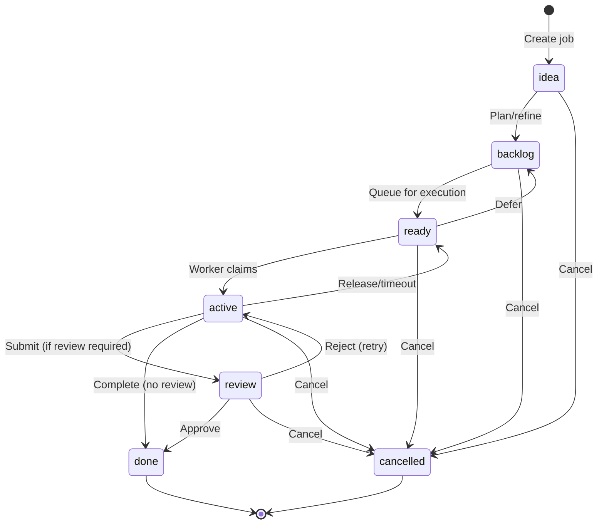
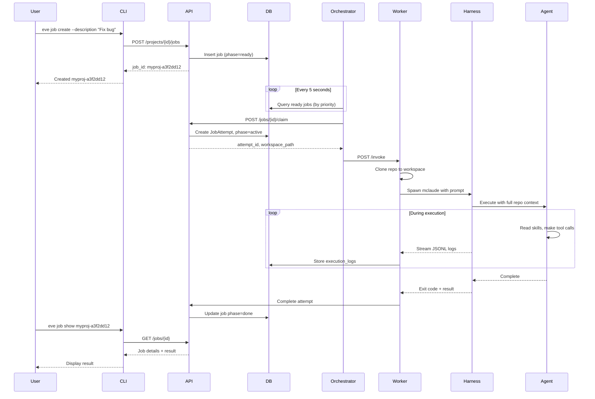
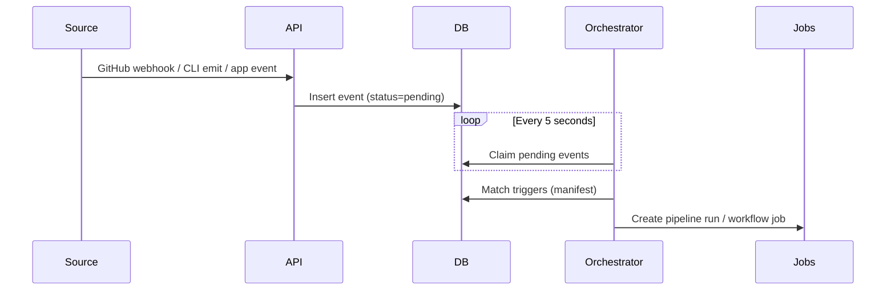
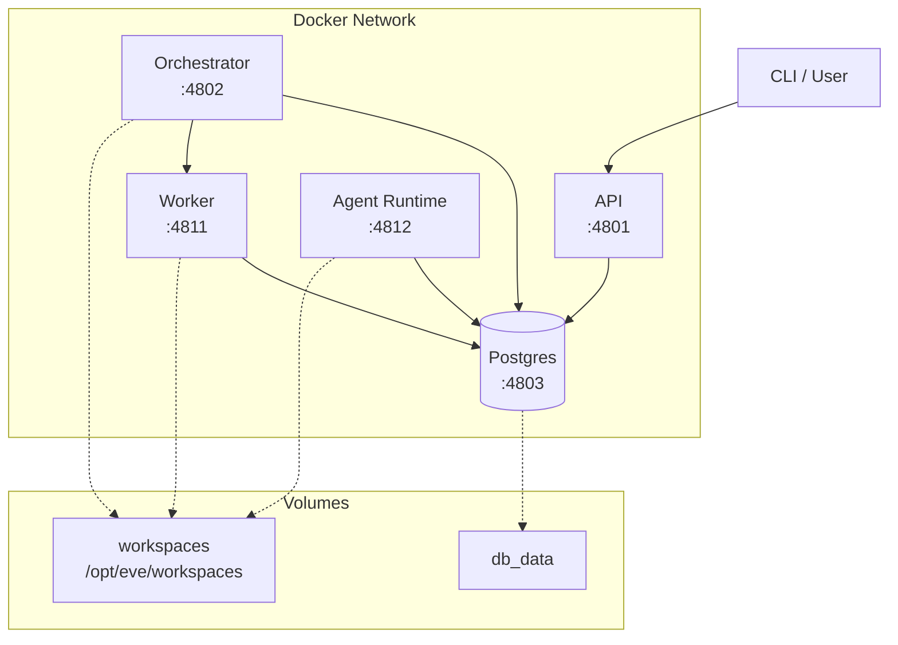
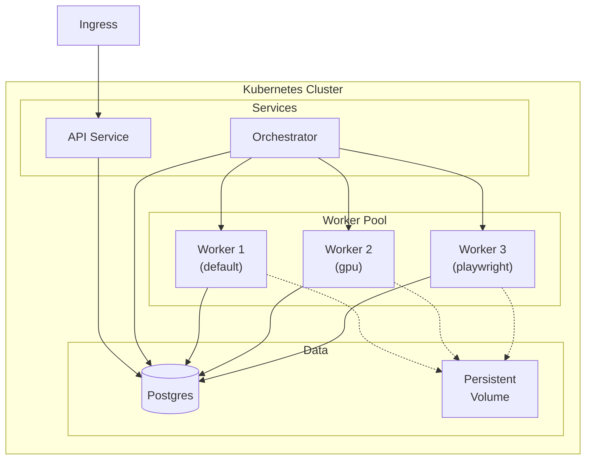
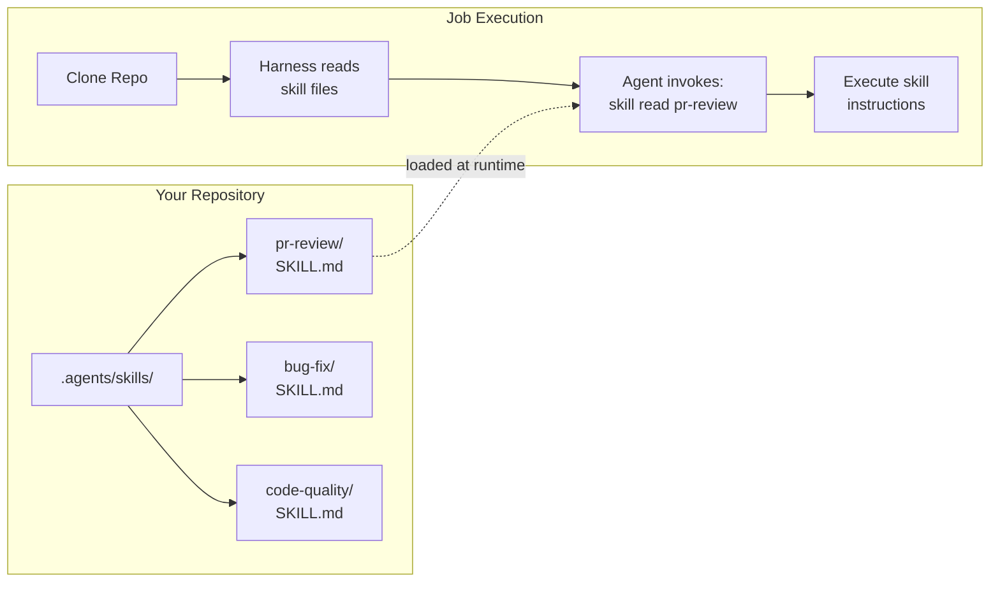
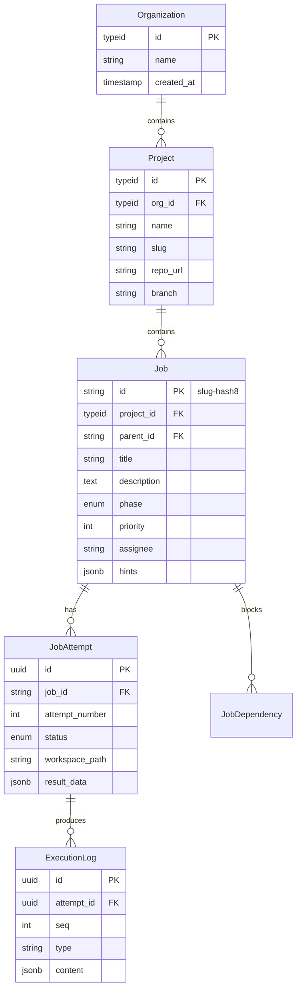

# Eve Horizon System Overview

> **Purpose**: Single-page introduction with architecture diagrams. Point people here first.
> **Status**: Current | Last Updated: 2026-02-12

## What is Eve Horizon?

Eve Horizon is a **job-first platform for running AI-powered skills against Git repositories**. It orchestrates AI agents (Claude, Z.ai, etc.) to execute development tasks in isolated workspaces with full auditability.

**Core Philosophy**:
- **CLI-first**: Both humans and AI agents use the same CLI interface
- **Job-centric**: Everything is tracked as jobs with phases, priorities, and dependencies
- **Event-driven**: Automation flows through a central event spine in Postgres
- **Skills-based**: Reusable capabilities live in repos as SKILL.md files installed via the `skills` CLI (OpenSkills format)
- **Isolated execution**: Each job attempt runs in a fresh workspace with cloned repo

**Agent-native design reference**:
- [docs/ideas/agent-native-design.md](../ideas/agent-native-design.md)

**Supporting repos**:
- Skillpacks: https://github.com/eve-horizon/eve-skillpacks
- Fullstack example: https://github.com/eve-horizon/eve-horizon-fullstack-example

---

## System Architecture

```
┌─────────────────────────────────────────────────────────────────────────┐
│                           EVE HORIZON                                   │
├─────────────────────────────────────────────────────────────────────────┤
│                                                                         │
│   ┌──────────────────────────────────────────────────────────────────┐ │
│   │                     USER / AI AGENT                               │ │
│   │                                                                    │ │
│   │    eve job create    eve job list    eve job logs    eve project  │ │
│   │                                                                    │ │
│   └────────────────────────────┬─────────────────────────────────────┘ │
│                                │                                        │
│                                │ HTTP REST                              │
│                                ▼                                        │
│   ┌──────────────────────────────────────────────────────────────────┐ │
│   │                      API GATEWAY                                  │ │
│   │                     (NestJS/Fastify)                              │ │
│   │                                                                    │ │
│   │  • Org/Project/Job CRUD        • Secrets management              │ │
│   │  • Events API + integrations    • OpenAPI at /docs                │ │
│   │  • Authentication               • Attempt management              │ │
│   │                                                                    │ │
│   │                         Port 4801                                 │ │
│   └────────────────────────────┬─────────────────────────────────────┘ │
│                                │                                        │
│          ┌─────────────────────┼─────────────────────┐                 │
│          │                     │                     │                 │
│          ▼                     ▼                     ▼                 │
│   ┌─────────────┐    ┌─────────────────┐    ┌─────────────────┐       │
│   │  DATABASE   │    │  ORCHESTRATOR   │    │     WORKER      │       │
│   │ (Postgres)  │◄───│   (Scheduler)   │───►│   (Executor)    │       │
│   │             │    │                 │    │                 │       │
│   │ • Jobs      │    │ • Poll ready    │    │ • Clone repo    │       │
│   │ • Attempts  │    │ • Event router  │    │ • Agent jobs    │       │
│   │ • Events    │    │ • Trigger match │    │ • Script jobs   │       │
│   │ • Logs      │    │ • Drive phases  │    │ • Action jobs   │       │
│   │ • Secrets   │    │                 │    │                 │       │
│   │             │    │   Port 4802     │    │ Port 4811       │       │
│   │             │    │                │    │                │       │
│   │  Port 4803  │    └─────────────────┘    └────────┬────────┘       │
│   └─────────────┘                                    │                 │
│                                                      ▼                 │
│                                            ┌─────────────────┐         │
│                                            │   GATEWAY       │         │
│                                            │  (Slack/WebChat)│         │
│                                            └─────────────────┘         │
│                                                                         │
│                                            ┌─────────────────┐         │
│                                            │    HARNESS      │         │
│                                            │  (cc-mirror)    │         │
│                                            │                 │         │
│                                            │ • mclaude       │         │
│                                            │ • zai           │         │
│                                            │ • gemini        │         │
│                                            └────────┬────────┘         │
│                                                     │                  │
│                                                     ▼                  │
│                                            ┌─────────────────┐         │
│                                            │   AI AGENT      │         │
│                                            │ (Claude/Z.ai)   │         │
│                                            │                 │         │
│                                            │ Executes skill  │         │
│                                            │ in workspace    │         │
│                                            └─────────────────┘         │
│                                                                         │
└─────────────────────────────────────────────────────────────────────────┘
```

---

## Web Auth (Supabase + SSO)

When web auth is enabled, Eve runs a GoTrue (Supabase Auth) service and a
dedicated SSO broker (`apps/sso`). Browser apps discover the auth endpoints via
`GET /auth/config` and exchange Supabase access tokens for Eve RS256 tokens via
`POST /auth/exchange`.

Local k3d defaults:
- `http://auth.eve.lvh.me` (GoTrue)
- `http://sso.eve.lvh.me` (SSO broker)
- `http://mail.eve.lvh.me` (Mailpit)

---

## Observability + Cost Tracking

Job attempts emit `llm.call` usage events that are stored in execution logs and
assembled into **execution receipts**. Receipts include timing, token usage,
and base/billed cost totals. See [Observability](./observability.md) and
[Pricing & Billing](./pricing-and-billing.md).

---

## Identity Providers

Non-web auth flows (SSH, Nostr) are implemented via a pluggable identity
provider registry. See [Identity Providers](./identity-providers.md).

## Job Lifecycle

Jobs are the central unit of work. They flow through phases with optional human review.



### Phase Descriptions

| Phase | Description |
|-------|-------------|
| **idea** | Initial creation, not yet scheduled |
| **backlog** | Planned but not ready (deferred or blocked) |
| **ready** | Schedulable, waiting for worker |
| **active** | Currently executing |
| **review** | Awaiting human/agent approval |
| **done** | Successfully completed |
| **cancelled** | Terminated |

### Job Priority

Priority 0-4 (P0 = critical, P4 = backlog). Higher priority jobs are scheduled first within the ready pool.

---

## Execution Flow



---

## Event Flow (Triggers → Pipelines/Workflows)

Events are the entry point for automation. They are stored in Postgres and routed by the orchestrator.



**Current behavior**: events are claimed, trigger matches are computed, and pipeline runs or
workflow jobs are created when triggers match. Pipeline runs expand into job graphs
with dependency edges based on `depends_on`.

---

## Deployment Architecture

### Current: Docker Compose



**Services:**
- **api** (4801): REST API gateway, Swagger at `/docs`
- **orchestrator** (4802): Job scheduler, claims and routes jobs
- **worker** (4811): Executes harnesses in isolated workspaces
- **db** (4803): PostgreSQL 16 for all state

**Shared Volume:**
- `workspaces`: `/opt/eve/workspaces` mounted by orchestrator and worker

### Future: Kubernetes



**Planned Enhancements:**
- Worker registry with dynamic scaling
- Specialized worker types (GPU, Playwright, etc.)
- Multi-tenant RLS policies
- Service mesh for advanced routing

---

## Skills System

Skills are reusable AI capabilities stored in repos using the OpenSkills SKILL.md format and installed via the `skills` CLI.



**Key Points:**
- Skills live in `.agents/skills/{name}/SKILL.md`
- Harness reads skills directly from cloned repo (no syncing)
- Each job attempt gets a fresh clone with current skills
- Skills follow the OpenSkills SKILL.md format and are installed via the `skills` CLI

---

## Job Workspace Structure

Each job attempt gets an isolated workspace:

```
/opt/eve/workspaces/
└── {project_id}/
    └── {job_id}/
        └── {attempt_number}/
            └── repo/                  # Cloned Git repo
                ├── .agent/
                │   └── skills/        # Skills read from here
                ├── AGENTS.md          # Agent instructions
                ├── src/               # Project source code
                └── ...
```

---

## Data Model



**ID Formats:**
- **Org/Project**: TypeID (globally unique, sortable) - `org_01H455...`, `proj_01H455...`
- **Job**: Human-readable - `myproj-a3f2dd12` (root), `myproj-a3f2dd12.1` (child)
- **Attempt**: UUID + job-scoped number - referenced as `job_id/attempt_number`

---

## Key Configuration

### Environment Variables

```bash
# Database
DATABASE_URL=postgres://eve:eve@db:5432/eve
EVE_DB_PORT=4803

# Services
EVE_API_PORT=4801
EVE_ORCHESTRATOR_PORT=4802
EVE_WORKER_PORT=4811

# Worker routing (comma-separated key=value)
EVE_WORKER_URLS=default-worker=http://worker:4811

# Secrets & Auth
EVE_SECRETS_MASTER_KEY=...      # API secrets encryption
EVE_INTERNAL_API_KEY=...        # Inter-service auth
EVE_AUTH_ENABLED=false          # Enable API bearer auth
EVE_AUTH_JWT_SECRET=...         # JWT secret (HS256)
CLAUDE_CODE_OAUTH_TOKEN=...     # Claude authentication
Z_AI_API_KEY=...                # Z.ai authentication

# Workspace
WORKSPACE_ROOT=/opt/eve/workspaces
```

### Job Hints

Jobs can specify execution preferences:

```json
{
  "hints": {
    "harness": "mclaude",           // or "zai", "gemini"
    "worker_type": "default",       // or "gpu", "playwright"
    "permission_policy": "yolo",    // default; or "auto_edit", "never"
    "timeout_seconds": 3600
  }
}
```

---

## Quick Start

```bash
# 1. Start services (default runtime)
./bin/eh k8s start

# Optional: quick dev loop
# ./bin/eh start docker

# 2. Create org and project
eve org ensure "My Org"
eve project ensure --name myproj --repo-url https://github.com/org/repo --branch main

# 3. Create and run a job
eve job create --project myproj --description "Fix the login bug in auth.ts"

# 4. Watch execution
eve job logs myproj-a3f2dd12

# 5. Check result
eve job show myproj-a3f2dd12
```

---

## Related Documentation

| Topic | Document |
|-------|----------|
| Job API specification | [job-api.md](./job-api.md) |
| API design philosophy | [api-philosophy.md](./api-philosophy.md) |
| Skills system details | [skills.md](./skills.md) |
| Harness execution | [harness-execution.md](./harness-execution.md) |
| Worker types | [worker-types.md](./worker-types.md) |
| Deployment details | [deployment.md](./deployment.md) |
| Extension points | [extension-points.md](./extension-points.md) |
| CLI credentials | [cli-tools-and-credentials.md](./cli-tools-and-credentials.md) |
| OpenAPI spec | [openapi.yaml](./openapi.yaml) |

---

## Summary

Eve Horizon provides:

1. **Job-based orchestration** - Track work as jobs with phases, priorities, and dependencies
2. **AI agent execution** - Run Claude, Z.ai, or other agents against your code
3. **Isolated workspaces** - Each job attempt gets a fresh repo clone
4. **Skills system** - Reusable capabilities in OpenSkills SKILL.md format installed via `skills`
5. **Full auditability** - All execution logs captured and queryable
6. **CLI-first design** - Same interface for humans and AI agents
7. **Extensible architecture** - Multiple harnesses, worker types, and deployment options
